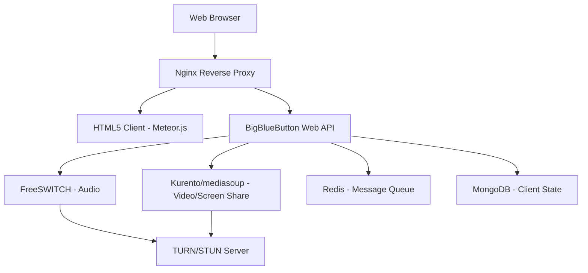

# How to Run BigBlueButton in Docker for Online Learning

Author: [nawazdhandala](https://github.com/nawazdhandala)

Tags: Docker, BigBlueButton, Video Conferencing, Online Learning, WebRTC, Self-Hosted

Description: Deploy BigBlueButton in Docker containers for self-hosted online learning with video conferencing, screen sharing, and whiteboard features.

---

BigBlueButton is an open-source web conferencing system designed specifically for online learning. It provides real-time video, audio, screen sharing, a multi-user whiteboard, breakout rooms, polls, and shared notes. Schools, universities, and training organizations use it as a self-hosted alternative to proprietary platforms like Zoom or Microsoft Teams.

Running BigBlueButton in Docker streamlines what is traditionally a complex installation process. This guide covers the full setup, from container configuration to production-ready deployment.

## Why BigBlueButton?

BigBlueButton was built with education in mind. Unlike general-purpose video conferencing tools, it includes features tailored for teaching: a presentation mode with slide uploads, a multi-user whiteboard for collaborative drawing, breakout rooms for small group work, and built-in polling for instant feedback. The platform also records sessions automatically, producing playback files that students can review later.

## Architecture Overview

BigBlueButton consists of several interconnected components. Understanding this architecture helps when debugging Docker deployments.



The system uses FreeSWITCH for audio processing, Kurento or mediasoup for WebRTC video, Redis for pub/sub messaging, and MongoDB for maintaining client state. Nginx sits in front as a reverse proxy handling SSL termination.

## Prerequisites

BigBlueButton is resource-intensive. Plan for the following:

- A dedicated server with at least 4 CPU cores and 8 GB RAM (16 GB recommended)
- Docker and Docker Compose installed
- A public domain name with DNS configured
- Ports 80, 443, and 16384-32768 (UDP, for WebRTC media) open
- A valid SSL certificate (BigBlueButton requires HTTPS)

## Setting Up with Docker

The community-maintained [bigbluebutton/docker](https://github.com/bigbluebutton/docker) repository provides the official Docker deployment method for BigBlueButton 3.0. It builds all necessary images locally and generates a complete Docker Compose configuration through an automated setup script.

> **Note:** BigBlueButton does not publish pre-built images to Docker Hub. The Docker setup builds images from source using the official repository. Do not attempt to pull images like `bigbluebutton/bbb-web` directly — they do not exist.

### Step 1: Install Docker

Make sure you have Docker CE (v23.0+) and the Docker Compose plugin installed on a native Linux host. BigBlueButton's Docker setup does not work on Windows, WSL, or macOS.

```bash
# Install Docker CE (Ubuntu/Debian)
curl -fsSL https://get.docker.com | sh

# Verify Docker Compose plugin is available
docker compose version
```

### Step 2: Clone the Repository

```bash
# Clone the official BigBlueButton Docker repository
git clone https://github.com/bigbluebutton/docker.git bbb-docker
cd bbb-docker
```

### Step 3: Run the Setup Script

The setup script walks you through configuration interactively. It asks for your domain name, whether to enable recordings, HTTPS settings, and generates a `.env` file and `docker-compose.yml` from templates.

```bash
# Run the interactive setup — this generates your .env and docker-compose.yml
./scripts/setup
```

During setup, you will configure:

- **Domain name** — your public domain (e.g., `bbb.example.com`)
- **HTTPS** — automatic certificate management via Let's Encrypt, or bring your own
- **TURN server** — built-in coturn for NAT traversal, or an external TURN server
- **Greenlight** — optional web front-end for managing rooms and users
- **Recordings** — enable or disable session recording

### Step 4: Review the Generated Configuration

After setup completes, review the generated `.env` file to verify your settings.

```bash
# Review the generated environment configuration
cat .env

# The shared secret is auto-generated — note it for API integration
grep SHARED_SECRET .env
```

The setup generates a `docker-compose.yml` with services including `bbb-web`, `freeswitch`, `nginx`, `redis`, `etherpad`, and others, all connected via a custom Docker network with static IPs.

### Step 5: Start BigBlueButton

```bash
# Build and launch all BigBlueButton services
docker compose up -d

# Watch the logs to verify everything starts correctly
docker compose logs -f

# Check the status of all containers
docker compose ps
```

The first launch takes longer as Docker builds the images from source. Subsequent starts use cached images.

## Key Services in the Stack

The generated `docker-compose.yml` includes these core services:

| Service | Description |
|---|---|
| `bbb-web` | Core BigBlueButton application server (API, meeting management) |
| `html5` | Meteor.js-based HTML5 client served to browsers |
| `freeswitch` | Audio processing engine for WebRTC voice |
| `mediasoup` | WebRTC video and screen sharing |
| `nginx` | Reverse proxy with SSL termination |
| `redis` | Pub/sub message broker |
| `etherpad` | Shared notes editor |
| `bbb-pads` | Integration layer between BigBlueButton and Etherpad |
| `greenlight` | (Optional) Web front-end for room management |
| `coturn` | (Optional) TURN/STUN relay for NAT traversal |

## Customizing the Environment

All configuration is managed through the `.env` file. Here are the most important settings:

```bash
# .env — Key configuration options

# Your public domain name
DOMAIN=bbb.example.com

# Auto-generated shared secret for API authentication
SHARED_SECRET=your_auto_generated_secret

# Public IP of your server (required for WebRTC)
EXTERNAL_IPv4=203.0.113.50

# Enable session recording
ENABLE_RECORDING=true

# TURN server configuration for users behind NAT
TURN_SECRET=your_turn_secret

# Welcome message shown when users join a meeting
WELCOME_MESSAGE=Welcome to BigBlueButton!
```

After changing `.env`, regenerate and restart:

```bash
# Regenerate the compose file after .env changes
./scripts/generate-compose

# Restart with the new configuration
docker compose up -d
```

## API Integration

BigBlueButton exposes a REST API for creating and managing meetings programmatically. You can integrate it with your learning management system or custom application.

```bash
# Retrieve your shared secret from the .env file
BBB_SECRET=$(grep SHARED_SECRET .env | cut -d'=' -f2)
BBB_URL="https://bbb.example.com/bigbluebutton/api"

# Calculate the checksum for the create call
CALL="createname=Test+Meeting&meetingID=test001&attendeePW=ap&moderatorPW=mp"
CHECKSUM=$(echo -n "${CALL}${BBB_SECRET}" | sha1sum | awk '{print $1}')

# Create the meeting
curl "${BBB_URL}/create?name=Test+Meeting&meetingID=test001&attendeePW=ap&moderatorPW=mp&checksum=${CHECKSUM}"
```

## Managing Recordings

BigBlueButton records sessions automatically when `ENABLE_RECORDING=true` is set in your `.env` file. Recordings are stored in the `data/bigbluebutton` directory on the host.

```bash
# List all recordings on the host
ls -la data/bigbluebutton/published/

# Check recording processing status inside the container
docker compose exec bbb-web bbb-record --list

# Delete old recordings to free disk space (older than 30 days)
find data/bigbluebutton/published -maxdepth 1 -mtime +30 -exec rm -rf {} \;
```

## Performance Tuning

BigBlueButton benefits from specific system-level tuning. Apply these settings on your Docker host.

```bash
# Increase the maximum number of open files for media handling
echo "* soft nofile 65536" >> /etc/security/limits.conf
echo "* hard nofile 65536" >> /etc/security/limits.conf

# Optimize network buffers for WebRTC traffic
sysctl -w net.core.rmem_max=16777216
sysctl -w net.core.wmem_max=16777216
sysctl -w net.core.rmem_default=1048576
sysctl -w net.core.wmem_default=1048576
```

## Health Checks and Monitoring

The generated `docker-compose.yml` already includes health checks for the `bbb-web` service. You can verify the API is responding with:

```bash
# Check if the BigBlueButton API is responding
curl -s https://bbb.example.com/bigbluebutton/api | head -5

# View health status of all containers
docker compose ps
```

For ongoing monitoring, integrate with tools like OneUptime to track server health, meeting counts, and user capacity. Set up alerts for high CPU usage, which indicates the media servers are under pressure.

## Production Checklist

Before going live, run through these items. Verify the shared secret in `.env` is a strong random value (the setup script generates one automatically). Enable SSL with a valid certificate from Let's Encrypt (configured during setup) or your own CA. Configure firewall rules to allow only ports 80, 443, and 16384-32768 (UDP for WebRTC media). Set up log rotation so disk space does not fill up. Test with multiple concurrent users to verify your server can handle the expected load. Configure automatic backups for the `data/` directory which contains recordings and persistent state.

## Upgrading BigBlueButton

To upgrade to a newer version, pull the latest changes from the repository and rebuild:

```bash
# Pull the latest version
git pull

# Rebuild and restart all services
docker compose down
docker compose up -d --build
```

BigBlueButton in Docker gives you a fully featured online learning platform that you control. The containerized setup makes upgrades manageable, and the modular architecture lets you scale individual components as your user base grows.
