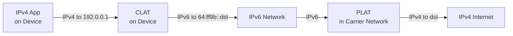

# How to Understand 464XLAT for IPv6-Only Mobile Networks

Author: [nawazdhandala](https://www.github.com/nawazdhandala)

Tags: IPv6, 464XLAT, Mobile Networks, CLAT, PLAT, IPv6 Transition

Description: A thorough explanation of 464XLAT, the translation architecture used by mobile carriers to deliver IPv6-only connectivity while maintaining compatibility with IPv4-only applications.

## What Is 464XLAT?

464XLAT (defined in RFC 6877) is an IPv6 transition architecture that combines two translation components to allow IPv4-only applications to run on IPv6-only mobile networks:

- **CLAT** (Customer-side Translator): runs on the device (phone, router)
- **PLAT** (Provider-side Translator): runs in the carrier's network (equivalent to NAT64)

The "464" name describes the translation path: **IPv4 → IPv6 → IPv4** - the application sends IPv4, the CLAT translates it to IPv6 for transport, and the PLAT translates it back to IPv4 to reach IPv4-only servers.

## Why 464XLAT Was Needed

Early mobile IPv6 deployments used NAT64+DNS64, which works for applications that use hostnames and DNS. However, many applications:

- Hard-code IPv4 literal addresses (e.g., `connect("8.8.8.8", 53)`)
- Use IPv4-only socket APIs
- Do not call DNS before connecting

These applications cannot benefit from DNS64 synthesis because they never make a DNS query. 464XLAT solves this by providing a local IPv4 address on the device itself, making the application think it has normal IPv4 connectivity.

## 464XLAT Architecture



The device has:
- An IPv6 address for native IPv6 connectivity (assigned by carrier)
- A private IPv4 address (`192.0.0.0/29` defined in RFC 7335) for the CLAT interface

## Step-by-Step Packet Flow

1. IPv4 app sends packet to `8.8.8.8` using source `192.0.0.2`
2. CLAT intercepts the packet on the local device
3. CLAT translates IPv4 to IPv6: source becomes device's IPv6 ULA/GUA, destination becomes `64:ff9b::808:808`
4. IPv6 packet travels over the carrier's IPv6-only network
5. PLAT (NAT64 gateway at the carrier) receives the IPv6 packet
6. PLAT translates IPv6 back to IPv4: extracts `8.8.8.8` from the `64:ff9b::` prefix
7. IPv4 packet reaches `8.8.8.8`
8. Response follows the reverse path

## DNS Discovery of PLAT Prefix (RFC 7050)

A key feature of 464XLAT is automatic discovery of the PLAT's NAT64 prefix. The device queries for a special name `ipv4only.arpa`:

```bash
# The device queries for AAAA record of ipv4only.arpa

# The DNS64/PLAT returns a synthesized address that reveals the prefix
dig AAAA ipv4only.arpa

# ipv4only.arpa resolves to 192.0.0.1 and 192.0.0.170
# DNS64 synthesizes: 64:ff9b::c000:0001
# Strip the known IPv4: remaining prefix is 64:ff9b::/96
```

This allows devices to automatically configure themselves with the correct PLAT prefix without manual configuration.

## 464XLAT vs NAT64+DNS64

| Aspect | NAT64+DNS64 | 464XLAT |
|---|---|---|
| IPv4 literal support | No | Yes (via CLAT) |
| Requires DNS | Yes | No |
| Translation layers | 1 (IPv6→IPv4) | 2 (IPv4→IPv6→IPv4) |
| Complexity | Lower | Higher |
| Mobile deployment | Limited | Industry standard |
| Android/iOS support | Partial | Full (Android 5+, iOS 8+) |

## Real-World Deployment: Carrier Networks

Major mobile carriers (T-Mobile, AT&T, Verizon, many others) deploy 464XLAT for their IPv6-only LTE/5G networks. The architecture allows them to:

- Allocate IPv6-only addresses to devices (no IPv4 address on the radio interface)
- Save IPv4 address space in the carrier network
- Provide full internet compatibility including IPv4-literal applications
- Achieve IPv6 deployment ratios above 80% on mobile

## Testing 464XLAT Behavior

On an Android or Linux device connected to a 464XLAT network:

```bash
# Check if CLAT interface is present (Android: clat, Linux: nat64)
ip link show clat
ip addr show clat

# Verify the private IPv4 address assigned to CLAT
ip addr show clat | grep 'inet '

# Test IPv4 connectivity through CLAT
ping -4 8.8.8.8

# Verify IPv6 native connectivity
ping -6 2001:4860:4860::8888

# Check CLAT prefix discovery
dig AAAA ipv4only.arpa
```

## Summary

464XLAT is the dominant IPv6 transition technology in mobile networks. It adds a CLAT component on devices that locally translates IPv4 to IPv6, enabling even IPv4-literal applications to work on IPv6-only networks. The PLAT (NAT64) in the carrier network translates back to IPv4 for internet connectivity. This two-stage translation is transparent to applications.
