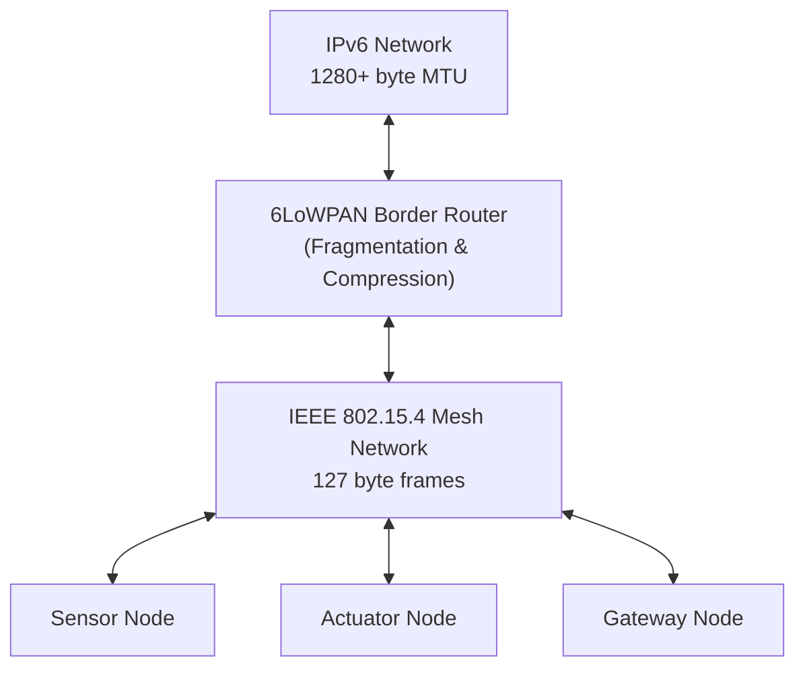

# How to Understand 6LoWPAN (IPv6 over Low-Power Wireless Personal Area Networks)

Author: [nawazdhandala](https://www.github.com/nawazdhandala)

Tags: IPv6, 6LoWPAN, IoT, IEEE 802.15.4, Networking, Embedded

Description: Understand how 6LoWPAN adapts IPv6 for constrained IoT devices operating over IEEE 802.15.4 radio links through header compression, fragmentation, and mesh addressing.

## Introduction

6LoWPAN (IPv6 over Low-Power Wireless Personal Area Networks) is a set of standards defined in RFC 4944, RFC 6282, and related documents that make it possible to run IPv6 on extremely constrained devices using IEEE 802.15.4 radio links. These are the wireless links used by Zigbee, Thread, and other low-power IoT protocols.

## Why IPv6 Can't Run Directly on 802.15.4

IEEE 802.15.4 has severe constraints:
- **Maximum frame size**: 127 bytes
- **Minimum usable payload**: ~80-100 bytes after MAC headers and security
- IPv6 requires a **minimum MTU of 1280 bytes**
- IPv6 headers alone are **40 bytes** (fixed) + extension headers
- Link-layer security adds 21+ bytes

6LoWPAN bridges this gap with adaptation layer techniques.

## 6LoWPAN Architecture



## Key 6LoWPAN Techniques

### 1. Header Compression (RFC 6282 - IPHC)

IPHC (IP Header Compression) can compress a 40-byte IPv6 header down to as few as 2-3 bytes by:
- Inferring the IPv6 prefix from context (stored by both endpoints)
- Inferring addresses from the IEEE 802.15.4 MAC address (EUI-64)
- Eliding fields that have constant values in most IoT traffic (hop limit, traffic class)

```
Uncompressed IPv6 header: 40 bytes
After IPHC compression:    2-7 bytes typical
Savings: ~33-38 bytes per packet
```

### 2. Fragmentation and Reassembly (RFC 4944)

Since IPv6 requires 1280 bytes MTU and 802.15.4 only supports ~90 bytes payload:
- 6LoWPAN splits IPv6 packets into multiple 802.15.4 fragments
- Each fragment has a 6LoWPAN fragmentation header (4 bytes: datagram size + tag + offset)
- The receiving node reassembles before passing to IPv6

### 3. Mesh Addressing

For multi-hop networks, 6LoWPAN provides a mesh addressing header that allows frames to be forwarded multiple hops within the 802.15.4 network before reaching the 6LoWPAN border router.

## Dispatch Byte

Every 6LoWPAN frame starts with a "dispatch byte" that identifies the type of 6LoWPAN frame:

| Pattern | Meaning |
|---|---|
| `00 xxxxxx` | Not a 6LoWPAN frame (e.g., raw NALP) |
| `01 000000` | Uncompressed IPv6 |
| `01 1xxxxx` | LOWPAN_IPHC compressed header |
| `11 000xxx` | Mesh addressing header |
| `11 000xxx` + `11 0x xxxx` | Fragmentation |

## 6LoWPAN in Practice with Linux

The Linux kernel includes 6LoWPAN support through the `ieee802154` subsystem:

```bash
# Check if 6LoWPAN kernel modules are available
lsmod | grep lowpan
# or
modprobe -v lowpan

# Create a 6LoWPAN interface on an 802.15.4 radio
# (requires 802.15.4 hardware, e.g., atusb, cc2531)
ip link add link wpan0 name lowpan0 type lowpan
ip link set wpan0 up
ip link set lowpan0 up

# Assign an IPv6 address (derived from EUI-64 of 802.15.4 address)
ip -6 addr show lowpan0
```

## Node Configuration Example (Linux-based IoT device)

```bash
# Configure 802.15.4 interface parameters
iwpan phy phy0 set channel 0 26  # Channel 26 (2480 MHz)
iwpan dev wpan0 set pan_id 0xabcd
iwpan dev wpan0 set short_addr 0x0001

# Enable 6LoWPAN adaptation
ip link set lowpan0 up

# The 6LoWPAN address is auto-derived from the MAC address
ip -6 addr show lowpan0
# inet6 fe80::... link (derived from 802.15.4 EUI-64)
```

## Conclusion

6LoWPAN makes IPv6 viable for the most constrained IoT devices by providing header compression, fragmentation, and mesh addressing as an adaptation layer between IPv6 and IEEE 802.15.4. The result is a fully addressable IPv6 end-to-end path from the internet to a sensor node with a tiny battery and a sub-100-byte radio frame size. This is the foundation for Thread, Matter, and other modern IoT protocols.
