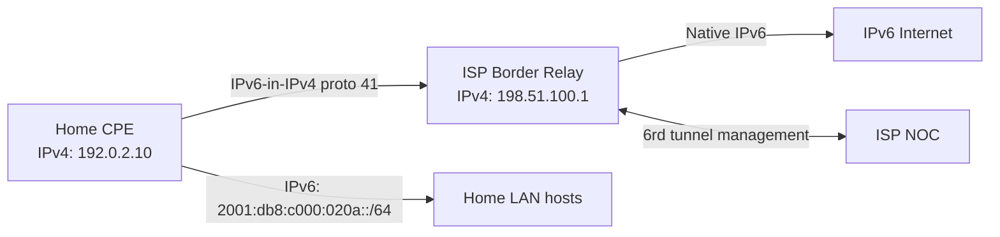

# How to Understand 6rd (IPv6 Rapid Deployment) for ISPs

Author: [nawazdhandala](https://www.github.com/nawazdhandala)

Tags: IPv6, 6rd, ISP, Tunneling, RFC 5969

Description: Learn how 6rd (IPv6 Rapid Deployment) works as an ISP-controlled IPv6-over-IPv4 tunneling mechanism, how addresses are derived, and when it was deployed.

## Overview

6rd (IPv6 Rapid Deployment) was developed by Free (a French ISP) in 2008 and standardized in RFC 5969. It is an ISP-managed variant of 6to4 that eliminates the relay quality problem by using ISP-controlled border relays (BRs). The ISP assigns a 6rd prefix, and customer IPv6 addresses embed the customer's IPv4 address within that prefix.

## How 6rd Differs from 6to4

| Feature | 6to4 | 6rd |
|---|---|---|
| Prefix | Fixed: 2002::/16 | ISP-assigned (any prefix) |
| Relay | Public anycast 192.88.99.1 | ISP-controlled Border Relay (BR) |
| Address assignment | Auto from public IPv4 | ISP prefix + IPv4 embedded |
| IPv4 support | Public IPs only | ISP controls (can include private IPv4) |
| Relay quality | Uncontrolled | ISP SLA |
| Status | Deprecated (RFC 7526) | Transitional — mostly replaced by dual-stack |

## Address Derivation

The ISP defines:
- A 6rd prefix (e.g., `2001:db8::/32`)
- IPv4 mask bits to embed (e.g., 32 bits = full IPv4)

Example:
```
6rd Prefix:    2001:db8::/32
IPv4 mask:     32 bits (full IPv4 address embedded)
Customer IPv4: 192.0.2.10 = c0:00:02:0a

6rd CE address:
  2001:db8: + c000:020a + :0001:0000:0000:0001
  = 2001:db8:c000:020a::/64

6rd BR (relay) IPv4: 198.51.100.1
```

If the ISP shortens the IPv4 mask (e.g., 24 bits — last octet removed), the prefix is longer:
```
6rd Prefix:    2001:db8::/32
IPv4 mask:     24 bits (first 3 octets of IPv4)
IPv4 bits:     192.0.2 = c0:00:02

CE prefix: 2001:db8:c000:02XX::/56   (X = dynamic host ID)
```

## 6rd Provisioning via DHCPv4

The ISP provisions 6rd parameters to CPE devices via DHCPv4 option 212 (RFC 5969):

```
DHCP option 212 carries:
  - IPv4MaskLen: bits of IPv4 to embed (e.g., 32)
  - 6rdPrefix: e.g., 2001:db8::/32
  - 6rdBRIPv4Address: e.g., 198.51.100.1
```

CPE receives these and automatically configures the 6rd tunnel.

## 6rd Architecture



## CPE Configuration Example

A home router (CPE) implementing 6rd:

```bash
# Linux CPE — manual 6rd configuration
# (normally auto-provisioned via DHCPv4 option 212)

IP4=192.0.2.10        # WAN IPv4 from ISP DHCP
BR=198.51.100.1       # ISP Border Relay IPv4
PREFIX=2001:db8::     # 6rd prefix
PLEN=32               # 6rd prefix length (bits)
IP4MASKLEN=32         # IPv4 bits to embed

# Convert IPv4 to hex: 192.0.2.10 = c0000210
HEX=$(printf '%08x' $(echo $IP4 | awk -F. '{printf "%d\n", ($1*2^24)+($2*2^16)+($3*2^8)+$4}'))

# 6rd prefix for this CPE
CE_PREFIX="${PREFIX}:${HEX:0:4}:${HEX:4:4}::/64"
echo "6rd CE prefix: $CE_PREFIX"

# Create tunnel
ip tunnel add 6rd mode sit remote any local $IP4 ttl 64
ip tunnel 6rd dev 6rd relay prefix $PREFIX/$PLEN mappedlen $IP4MASKLEN
ip link set 6rd up
ip addr add ${PREFIX}:${HEX:0:4}:${HEX:4:4}::1/128 dev 6rd
ip route add ::/0 via ::$BR dev 6rd
```

## Router Advertisement to Home Network

The CPE advertises the delegated /64 to home LAN devices:

```bash
# /etc/radvd.conf on CPE
interface eth0 {
    AdvSendAdvert on;
    MinRtrAdvInterval 30;
    MaxRtrAdvInterval 100;
    prefix 2001:db8:c000:020a::/64 {
        AdvOnLink on;
        AdvAutonomous on;   # Enable SLAAC
        AdvRouterAddr off;
    };
};
```

## Real-World 6rd Deployments

6rd was deployed by several ISPs during 2009-2015:
- **Free (Iliad, France)** — first ISP, deployed 2008
- **Comcast** — tested but ultimately went to native dual-stack
- **US ISPs** — brief deployment then transitioned to native IPv6

Most ISPs that deployed 6rd have since migrated to native dual-stack. 6rd is considered a transitional mechanism, not a permanent solution.

## Security Considerations

```bash
# 6rd traffic is protocol 41 — same as 6in4
# Filter non-authorized 6rd tunnels

# Block protocol 41 from sources other than ISP BR
iptables -A INPUT -p 41 -s 198.51.100.1 -j ACCEPT
iptables -A INPUT -p 41 -j DROP

# Block 6rd prefixes at enterprise border if not used
ip6tables -I FORWARD -s 2001:db8:c000::/36 -j DROP
```

## Summary

6rd (RFC 5969) solved 6to4's relay quality problem by using ISP-controlled Border Relays with operator-guaranteed uplinks. The ISP assigns a custom prefix (not the broken `2002::/16`) and embeds some or all of the customer's IPv4 address. CPE is provisioned via DHCPv4 option 212. Like 6to4, 6rd is a transitional mechanism — most ISPs have moved to native dual-stack. 6rd traffic uses IP protocol 41 (same as 6in4), so the same firewall blocking rules apply.
