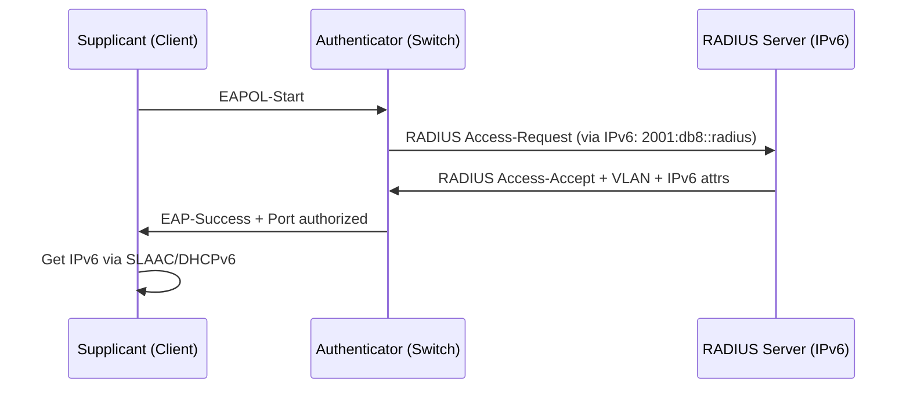

# How to Configure 802.1X Authentication with IPv6

Author: [nawazdhandala](https://www.github.com/nawazdhandala)

Tags: 802.1X, IPv6, EAP, RADIUS, Network Access Control, Wired, Wi-Fi

Description: Configure 802.1X port-based authentication in IPv6 environments including RADIUS server IPv6 addressing, supplicant configuration, and dynamic VLAN assignment.

## 802.1X and IPv6 Relationship

802.1X operates at Layer 2 — authentication happens before any IP address is assigned. IPv6 becomes relevant in two ways:
1. The RADIUS server is reachable via IPv6 from the authenticator (switch/AP)
2. After authentication, the user receives IPv6 addresses (via SLAAC, DHCPv6, or RADIUS)



## FreeRADIUS: 802.1X over IPv6

```bash
# FreeRADIUS listen on IPv6 for authenticators
# /etc/freeradius/3.0/sites-enabled/default

listen {
    type = auth
    ipaddr = ::          # IPv6 and IPv4 dual-stack
    port = 1812
}

# EAP configuration (unchanged — 802.1X EAP is Layer 2)
# /etc/freeradius/3.0/mods-enabled/eap
eap {
    default_eap_type = peap
    timer_expire     = 60

    peap {
        default_eap_type = mschapv2
        virtual_server = "inner-tunnel"
    }
}
```

```
# /etc/freeradius/3.0/users
# 802.1X user with VLAN assignment and IPv6 attributes

wired_user  Cleartext-Password := "secret"
            Tunnel-Type = VLAN,
            Tunnel-Medium-Type = IEEE-802,
            Tunnel-Private-Group-ID = "100",
            Framed-IPv6-Prefix = "2001:db8:vlan100::user/128",
            Session-Timeout = 28800
```

## Cisco Switch: 802.1X with IPv6 RADIUS

```
! Cisco Catalyst — 802.1X with IPv6 RADIUS server

! Configure RADIUS server via IPv6
radius server IPV6_RADIUS
 address ipv6 2001:db8::radius
 auth-port 1812
 acct-port 1813
 key radiuskey

aaa group server radius RADIUS_GRP
 server name IPV6_RADIUS
 ip radius source-interface Vlan100   ! Must have IPv6 address
 ipv6 radius source-interface Vlan100

! Enable 802.1X
aaa new-model
aaa authentication dot1x default group RADIUS_GRP
aaa authorization network default group RADIUS_GRP
aaa accounting dot1x default start-stop group RADIUS_GRP

dot1x system-auth-control

! Configure interface
interface GigabitEthernet0/1
 switchport mode access
 switchport access vlan 100
 dot1x pae authenticator
 dot1x port-control auto
 spanning-tree portfast

! Verify
show dot1x all summary
show radius statistics
```

## Aruba/HP Switch: 802.1X with IPv6 RADIUS

```
! Aruba CX — 802.1X with IPv6 RADIUS

radius-server host 2001:db8::radius key plain "radiuskey"
radius-server host 2001:db8::radius auth-port 1812

aaa authentication port-access dot1x authenticator
aaa group radius RADIUS_GRP
 host 2001:db8::radius

interface 1/1/1
 vlan access 100
 dot1x authenticator
 dot1x role authenticator
 aaa authentication port-access dot1x authenticator
 no shutdown
```

## Linux Supplicant: wpa_supplicant with IPv6 Network

```bash
# /etc/wpa_supplicant/wpa_supplicant.conf
# Wired 802.1X supplicant

ctrl_interface=/run/wpa_supplicant
ctrl_interface_group=0
eapol_version=1
ap_scan=0
fast_reauth=1

network={
    key_mgmt=IEEE8021X
    eap=PEAP
    identity="wired_user"
    password="secret"
    phase2="auth=MSCHAPV2"
    ca_cert="/etc/ssl/certs/ca.pem"
    eapol_flags=0
}

# Start supplicant
wpa_supplicant -c /etc/wpa_supplicant/wpa_supplicant.conf \
    -i eth0 -D wired -B

# After authentication, get IPv6 via SLAAC
radvd-conf-check
# Or DHCPv6
dhclient -6 eth0
```

## Dynamic IPv6 VLAN Assignment

```
# FreeRADIUS: assign different VLAN + IPv6 pool per user group

# /etc/freeradius/3.0/users
corp_user  Cleartext-Password := "secret"
           Tunnel-Type = VLAN,
           Tunnel-Medium-Type = IEEE-802,
           Tunnel-Private-Group-ID = "200",
           Framed-IPv6-Pool = "corp_ipv6_pool",
           Filter-Id = "corp_acl"

guest_user Cleartext-Password := "guestpass"
           Tunnel-Type = VLAN,
           Tunnel-Medium-Type = IEEE-802,
           Tunnel-Private-Group-ID = "300",
           Framed-IPv6-Pool = "guest_ipv6_pool"
```

```bash
# Per-VLAN IPv6 pools in FreeRADIUS
# /etc/freeradius/3.0/mods-enabled/ippool_corp

ippool corp_ipv6_pool {
    backend = redis
    redis { server = "[::1]:6379"; database = 2 }
    range-start = 2001:db8:corp::1
    range-stop  = 2001:db8:corp::ffff
    prefix-len  = 128
    key = "%{User-Name}"
    lease-duration = 28800
}

ippool guest_ipv6_pool {
    backend = redis
    redis { server = "[::1]:6379"; database = 3 }
    range-start = 2001:db8:guest::1
    range-stop  = 2001:db8:guest::ffff
    prefix-len  = 128
    lease-duration = 3600
}
```

## Monitoring 802.1X Sessions

```bash
# Check active 802.1X sessions on Cisco switch
show authentication sessions
show dot1x all details

# FreeRADIUS: active sessions in radacct
mysql -u radius -p radius << 'EOF'
SELECT username, nasipv6address, framedipv6prefix,
       acctstarttime, TIMESTAMPDIFF(MINUTE, acctstarttime, NOW()) AS min_ago
FROM radacct
WHERE acctstoptime IS NULL
  AND nasipv6address IS NOT NULL
ORDER BY acctstarttime DESC
LIMIT 20;
EOF
```

## Conclusion

802.1X authentication itself is Layer 2 and unaffected by IPv6, but the RADIUS infrastructure supporting it can be fully IPv6-native. Configure RADIUS servers via IPv6 addresses on Cisco (`address ipv6`), Aruba, and other authenticators. After successful authentication, IPv6 address assignment occurs via SLAAC on the authorized VLAN or via RADIUS attributes (`Framed-IPv6-Prefix`, `Framed-IPv6-Pool`). Dynamic VLAN assignment works the same as IPv4 — `Tunnel-Type = VLAN` with `Tunnel-Private-Group-ID`. Monitor sessions with `show authentication sessions` and query `radacct` for IPv6 NAS address tracking.
