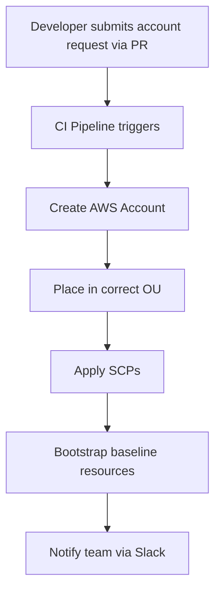

# How to Implement Account Vending Machine with OpenTofu

Author: [nawazdhandala](https://www.github.com/nawazdhandala)

Tags: OpenTofu, Account Vending Machine, AWS Organizations, Automation, Infrastructure as Code

Description: Learn how to build an Account Vending Machine with OpenTofu to automate the provisioning of new AWS accounts with standardized baselines.

An Account Vending Machine (AVM) automates the creation and bootstrapping of new AWS accounts. It creates the account, places it in the right OU, applies baseline security controls, and provisions shared infrastructure — all triggered by a single configuration change.

## Architecture



## Account Request File

```hcl
# accounts/new-team-sandbox.hcl
locals {
  account_name  = "mycompany-new-team-sandbox"
  email         = "aws+new-team@mycompany.com"
  ou            = "Sandbox"
  cost_center   = "engineering-new-team"
  owner_email   = "alice@mycompany.com"
  vpc_cidr      = "10.50.0.0/16"
}
```

## Account Vending Module

```hcl
# modules/account-vending/main.tf

# Step 1: Create the account
resource "aws_organizations_account" "new" {
  name      = var.account_name
  email     = var.email
  parent_id = var.parent_ou_id
  role_name = "OrganizationAccountAccessRole"

  tags = {
    CostCenter = var.cost_center
    Owner      = var.owner_email
    ManagedBy  = "opentofu-avm"
  }

  close_on_deletion = false
}

# Step 2: Wait for the account to be fully active
resource "time_sleep" "wait_for_account" {
  depends_on      = [aws_organizations_account.new]
  create_duration = "60s"
}

# Step 3: Assume role in the new account
provider "aws" {
  alias  = "new_account"
  region = var.region

  assume_role {
    role_arn = "arn:aws:iam::${aws_organizations_account.new.id}:role/OrganizationAccountAccessRole"
  }
}

# Step 4: Create baseline VPC
resource "aws_vpc" "baseline" {
  provider             = aws.new_account
  cidr_block           = var.vpc_cidr
  enable_dns_hostnames = true
  depends_on           = [time_sleep.wait_for_account]
  tags                 = { Name = "baseline-vpc" }
}

# Step 5: Enable AWS Config
resource "aws_config_configuration_recorder" "baseline" {
  provider  = aws.new_account
  name      = "default"
  role_arn  = aws_iam_role.config.arn
  depends_on = [time_sleep.wait_for_account]
}

# Step 6: Enable Security Hub
resource "aws_securityhub_account" "baseline" {
  provider   = aws.new_account
  depends_on = [time_sleep.wait_for_account]
}
```

## Root Configuration

```hcl
# main.tf — Vend a new account by adding a module call
module "new_team_sandbox" {
  source = "./modules/account-vending"

  account_name  = "mycompany-new-team-sandbox"
  email         = "aws+new-team@mycompany.com"
  parent_ou_id  = aws_organizations_organizational_unit.sandbox.id
  cost_center   = "engineering-new-team"
  owner_email   = "alice@mycompany.com"
  vpc_cidr      = "10.50.0.0/16"
  region        = "us-east-1"
}
```

## CI/CD Trigger

```yaml
# .github/workflows/account-vending.yml
on:
  push:
    paths:
      - 'accounts/*.hcl'
    branches: [main]

jobs:
  vend:
    runs-on: ubuntu-latest
    steps:
      - uses: actions/checkout@v4
      - name: Apply Account Vending
        run: |
          tofu init
          tofu apply -auto-approve
```

## Conclusion

An Account Vending Machine with OpenTofu codifies the account creation process into a repeatable, reviewable pipeline. Adding an account is as simple as adding a module call (or a configuration file), creating a PR, getting it reviewed, and merging. The pipeline handles account creation, OU placement, and baseline resource provisioning automatically.
