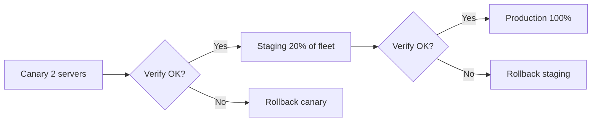

# How to Roll Out IPv6 Across a Fleet of Servers with Ansible

Author: [nawazdhandala](https://www.github.com/nawazdhandala)

Tags: Ansible, IPv6, Fleet Management, Rolling Deployment, Network Automation

Description: A guide to performing a phased, rolling IPv6 rollout across a large fleet of servers using Ansible with staged deployment, rollback, and verification.

Rolling out IPv6 to a production server fleet requires careful staging to minimize risk. This guide shows how to use Ansible's serial execution, host grouping, and rollback capabilities for a safe, phased IPv6 deployment.

## Rollout Strategy



## Inventory with Phased Groups

```ini
# inventory.ini - Hosts organized by rollout phase
[canary]
web-01 ansible_host=10.0.1.1
web-02 ansible_host=10.0.1.2

[staging]
web-03 ansible_host=10.0.1.3
web-04 ansible_host=10.0.1.4
# ... up to 20% of fleet

[production]
web-05 ansible_host=10.0.1.5
# ... all remaining servers

[all_web:children]
canary
staging
production
```

## Core IPv6 Configuration Role

```yaml
# roles/ipv6_config/tasks/main.yml - Core IPv6 configuration tasks
---
- name: Configure IPv6 address via Netplan
  ansible.builtin.template:
    src: netplan-ipv6.yaml.j2
    dest: /etc/netplan/60-ipv6.yaml
    mode: "0600"
  notify: Apply Netplan

- name: Enable IPv6 sysctl settings
  ansible.posix.sysctl:
    name: "{{ item.name }}"
    value: "{{ item.value }}"
    state: present
    sysctl_file: /etc/sysctl.d/99-ipv6.conf
  loop:
    - { name: net.ipv6.conf.all.forwarding, value: "0" }
    - { name: net.ipv6.conf.all.accept_ra, value: "1" }

- name: Update DNS search to include IPv6 resolver
  ansible.builtin.lineinfile:
    path: /etc/resolv.conf
    line: "nameserver 2001:4860:4860::8888"
    insertafter: EOF
```

## Phase 1: Canary Deployment

```yaml
# phase1-canary.yml - Deploy to canary servers only
---
- name: Phase 1 - IPv6 Canary Deployment
  hosts: canary
  become: true
  # Deploy one at a time to canary servers
  serial: 1

  pre_tasks:
    - name: "PHASE 1: Starting IPv6 canary rollout on {{ inventory_hostname }}"
      ansible.builtin.debug:
        msg: "Rolling out IPv6 to canary server {{ inventory_hostname }}"

  roles:
    - ipv6_config

  post_tasks:
    - name: Wait for IPv6 address to appear
      ansible.builtin.wait_for:
        timeout: 30

    - name: Verify IPv6 address is assigned
      ansible.builtin.command:
        cmd: ip -6 addr show scope global
      register: ipv6_check
      changed_when: false

    - name: Fail if no IPv6 address
      ansible.builtin.fail:
        msg: "IPv6 address not assigned after rollout"
      when: "'scope global' not in ipv6_check.stdout"

    - name: Test IPv6 external connectivity
      ansible.builtin.command:
        cmd: ping6 -c 3 -W 5 2001:4860:4860::8888
      changed_when: false
```

## Phase 2: Staging (20% of Fleet)

```yaml
# phase2-staging.yml - Deploy to 20% of servers
---
- name: Phase 2 - IPv6 Staging Deployment
  hosts: staging
  become: true
  # Deploy in batches of 5 (or 20% per batch)
  serial: "20%"

  roles:
    - ipv6_config

  post_tasks:
    - name: Run post-deploy checks
      ansible.builtin.include_tasks: tasks/verify-ipv6.yml
```

## Phase 3: Full Production Rollout

```yaml
# phase3-production.yml - Deploy to all remaining servers
---
- name: Phase 3 - IPv6 Full Production Deployment
  hosts: production
  become: true
  # Deploy in batches of 10
  serial: 10
  # Stop if more than 5% of hosts fail
  max_fail_percentage: 5

  roles:
    - ipv6_config

  post_tasks:
    - name: Run comprehensive post-deploy verification
      ansible.builtin.include_tasks: tasks/verify-ipv6.yml
```

## Rollback Playbook

```yaml
# rollback-ipv6.yml - Remove IPv6 configuration if issues are found
---
- name: Rollback IPv6 configuration
  hosts: "{{ target_hosts | default('canary') }}"
  become: true

  tasks:
    - name: Remove Netplan IPv6 config
      ansible.builtin.file:
        path: /etc/netplan/60-ipv6.yaml
        state: absent
      notify: Apply Netplan

    - name: Remove IPv6 sysctl settings
      ansible.builtin.file:
        path: /etc/sysctl.d/99-ipv6.conf
        state: absent
      notify: Apply sysctl
```

## Execute the Rollout

```bash
# Phase 1: Canary (always run --check first)
ansible-playbook phase1-canary.yml -i inventory.ini --check
ansible-playbook phase1-canary.yml -i inventory.ini

# Phase 2: Staging
ansible-playbook phase2-staging.yml -i inventory.ini

# Phase 3: Production
ansible-playbook phase3-production.yml -i inventory.ini

# Rollback if needed
ansible-playbook rollback-ipv6.yml -i inventory.ini -e "target_hosts=canary"
```

A phased Ansible rollout with per-phase verification and a ready rollback playbook is the safest way to introduce IPv6 to a production server fleet without risking a fleet-wide outage.
