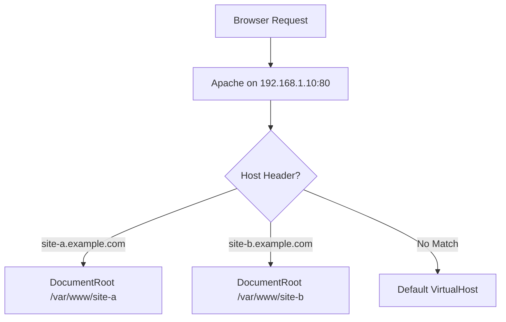

# How to Set Up Name-Based Virtual Hosts on a Single IPv4 Address in Apache

Author: [nawazdhandala](https://www.github.com/nawazdhandala)

Tags: Apache, IPv4, Virtual Hosts, Web Server, Linux, HTTP, Configuration

Description: Learn how to configure Apache to serve multiple websites from a single IPv4 address using name-based virtual hosting.

---

Name-based virtual hosting lets one Apache server host dozens of websites on a single IPv4 address. Apache distinguishes between sites using the HTTP `Host` header that browsers send with every request.

## How Name-Based Virtual Hosting Works



## Creating the Document Roots

```bash
# Create web roots and sample pages for two sites

mkdir -p /var/www/site-a /var/www/site-b
echo "<h1>Site A</h1>" > /var/www/site-a/index.html
echo "<h1>Site B</h1>" > /var/www/site-b/index.html
chown -R www-data:www-data /var/www/site-a /var/www/site-b
```

## Configuring the Virtual Hosts

```apacheconf
# /etc/apache2/sites-available/site-a.conf
<VirtualHost 192.168.1.10:80>
    # This ServerName must match the Host header sent by the browser
    ServerName site-a.example.com
    ServerAlias www.site-a.example.com

    DocumentRoot /var/www/site-a

    <Directory /var/www/site-a>
        Options -Indexes +FollowSymLinks
        AllowOverride All
        Require all granted
    </Directory>

    ErrorLog  ${APACHE_LOG_DIR}/site-a-error.log
    CustomLog ${APACHE_LOG_DIR}/site-a-access.log combined
</VirtualHost>
```

```apacheconf
# /etc/apache2/sites-available/site-b.conf
<VirtualHost 192.168.1.10:80>
    ServerName site-b.example.com
    DocumentRoot /var/www/site-b

    <Directory /var/www/site-b>
        Options -Indexes +FollowSymLinks
        AllowOverride All
        Require all granted
    </Directory>

    ErrorLog  ${APACHE_LOG_DIR}/site-b-error.log
    CustomLog ${APACHE_LOG_DIR}/site-b-access.log combined
</VirtualHost>
```

## Enabling the Sites

```bash
# Enable the virtual hosts
a2ensite site-a.conf
a2ensite site-b.conf

# Verify Apache configuration syntax
apachectl configtest

# Reload Apache to activate the new sites
systemctl reload apache2
```

## Setting a Default Virtual Host

The first `VirtualHost` block that matches the IP:port pair is treated as the default. Create a catch-all to handle requests with unknown `Host` headers.

```apacheconf
# /etc/apache2/sites-available/000-default.conf
<VirtualHost 192.168.1.10:80>
    ServerName default.example.com
    DocumentRoot /var/www/html

    # Return 404 for unrecognized hosts
    <Location />
        Require all denied
    </Location>
</VirtualHost>
```

## Testing

```bash
# Simulate a request with a specific Host header
curl -H "Host: site-a.example.com" http://192.168.1.10/
curl -H "Host: site-b.example.com" http://192.168.1.10/
```

## Key Takeaways

- Apache selects the virtual host based on the `Host` header after matching on IP:port.
- The first listed VirtualHost for an IP:port acts as the default.
- Use `ServerAlias` to handle multiple hostnames (e.g., with and without `www`).
- Always run `apachectl configtest` before reloading to catch syntax errors.
