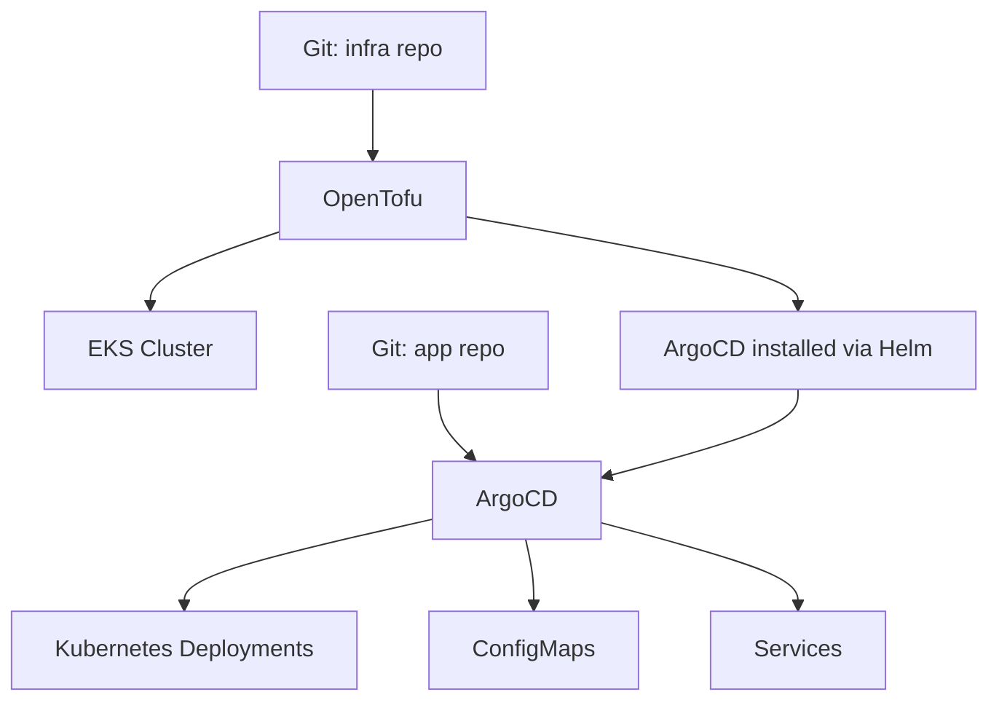

# How to Use ArgoCD with OpenTofu for Kubernetes GitOps

Author: [nawazdhandala](https://www.github.com/nawazdhandala)

Tags: OpenTofu, ArgoCD, GitOps, Kubernetes, Helm, Infrastructure as Code

Description: Learn how to combine OpenTofu for infrastructure provisioning with ArgoCD for application deployment, creating a complete GitOps pipeline where OpenTofu provisions clusters and ArgoCD manages...

---

OpenTofu and ArgoCD complement each other in a GitOps stack: OpenTofu provisions the EKS/AKS/GKE cluster and installs ArgoCD via Helm, then ArgoCD takes over to continuously sync Kubernetes application manifests from Git. This creates a clean separation between infrastructure and application deployment.

## Two-Layer GitOps



## OpenTofu: Provision Cluster and Install ArgoCD

```hcl
# argocd.tf

resource "helm_release" "argocd" {
  name             = "argocd"
  repository       = "https://argoproj.github.io/argo-helm"
  chart            = "argo-cd"
  version          = "6.7.3"
  namespace        = "argocd"
  create_namespace = true

  values = [
    yamlencode({
      configs = {
        params = {
          "server.insecure" = false
        }

        # Repository credentials (for private repos)
        credentialTemplates = {
          github = {
            url      = "https://github.com/myorg"
            username = "argocd"
            password = var.github_token
          }
        }
      }

      server = {
        replicas = var.environment == "production" ? 2 : 1

        ingress = {
          enabled = true
          annotations = {
            "kubernetes.io/ingress.class"    = "nginx"
            "cert-manager.io/cluster-issuer" = "letsencrypt-prod"
          }
          hosts = ["argocd.${var.domain}"]
          tls   = [{ secretName = "argocd-tls", hosts = ["argocd.${var.domain}"] }]
        }
      }

      applicationSet = { enabled = true }
      notifications  = { enabled = true }
    })
  ]
}
```

## ArgoCD Project and Application

```hcl
# argocd_apps.tf
resource "kubernetes_manifest" "argocd_project" {
  manifest = {
    apiVersion = "argoproj.io/v1alpha1"
    kind       = "AppProject"
    metadata = {
      name      = var.team
      namespace = "argocd"
    }
    spec = {
      description = "${var.team} team applications"
      sourceRepos = ["https://github.com/myorg/*"]
      destinations = [{
        namespace = "${var.team}-*"
        server    = "https://kubernetes.default.svc"
      }]
      clusterResourceWhitelist = [{
        group = ""
        kind  = "Namespace"
      }]
    }
  }
  depends_on = [helm_release.argocd]
}

resource "kubernetes_manifest" "app" {
  manifest = {
    apiVersion = "argoproj.io/v1alpha1"
    kind       = "Application"
    metadata = {
      name      = "${var.app_name}-${var.environment}"
      namespace = "argocd"
      finalizers = ["resources-finalizer.argocd.argoproj.io"]
    }
    spec = {
      project = var.team

      source = {
        repoURL        = "https://github.com/myorg/app-configs"
        targetRevision = var.environment == "production" ? "main" : "HEAD"
        path           = "environments/${var.environment}/${var.app_name}"
      }

      destination = {
        server    = "https://kubernetes.default.svc"
        namespace = "${var.team}-${var.environment}"
      }

      syncPolicy = {
        automated = {
          prune    = true
          selfHeal = true
        }
        syncOptions = ["CreateNamespace=true"]
        retry = {
          limit = 5
          backoff = {
            duration    = "5s"
            factor      = 2
            maxDuration = "3m"
          }
        }
      }
    }
  }
}
```

## ApplicationSet for Multiple Environments

```hcl
resource "kubernetes_manifest" "app_set" {
  manifest = {
    apiVersion = "argoproj.io/v1alpha1"
    kind       = "ApplicationSet"
    metadata = {
      name      = "${var.app_name}-environments"
      namespace = "argocd"
    }
    spec = {
      generators = [{
        list = {
          elements = [
            { environment = "dev",        branch = "develop" }
            { environment = "staging",    branch = "staging" }
            { environment = "production", branch = "main" }
          ]
        }
      }]

      template = {
        metadata = { name = "${var.app_name}-{{environment}}" }
        spec = {
          project = var.team
          source = {
            repoURL        = "https://github.com/myorg/app-configs"
            targetRevision = "{{branch}}"
            path           = "environments/{{environment}}/${var.app_name}"
          }
          destination = {
            server    = "https://kubernetes.default.svc"
            namespace = "{{environment}}-${var.app_name}"
          }
          syncPolicy = {
            automated = { prune = true, selfHeal = true }
          }
        }
      }
    }
  }
}
```

## Best Practices

- Use OpenTofu to install ArgoCD and define ArgoCD Projects and Applications as code - this makes the GitOps layer itself reproducible.
- Enable `selfHeal = true` on ArgoCD applications - this automatically corrects any manual changes made to cluster resources.
- Use ApplicationSet to manage multiple environments from a single template instead of duplicating Application resources.
- Restrict ArgoCD project destinations to team-specific namespaces (`${var.team}-*`) to prevent cross-team interference.
- Enable ArgoCD notifications and wire them to Slack so teams know when deployments succeed or fail.
