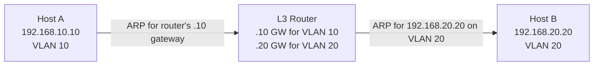

# How to Understand ARP in VLAN Environments

Author: [nawazdhandala](https://www.github.com/nawazdhandala)

Tags: Networking, ARP, VLAN, Switching, IPv4

Description: Learn how ARP works in VLAN-segmented networks, including inter-VLAN routing, ARP flooding, and proxy ARP considerations.

## ARP and VLAN Basics

VLANs segment a physical network into multiple logical broadcast domains. Since ARP is a broadcast protocol, ARP requests are **confined to a single VLAN** - they cannot cross VLAN boundaries without help.

```text
VLAN 10 (192.168.10.0/24)   ←→ VLAN 20 (192.168.20.0/24)
  ARP broadcasts stay in VLAN 10     ARP broadcasts stay in VLAN 20
  Hosts can only ARP for 192.168.10.x  Hosts can only ARP for 192.168.20.x
```

## ARP Within a VLAN

All hosts in the same VLAN share the same broadcast domain. ARP works normally:

1. Host in VLAN 10 wants 192.168.10.20
2. Broadcasts ARP Request on VLAN 10
3. All VLAN 10 hosts receive it
4. Target replies with its MAC

## Inter-VLAN Communication Requires a Router

To communicate between VLANs, packets must go through a layer 3 device (router or L3 switch). When Host A (VLAN 10) wants to reach Host B (VLAN 20):



Host A sends traffic to its default gateway MAC (within VLAN 10). The router then forwards to VLAN 20, doing its own ARP for the destination there.

## Router-on-a-Stick (VLAN Trunking)

A single router interface with VLAN sub-interfaces:

```bash
# Linux with VLAN sub-interfaces

# Create VLAN 10 sub-interface
ip link add link eth1 name eth1.10 type vlan id 10
ip addr add 192.168.10.1/24 dev eth1.10
ip link set eth1.10 up

# Create VLAN 20 sub-interface
ip link add link eth1 name eth1.20 type vlan id 20
ip addr add 192.168.20.1/24 dev eth1.20
ip link set eth1.20 up

# Enable routing
sysctl -w net.ipv4.ip_forward=1
```

Now the router performs ARP on each VLAN sub-interface independently.

## ARP and VLAN Tags

ARP packets in a VLAN-trunked environment are tagged with 802.1Q headers:

```text
Ethernet Header:
  Destination: ff:ff:ff:ff:ff:ff
  Source: host_mac
  EtherType: 0x8100 (802.1Q)

802.1Q Tag:
  VLAN ID: 10
  Priority: 0

ARP Payload: (standard ARP)
```

## Proxy ARP Across VLANs

If proxy ARP is enabled on a router, it can respond to ARP requests on behalf of hosts in other subnets, making inter-VLAN routing transparent to clients:

```bash
# Enable proxy ARP on a Linux router interface
echo 1 > /proc/sys/net/ipv4/conf/eth1.10/proxy_arp
```

**Caution**: Proxy ARP can lead to large ARP tables and should be used carefully.

## VLAN ARP Flooding Issue

When a switch does not know the destination MAC, it floods the frame to all ports in the VLAN. Excessive ARP broadcasts can cause:

- High CPU on switches (ARP storms)
- Performance degradation for all hosts in the VLAN
- Security exposure (all hosts see all ARP broadcasts)

Mitigation: Enable ARP proxy/suppression at the gateway, or use /24 or smaller VLANs.

## Checking VLAN ARP on Linux

```bash
# Show ARP entries per interface (VLAN sub-interfaces)
ip neigh show dev eth1.10
ip neigh show dev eth1.20

# View VLAN interfaces
ip link show type vlan
```

## Key Takeaways

- ARP broadcasts are limited to their VLAN's broadcast domain.
- Inter-VLAN communication requires a layer 3 router performing ARP on each VLAN.
- Router-on-a-stick creates per-VLAN sub-interfaces on a trunk link.
- ARP floods in large VLANs can cause performance issues; keep VLANs small.

**Related Reading:**

- [How to Configure Proxy ARP on a Router](https://oneuptime.com/blog/post/2026-03-20-configure-proxy-arp-linux-ipv4/view)
- [How to Understand ARP Broadcast Domain Boundaries](https://oneuptime.com/blog/post/2026-03-20-arp-broadcast-domain-boundaries/view)
- [How to Mitigate ARP Storms on a Network](https://oneuptime.com/blog/post/2026-03-20-mitigate-arp-storms/view)
