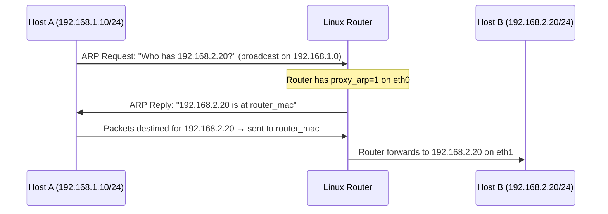

# How to Configure ARP Proxy for Subnets Without Routing

Author: [nawazdhandala](https://www.github.com/nawazdhandala)

Tags: Networking, ARP, Proxy ARP, Linux, Routing

Description: Learn how to use proxy ARP on a Linux router to provide connectivity to subnets that cannot be reached by standard routing.

## What Is Proxy ARP?

Proxy ARP allows a router to respond to ARP requests on behalf of hosts in another subnet. The router answers ARP queries with its own MAC address, then forwards the actual packets to the destination.

**Use cases:**

- Connecting subnets without configuring routes on end hosts
- Migration scenarios where hosts cannot be immediately re-addressed
- Transparent routing between adjacent subnets
- Some VPN and tunneling scenarios

## How Proxy ARP Works



## Enabling Proxy ARP on Linux

```bash
# Enable proxy ARP on the interface facing Host A

echo 1 > /proc/sys/net/ipv4/conf/eth0/proxy_arp

# Or with sysctl
sudo sysctl -w net.ipv4.conf.eth0.proxy_arp=1

# Enable on all interfaces (use with caution)
sudo sysctl -w net.ipv4.conf.all.proxy_arp=1
```

## Full Example: Two Subnets Without Routes on End Hosts

### Setup

```text
eth0: 192.168.1.1/24  (LAN A)
eth1: 192.168.2.1/24  (LAN B)
```

Both LANs use the router as the default gateway, but hosts in LAN A want to reach LAN B directly without configuring routes.

### Configuration

```bash
# On the Linux router:

# Enable IP forwarding
sysctl -w net.ipv4.ip_forward=1

# Enable proxy ARP on both interfaces
sysctl -w net.ipv4.conf.eth0.proxy_arp=1
sysctl -w net.ipv4.conf.eth1.proxy_arp=1
```

Now when Host A (192.168.1.10) ARPs for Host B (192.168.2.20):
- Router receives the ARP on eth0
- Router checks routing table: knows 192.168.2.0/24 is on eth1
- Router replies with its own MAC for eth0
- Host A sends traffic to Router, which forwards to Host B

## Selective Proxy ARP with arp_proxy_delay

Linux proxy ARP has a delay parameter to avoid unnecessary proxy responses:

```bash
# View current delay (in jiffies, usually 100 = 1 second)
cat /proc/sys/net/ipv4/conf/eth0/proxy_arp_pvlan
```

## Persistent Configuration

```bash
cat >> /etc/sysctl.conf << 'EOF'
net.ipv4.ip_forward = 1
net.ipv4.conf.eth0.proxy_arp = 1
net.ipv4.conf.eth1.proxy_arp = 1
EOF
sudo sysctl -p
```

## Caveats and Risks

1. **ARP table growth**: The router must maintain ARP entries for all hosts on both sides.
2. **Security concerns**: Proxy ARP can mask routing problems and complicate troubleshooting.
3. **Flat network effect**: Subnets become effectively flat, increasing broadcast domain size.
4. **Not a substitute for routing**: Use proper routing configurations where possible.

## Verifying Proxy ARP

```bash
# From Host A, ping Host B and check if the MAC in ARP table is the router's MAC
# On Host A:
ping -c 1 192.168.2.20
arp -n 192.168.2.20
# Should show: 192.168.2.20  ether  [router_eth0_mac]

# Confirm proxy ARP is responding (on router):
tcpdump -n -e arp -i eth0 | grep "192.168.2"
```

## Key Takeaways

- Proxy ARP allows a router to answer ARP requests on behalf of hosts in other subnets.
- Enable with `sysctl -w net.ipv4.conf.eth0.proxy_arp=1` on Linux.
- IP forwarding must also be enabled for packets to actually be forwarded.
- Use proxy ARP sparingly; it masks routing complexity and can cause issues in large networks.

**Related Reading:**

- [How to Configure Proxy ARP on a Router](https://oneuptime.com/blog/post/2026-03-20-configure-proxy-arp-linux-ipv4/view)
- [How to Understand ARP in VLAN Environments](https://oneuptime.com/blog/post/2026-03-20-arp-in-vlan-environments/view)
- [How to Set Up IP Forwarding on Linux](https://oneuptime.com/blog/post/2026-03-20-ip-forwarding-linux/view)
