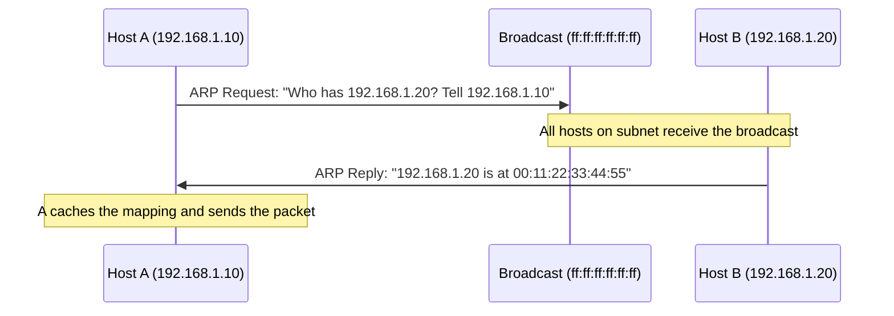

# How to Understand ARP Request and Reply Messages

Author: [nawazdhandala](https://www.github.com/nawazdhandala)

Tags: Networking, ARP, IPv4, Packet Analysis

Description: Learn the structure and flow of ARP request and reply messages, including packet fields and the resolution process.

## ARP Overview

ARP (Address Resolution Protocol) resolves IPv4 addresses to MAC addresses. When a host needs to send a packet to an IP on the same subnet but doesn't know the MAC, it broadcasts an ARP Request and waits for an ARP Reply.

## ARP Message Flow



## ARP Packet Structure

ARP packets are 28 bytes for IPv4/Ethernet:

| Field | Size | Description |
|-------|------|-------------|
| Hardware Type | 2 bytes | 1 = Ethernet |
| Protocol Type | 2 bytes | 0x0800 = IPv4 |
| Hardware Addr Len | 1 byte | 6 (MAC = 6 bytes) |
| Protocol Addr Len | 1 byte | 4 (IPv4 = 4 bytes) |
| Operation | 2 bytes | 1 = Request, 2 = Reply |
| Sender MAC | 6 bytes | Sender's MAC address |
| Sender IP | 4 bytes | Sender's IPv4 address |
| Target MAC | 6 bytes | Target MAC (00:00... in request) |
| Target IP | 4 bytes | Target IPv4 address |

## ARP Request

- **Destination MAC**: `ff:ff:ff:ff:ff:ff` (broadcast)
- **Operation**: 1 (Request)
- **Target MAC**: `00:00:00:00:00:00` (unknown, asking)
- **Target IP**: IP being resolved

```
ARP Request:
  Who has 192.168.1.20? Tell 192.168.1.10
  Sender MAC:  aa:bb:cc:dd:ee:01
  Sender IP:   192.168.1.10
  Target MAC:  00:00:00:00:00:00  (unknown)
  Target IP:   192.168.1.20
```

## ARP Reply

- **Destination MAC**: Unicast back to requester
- **Operation**: 2 (Reply)
- **Sender MAC**: The actual MAC of the target
- **Target MAC**: The requester's MAC

```
ARP Reply:
  192.168.1.20 is at 00:11:22:33:44:55
  Sender MAC:  00:11:22:33:44:55
  Sender IP:   192.168.1.20
  Target MAC:  aa:bb:cc:dd:ee:01
  Target IP:   192.168.1.10
```

## Crafting ARP Messages with Scapy

```python
from scapy.all import ARP, Ether, srp, sendp

# Build ARP Request
def arp_request(target_ip, iface='eth0'):
    ether = Ether(dst='ff:ff:ff:ff:ff:ff')  # broadcast
    arp = ARP(pdst=target_ip, op=1)          # op=1: request
    packet = ether / arp
    result, _ = srp(packet, timeout=2, iface=iface, verbose=False)
    for _, rcv in result:
        print(f"IP: {rcv[ARP].psrc}  MAC: {rcv[ARP].hwsrc}")

arp_request('192.168.1.20')

# Craft an ARP Reply (for testing)
def send_arp_reply(target_ip, target_mac, spoofed_ip, iface='eth0'):
    pkt = Ether(dst=target_mac) / ARP(
        op=2,          # reply
        psrc=spoofed_ip,
        pdst=target_ip,
        hwdst=target_mac
    )
    sendp(pkt, iface=iface, verbose=False)
```

## Capturing ARP with tcpdump

```bash
# Capture all ARP traffic
tcpdump -n -e arp

# Capture only ARP requests
tcpdump -n -e 'arp[6:2] = 1'

# Capture only ARP replies
tcpdump -n -e 'arp[6:2] = 2'
```

## Key Takeaways

- ARP requests are broadcast; ARP replies are unicast.
- The Operation field (1=request, 2=reply) distinguishes message types.
- The Target MAC in a request is all zeros because it is not yet known.
- Both sender MAC and IP are included so the target can update its own cache upon receiving the request.

**Related Reading:**

- [How to Understand How ARP Maps IP Addresses to MAC Addresses](https://oneuptime.com/blog/post/2026-03-20-how-arp-maps-ip-to-mac-addresses/view)
- [How to Understand Gratuitous ARP and Its Uses](https://oneuptime.com/blog/post/2026-03-20-gratuitous-arp-uses/view)
- [How to Analyze ARP Traffic with Wireshark](https://oneuptime.com/blog/post/2026-03-20-analyze-arp-wireshark/view)
