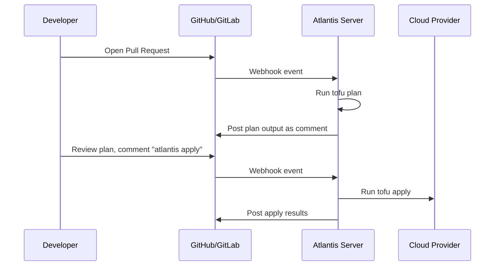

# How to Use Atlantis for Pull Request Automation with OpenTofu

Author: [nawazdhandala](https://www.github.com/nawazdhandala)

Tags: OpenTofu, Atlantis, Pull Request Automation, GitOps, CI/CD, Infrastructure as Code

Description: A step-by-step guide to configuring Atlantis to automatically run OpenTofu plan and apply operations in response to pull requests, enabling a GitOps workflow for infrastructure changes.

## Introduction

Atlantis is an open-source tool that enables GitOps workflows for infrastructure-as-code by automatically running `tofu plan` on pull requests and `tofu apply` on merge. This guide walks through setting up Atlantis with OpenTofu so your team can review infrastructure changes directly in pull request comments before they reach production.

## How Atlantis Works



## Installing Atlantis

The easiest way to run Atlantis is via Docker or Kubernetes. Here is a minimal Docker Compose setup:

```yaml
# docker-compose.yml
version: "3"
services:
  atlantis:
    image: ghcr.io/runatlantis/atlantis:latest
    ports:
      - "4141:4141"
    environment:
      # GitHub credentials
      ATLANTIS_GH_USER: "your-github-bot-user"
      ATLANTIS_GH_TOKEN: "ghp_yourtokenhere"
      ATLANTIS_GH_WEBHOOK_SECRET: "a-secret-string"
      # Where Atlantis is reachable from GitHub
      ATLANTIS_ATLANTIS_URL: "https://atlantis.yourcompany.com"
      # Repos that can use Atlantis
      ATLANTIS_REPO_ALLOWLIST: "github.com/yourorg/*"
    volumes:
      - ./repos:/home/atlantis
```

## Configuring Atlantis for OpenTofu

By default Atlantis calls `terraform`. Override this with the `atlantis.yaml` workflow configuration:

```yaml
# atlantis.yaml - place at the root of your repo
version: 3

# Define a custom workflow that calls tofu instead of terraform
workflows:
  opentofu:
    plan:
      steps:
        - run: tofu init -input=false
        - run: tofu plan -input=false -out=$PLANFILE
    apply:
      steps:
        - run: tofu apply -input=false $PLANFILE

projects:
  - name: production-vpc
    dir: environments/production/vpc
    workflow: opentofu
    autoplan:
      when_modified: ["*.tf", "../../../modules/**/*.tf"]
      enabled: true

  - name: production-eks
    dir: environments/production/eks
    workflow: opentofu
    autoplan:
      when_modified: ["*.tf"]
      enabled: true
```

## Setting the ATLANTIS_TERRAFORM_COMMAND Environment Variable

An alternative to custom workflows is pointing Atlantis to the `tofu` binary:

```bash
# Tell Atlantis which binary to use
export ATLANTIS_TERRAFORM_COMMAND=/usr/local/bin/tofu

# Or in docker-compose:
# environment:
#   ATLANTIS_TERRAFORM_COMMAND: /usr/local/bin/tofu
```

## Server-Side Repo Configuration

For centralized policy, configure allowed repos and workflow defaults in the server config:

```yaml
# server-atlantis.yaml
repos:
  - id: "github.com/yourorg/*"
    # Allow teams to override the workflow in their atlantis.yaml
    allow_custom_workflows: true
    # Require PR to be approved before apply
    apply_requirements:
      - approved
      - mergeable
    # Default workflow
    workflow: opentofu

workflows:
  opentofu:
    plan:
      steps:
        - run: tofu init -input=false
        - run: tofu plan -input=false -out=$PLANFILE
    apply:
      steps:
        - run: tofu apply -input=false $PLANFILE
```

## Using Atlantis Commands in Pull Requests

Once Atlantis is running, team members interact with infrastructure through PR comments:

```
# Trigger a plan manually
atlantis plan

# Plan only a specific project
atlantis plan -p production-vpc

# Apply after the plan looks good
atlantis apply

# Apply a specific project
atlantis apply -p production-vpc

# Unlock if a plan is stale
atlantis unlock
```

## Locking and Preventing Concurrent Changes

Atlantis automatically acquires a lock per project when a plan runs. This prevents two PRs from applying conflicting changes simultaneously. The lock is released when the PR is merged, closed, or manually unlocked.

## Conclusion

Atlantis brings pull request-driven infrastructure workflows to OpenTofu, giving teams visibility into planned changes and enforced approval gates before any resource is modified. By customizing the workflow to call `tofu` instead of `terraform`, you get the full benefit of OpenTofu's open-source features within your existing GitOps process.
