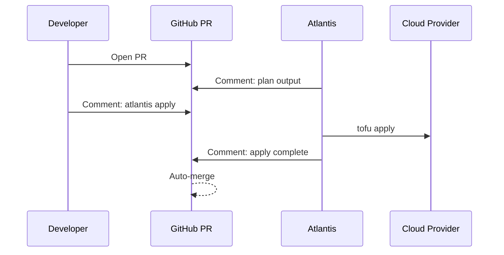

# How to Use Atlantis for Team OpenTofu Workflows

Author: [nawazdhandala](https://www.github.com/nawazdhandala)

Tags: OpenTofu, Atlantis, Pull Requests, GitOps, Team Workflow, Infrastructure as Code

Description: Learn how to set up Atlantis to automate OpenTofu plan and apply workflows directly from GitHub pull request comments, enabling GitOps for infrastructure with audit trails and approval gates.

---

Atlantis is a self-hosted PR automation tool that runs `tofu plan` and `tofu apply` in response to pull request comments. It keeps the plan/apply cycle inside the PR, creating a clear audit trail of who approved and applied each change.

## Atlantis Workflow



## Atlantis Configuration

```yaml
# atlantis.yaml — project configuration
version: 3
automerge: true
delete_source_branch_on_merge: true

projects:
  - name: production
    dir: environments/production
    workspace: default
    terraform_version: v1.6.0
    autoplan:
      when_modified:
        - "*.tf"
        - "*.tfvars"
        - "../modules/**/*.tf"
      enabled: true
    apply_requirements:
      - approved
      - mergeable
    workflow: production

  - name: staging
    dir: environments/staging
    workspace: default
    autoplan:
      when_modified: ["*.tf", "*.tfvars"]
      enabled: true
    apply_requirements:
      - approved

workflows:
  production:
    plan:
      steps:
        - init
        - plan:
            extra_args: ["-var-file=production.tfvars"]
    apply:
      steps:
        - apply:
            extra_args: ["-var-file=production.tfvars"]
```

## Deploying Atlantis on Kubernetes

```hcl
# atlantis.tf
resource "helm_release" "atlantis" {
  name             = "atlantis"
  repository       = "https://runatlantis.github.io/helm-charts"
  chart            = "atlantis"
  version          = "4.23.0"
  namespace        = "atlantis"
  create_namespace = true

  values = [
    yamlencode({
      atlantisUrl = "https://atlantis.${var.domain}"

      github = {
        user   = var.github_user
        secret = var.webhook_secret
      }

      repoAllowlist = "github.com/myorg/*"

      orgAllowlist = "github.com/myorg"

      requireApproval = true
      requireMergeable = true

      environmentSecrets = [
        { name = "GITHUB_TOKEN", secretName = "atlantis-secrets", secretKey = "github-token" },
        { name = "AWS_ACCESS_KEY_ID", secretName = "atlantis-secrets", secretKey = "aws-access-key-id" },
        { name = "AWS_SECRET_ACCESS_KEY", secretName = "atlantis-secrets", secretKey = "aws-secret-access-key" },
      ]

      resources = {
        requests = { cpu = "100m", memory = "256Mi" }
        limits   = { cpu = "500m", memory = "512Mi" }
      }

      persistence = {
        enabled      = true
        storageClass = "gp3"
        size         = "5Gi"
      }
    })
  ]
}
```

## PR Comment Commands

```bash
# Trigger a plan manually
atlantis plan

# Plan with specific variables
atlantis plan -- -var="instance_type=t3.large"

# Apply after approval
atlantis apply

# Apply specific project
atlantis apply -p production

# Discard the pending plan
atlantis unlock
```

## Repo-Level Webhook Configuration

```hcl
resource "github_repository_webhook" "atlantis" {
  repository = var.infra_repo

  configuration {
    url          = "https://atlantis.${var.domain}/events"
    content_type = "json"
    secret       = var.webhook_secret
    insecure_ssl = false
  }

  events = [
    "issue_comment",
    "pull_request",
    "pull_request_review",
    "push",
  ]
}
```

## Best Practices

- Set `apply_requirements: [approved, mergeable]` in `atlantis.yaml` to prevent applies without PR approval and passing CI.
- Use `autoplan: enabled: true` with `when_modified` patterns so Atlantis plans automatically when relevant files change.
- Deploy Atlantis with persistent storage — it stores plan files between plan and apply operations.
- Use separate webhook secrets per repository for security; rotate them like any credential.
- Enable `automerge: true` for non-production environments to streamline low-risk changes.
