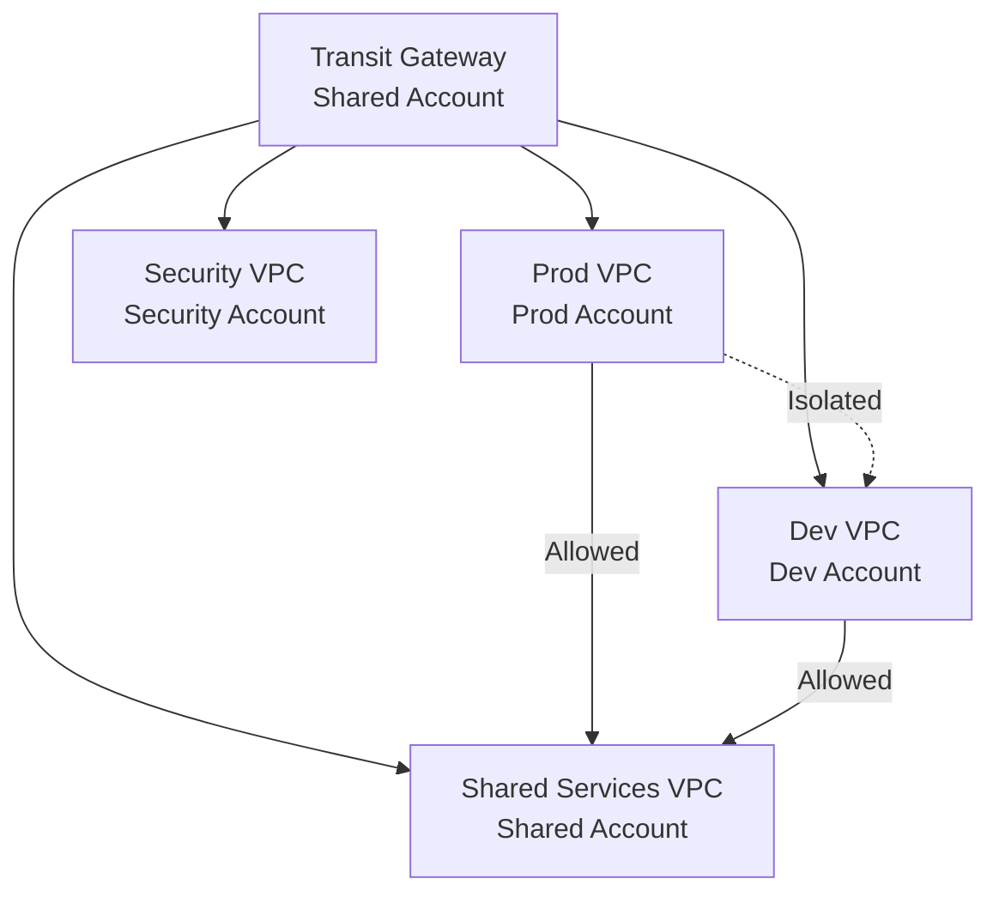

# How to Attach VPCs to Transit Gateway with OpenTofu

Author: [nawazdhandala](https://www.github.com/nawazdhandala)

Tags: OpenTofu, AWS, Transit Gateway, VPC, VPC Attachment, Multi-Account, Networking, Infrastructure as Code

Description: Learn how to attach multiple VPCs to an AWS Transit Gateway using OpenTofu, including cross-account attachments, route table configuration, and network segmentation patterns.

---

Attaching VPCs to a Transit Gateway enables centralized routing between multiple VPCs and on-premises networks. OpenTofu manages attachments from both the same account and cross-account scenarios using Resource Access Manager, with explicit route table associations for network segmentation.

## Multi-VPC Attachment Pattern



## Same-Account VPC Attachments

```hcl
# attachments.tf

locals {
  vpcs = {
    production = {
      vpc_id     = var.production_vpc_id
      subnet_ids = var.production_tgw_subnet_ids
      cidr       = var.production_vpc_cidr
    }
    development = {
      vpc_id     = var.development_vpc_id
      subnet_ids = var.development_tgw_subnet_ids
      cidr       = var.development_vpc_cidr
    }
    shared = {
      vpc_id     = var.shared_vpc_id
      subnet_ids = var.shared_tgw_subnet_ids
      cidr       = var.shared_vpc_cidr
    }
  }
}

resource "aws_ec2_transit_gateway_vpc_attachment" "main" {
  for_each = local.vpcs

  transit_gateway_id = var.transit_gateway_id
  vpc_id             = each.value.vpc_id
  subnet_ids         = each.value.subnet_ids

  dns_support  = "enable"
  ipv6_support = "disable"

  transit_gateway_default_route_table_association = false
  transit_gateway_default_route_table_propagation = false

  tags = {
    Name        = "${var.prefix}-tgw-${each.key}"
    Environment = each.key
    ManagedBy   = "opentofu"
  }
}
```

## Cross-Account VPC Attachments

```hcl
# cross_account_attachments.tf

# Step 1: In the TGW account — share the TGW with other accounts
resource "aws_ram_resource_share" "tgw" {
  name                      = "${var.prefix}-tgw"
  allow_external_principals = false
}

resource "aws_ram_resource_association" "tgw" {
  resource_arn       = var.transit_gateway_arn
  resource_share_arn = aws_ram_resource_share.tgw.arn
}

resource "aws_ram_principal_association" "accounts" {
  for_each = toset(var.member_account_ids)

  principal          = each.value
  resource_share_arn = aws_ram_resource_share.tgw.arn
}

# Step 2: In the spoke account — create the attachment
# This is typically in a separate terraform configuration per account

provider "aws" {
  alias = "spoke_account"
  assume_role {
    role_arn = "arn:aws:iam::${var.spoke_account_id}:role/TerraformRole"
  }
}

resource "aws_ec2_transit_gateway_vpc_attachment" "spoke" {
  provider = aws.spoke_account

  transit_gateway_id = var.transit_gateway_id  # TGW from central account
  vpc_id             = var.spoke_vpc_id
  subnet_ids         = var.spoke_tgw_subnet_ids

  transit_gateway_default_route_table_association = false
  transit_gateway_default_route_table_propagation = false

  tags = {
    Name    = "${var.prefix}-spoke-attachment"
    Account = var.spoke_account_id
  }
}

# Step 3: In the TGW account — accept the cross-account attachment
resource "aws_ec2_transit_gateway_vpc_attachment_accepter" "spoke" {
  transit_gateway_attachment_id = aws_ec2_transit_gateway_vpc_attachment.spoke.id

  transit_gateway_default_route_table_association = false
  transit_gateway_default_route_table_propagation = false

  tags = {
    Name = "Accepted attachment from ${var.spoke_account_id}"
  }

  depends_on = [aws_ec2_transit_gateway_vpc_attachment.spoke]
}
```

## Route Table Management

```hcl
# route_management.tf

# Segmented route tables — production can't reach dev, both can reach shared
resource "aws_ec2_transit_gateway_route_table" "by_env" {
  for_each = toset(["production", "development"])

  transit_gateway_id = var.transit_gateway_id

  tags = {
    Name = "${var.prefix}-tgw-rt-${each.key}"
  }
}

resource "aws_ec2_transit_gateway_route_table" "shared" {
  transit_gateway_id = var.transit_gateway_id

  tags = {
    Name = "${var.prefix}-tgw-rt-shared"
  }
}

# Associate each VPC with its route table
resource "aws_ec2_transit_gateway_route_table_association" "by_env" {
  for_each = toset(["production", "development"])

  transit_gateway_attachment_id  = aws_ec2_transit_gateway_vpc_attachment.main[each.key].id
  transit_gateway_route_table_id = aws_ec2_transit_gateway_route_table.by_env[each.key].id
}

resource "aws_ec2_transit_gateway_route_table_association" "shared" {
  transit_gateway_attachment_id  = aws_ec2_transit_gateway_vpc_attachment.main["shared"].id
  transit_gateway_route_table_id = aws_ec2_transit_gateway_route_table.shared.id
}

# Add routes to shared services from all environments
resource "aws_ec2_transit_gateway_route" "to_shared" {
  for_each = toset(["production", "development"])

  destination_cidr_block         = var.shared_vpc_cidr
  transit_gateway_attachment_id  = aws_ec2_transit_gateway_vpc_attachment.main["shared"].id
  transit_gateway_route_table_id = aws_ec2_transit_gateway_route_table.by_env[each.key].id
}

# Shared services can respond to all VPCs
resource "aws_ec2_transit_gateway_route" "from_shared_to_prod" {
  destination_cidr_block         = var.production_vpc_cidr
  transit_gateway_attachment_id  = aws_ec2_transit_gateway_vpc_attachment.main["production"].id
  transit_gateway_route_table_id = aws_ec2_transit_gateway_route_table.shared.id
}

resource "aws_ec2_transit_gateway_route" "from_shared_to_dev" {
  destination_cidr_block         = var.development_vpc_cidr
  transit_gateway_attachment_id  = aws_ec2_transit_gateway_vpc_attachment.main["development"].id
  transit_gateway_route_table_id = aws_ec2_transit_gateway_route_table.shared.id
}
```

## VPC Route Table Updates

```hcl
# vpc_routes.tf — update VPC route tables to route inter-VPC traffic via TGW

resource "aws_route" "private_to_shared" {
  count = length(var.private_route_table_ids)

  route_table_id         = var.private_route_table_ids[count.index]
  destination_cidr_block = var.shared_vpc_cidr
  transit_gateway_id     = var.transit_gateway_id

  depends_on = [aws_ec2_transit_gateway_vpc_attachment.main]
}
```

## Best Practices

- Create dedicated `/28` or `/27` subnets per AZ for TGW attachments — these subnets are exclusively used by Transit Gateway and should not contain workload resources.
- Use `transit_gateway_default_route_table_association = false` and `propagation = false` on all attachments — managing route tables explicitly gives you control over which VPCs can communicate.
- For cross-account attachments, use Resource Access Manager within an AWS Organization — this avoids the complexity of cross-account accepters and reduces the risk of routing errors.
- Structure TGW route tables around security boundaries, not just team ownership — production and development should be in separate route tables even if managed by the same team.
- After adding attachments, verify connectivity with `traceroute` before updating production route tables — this confirms the attachment, route table, and VPC routes are all configured correctly.
