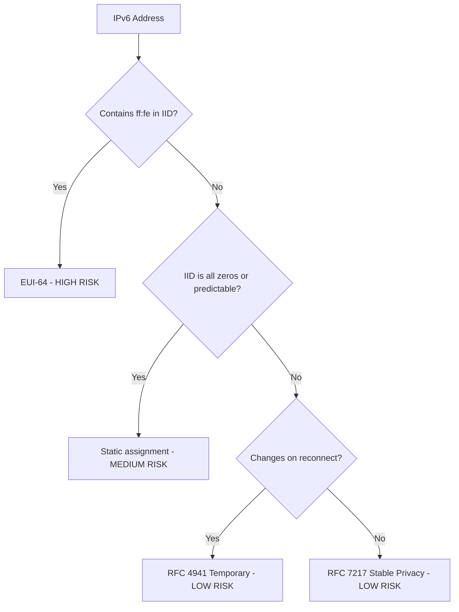

# How to Audit IPv6 Addresses for Tracking Risks

Author: [nawazdhandala](https://www.github.com/nawazdhandala)

Tags: IPv6, Security, Audit, Privacy, EUI-64, Networking

Description: Conduct a thorough audit of IPv6 addresses across your infrastructure to identify EUI-64 addresses and other tracking risks that could expose device identities.

## Introduction

An IPv6 address audit identifies which systems in your network are broadcasting their hardware MAC address via EUI-64 Interface Identifiers, which poses a persistent tracking risk. This guide covers manual inspection, scripted fleet audits, and network-level scanning approaches.

## Understanding the EUI-64 Signature

EUI-64 addresses always follow a predictable pattern in the Interface Identifier (IID): the 5th and 6th bytes (counting from the start of the IID) are always `ff:fe`.

In a full IPv6 address, this appears as `xxxx:xxff:fexx:xxxx` in the last four groups.

```bash
# Quick check: does an address contain the ff:fe EUI-64 signature?

ADDRESS="2001:db8::021a:2bff:fe3c:4d5e"
if echo "$ADDRESS" | grep -qiE ":[0-9a-f]{0,2}ff:fe[0-9a-f]{0,2}:"; then
    echo "WARNING: EUI-64 address detected in $ADDRESS"
else
    echo "OK: No EUI-64 signature found"
fi
```

## Script: Audit All Addresses on a Single Host

```bash
#!/bin/bash
# audit_ipv6_host.sh
# Audit all global IPv6 addresses on the current host for tracking risks

echo "=== IPv6 Address Tracking Audit ==="
echo "Host: $(hostname)"
echo "Date: $(date)"
echo ""

RISKS_FOUND=0

while IFS= read -r line; do
    addr=$(echo "$line" | awk '{print $2}' | cut -d/ -f1)
    iface=$(echo "$line" | awk '{print $NF}')

    # Skip link-local and loopback
    [[ "$addr" =~ ^fe80 ]] && continue
    [[ "$addr" =~ ^::1$ ]] && continue

    # Check for EUI-64 signature (ffXX:feXX pattern in IID)
    if echo "$addr" | grep -qiE ":[0-9a-f]{0,2}[0-9a-f]{2}ff:fe[0-9a-f]{2}[0-9a-f]{0,2}:"; then
        echo "[RISK] EUI-64 address on $iface: $addr"
        RISKS_FOUND=$((RISKS_FOUND + 1))
    else
        echo "[OK]   $iface: $addr"
    fi
done < <(ip -6 addr show scope global | grep inet6)

echo ""
echo "Total EUI-64 risk addresses found: $RISKS_FOUND"
```

## Script: Network-Wide Audit Using nmap

```bash
#!/bin/bash
# audit_ipv6_network.sh
# Scan a network segment and check for EUI-64 addresses

NETWORK="2001:db8:1::/64"

echo "Scanning $NETWORK for IPv6 hosts..."
# Discover live hosts in the subnet
nmap -6 -sn "$NETWORK" -oG - 2>/dev/null | awk '/Up$/{print $2}' | while read -r addr; do
    # Check for EUI-64 pattern
    if echo "$addr" | grep -qiE ":[0-9a-f]{0,2}ff:fe[0-9a-f]{0,2}:"; then
        # Try to recover the MAC address from the EUI-64
        IID=$(echo "$addr" | awk -F: '{print $(NF-3)":"$(NF-2)":"$(NF-1)":"$NF}')
        echo "EUI-64 detected: $addr"
        echo "  IID: $IID"
        # Flip bit 7 of first byte to recover first MAC byte
        FIRST=$(echo "$IID" | cut -d: -f1)
        FLIPPED=$(printf "%02x" $((16#$FIRST ^ 0x02)))
        echo "  Recovered MAC (approx): $FLIPPED:$(echo "$IID" | cut -d: -f2 | cut -c1-2):$(echo "$IID" | cut -d: -f2 | cut -c3-4):$(echo "$IID" | cut -d: -f3 | cut -c3-4):$(echo "$IID" | cut -d: -f4 | cut -c1-2):$(echo "$IID" | cut -d: -f4 | cut -c3-4)"
    fi
done
```

## Python Audit Tool with CSV Report

```python
#!/usr/bin/env python3
# ipv6_audit.py
# Audit a list of IPv6 addresses and generate a CSV report

import re
import csv
import sys

def is_eui64(addr: str) -> bool:
    """Check if an IPv6 address contains an EUI-64 IID."""
    # Expand the address for reliable checking
    # EUI-64 signature: bytes 4-5 of IID are ff:fe
    # In hex: the 5th and 6th 16-bit groups should contain fffe
    parts = addr.lower().split(":")
    if len(parts) != 8:
        return False  # Not a fully-expanded address
    # The IID is the last 4 groups
    iid = "".join(parts[4:])
    # Check for ff:fe at positions 4-5 (bytes 4 and 5 of the 8-byte IID)
    return iid[4:8] == "fffe"

def recover_mac(addr: str) -> str:
    """Recover MAC address from EUI-64 IPv6 address."""
    parts = addr.lower().split(":")
    iid = "".join(parts[4:])
    # Reverse the bit-flip on the first byte
    first_byte = int(iid[0:2], 16) ^ 0x02
    mac_bytes = [
        format(first_byte, "02x"),
        iid[2:4],
        iid[4:6],
        # Skip ff:fe (iid[6:10])
        iid[10:12],
        iid[12:14],
        iid[14:16],
    ]
    return ":".join(mac_bytes)

# Read addresses from stdin or file
addresses = [line.strip() for line in sys.stdin if line.strip()]

with open("ipv6_audit_report.csv", "w", newline="") as f:
    writer = csv.writer(f)
    writer.writerow(["Address", "Is EUI-64", "Recovered MAC", "Risk Level"])
    for addr in addresses:
        eui64 = is_eui64(addr)
        mac = recover_mac(addr) if eui64 else ""
        risk = "HIGH" if eui64 else "LOW"
        writer.writerow([addr, eui64, mac, risk])
        if eui64:
            print(f"RISK: {addr} -> MAC {mac}")

print("Report saved to ipv6_audit_report.csv")
```

## Interpreting Results



## Conclusion

Regular IPv6 address audits are essential to ensure that hardware MAC addresses are not being exposed through EUI-64 IIDs. The tools above provide a spectrum of approaches from quick one-liner checks to fleet-wide automated reporting. Schedule these audits regularly and integrate them into your security assessment process to maintain a strong IPv6 privacy posture.
