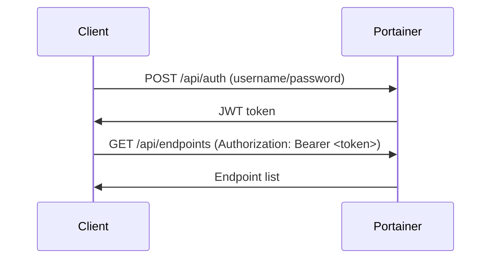

# How to Authenticate with the Portainer API Using JWT Tokens

Author: [nawazdhandala](https://www.github.com/nawazdhandala)

Tags: Portainer, API, JWT, Authentication, Automation

Description: Learn how to obtain and use JWT tokens to authenticate with the Portainer REST API for automation scripts.

## JWT Authentication Flow

Portainer's API uses JWT (JSON Web Tokens) for authentication. The flow is:



## Step 1: Obtain a JWT Token

```bash
# Authenticate and get a JWT token

curl -X POST "https://portainer.mycompany.com/api/auth" \
  -H "Content-Type: application/json" \
  -d '{
    "username": "admin",
    "password": "yourpassword"
  }'
```

Response:
```json
{
  "jwt": "eyJhbGciOiJIUzI1NiIsInR5cCI6IkpXVCJ9.eyJ1c2VybmFtZSI6ImFkbWluIiwicm9sZSI6MX0.example"
}
```

## Step 2: Extract the Token in a Script

```bash
#!/bin/bash
# Authenticate and store the JWT token

PORTAINER_URL="https://portainer.mycompany.com"
PORTAINER_USER="admin"
PORTAINER_PASS="yourpassword"

# Get the JWT token
TOKEN=$(curl -s -X POST "${PORTAINER_URL}/api/auth" \
  -H "Content-Type: application/json" \
  -d "{\"username\":\"${PORTAINER_USER}\",\"password\":\"${PORTAINER_PASS}\"}" \
  | jq -r '.jwt')

echo "Token obtained: ${TOKEN:0:20}..."  # Show only first 20 chars for security
```

## Step 3: Use the Token in API Calls

```bash
# Use the JWT token in subsequent API calls
TOKEN="your-jwt-token-here"

# List all environments
curl -s "https://portainer.mycompany.com/api/endpoints" \
  -H "Authorization: Bearer ${TOKEN}" | jq '.'

# Get Portainer settings
curl -s "https://portainer.mycompany.com/api/settings" \
  -H "Authorization: Bearer ${TOKEN}" | jq '.'
```

## Complete Python Example

```python
import requests
import json

class PortainerClient:
    def __init__(self, url, username, password):
        self.url = url.rstrip('/')
        self.token = None
        self._authenticate(username, password)

    def _authenticate(self, username, password):
        """Authenticate and store the JWT token."""
        response = requests.post(
            f"{self.url}/api/auth",
            json={"username": username, "password": password},
            verify=True  # Set to False only for self-signed certs in dev
        )
        response.raise_for_status()
        self.token = response.json()["jwt"]

    @property
    def headers(self):
        """Return auth headers for API calls."""
        return {"Authorization": f"Bearer {self.token}"}

    def get_endpoints(self):
        """List all Portainer environments."""
        response = requests.get(
            f"{self.url}/api/endpoints",
            headers=self.headers
        )
        response.raise_for_status()
        return response.json()

# Usage
client = PortainerClient(
    url="https://portainer.mycompany.com",
    username="admin",
    password="yourpassword"
)

environments = client.get_endpoints()
for env in environments:
    print(f"ID: {env['Id']}, Name: {env['Name']}, Type: {env['Type']}")
```

## JWT Token Expiry

Portainer JWT tokens expire after **8 hours** by default. For long-running scripts, re-authenticate when the token expires:

```bash
# Check if token is expired (decode JWT payload)
echo "your.jwt.token" | cut -d. -f2 | base64 -d 2>/dev/null | jq '.exp'
# Compare exp (Unix timestamp) with current time: date +%s
```

## Conclusion

JWT authentication is the primary method for Portainer API access in automation scripts. Always store tokens securely (not in code), handle expiry by re-authenticating, and consider using API tokens (access tokens) for long-lived integrations.
