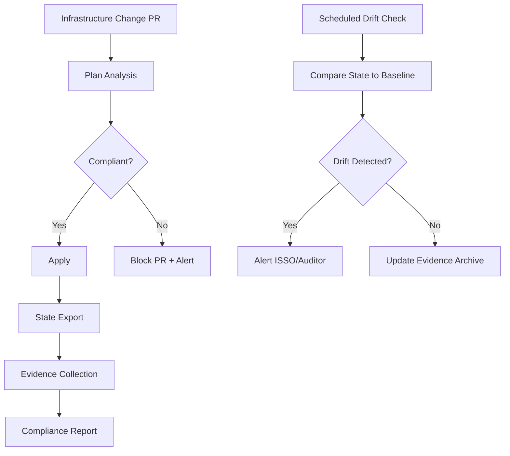

# How to Automate Compliance Audits with OpenTofu

Author: [nawazdhandala](https://www.github.com/nawazdhandala)

Tags: OpenTofu, Compliance Automation, Auditing, CI/CD, Infrastructure as Code

Description: Learn how to automate compliance audits with OpenTofu by integrating drift detection, policy checks, and evidence collection into continuous pipelines.

Manual compliance audits are expensive and infrequent. Automating them with OpenTofu-based pipelines makes compliance continuous: every change is checked against controls, evidence is collected automatically, and deviations are detected within hours rather than quarters.

## Compliance Automation Architecture



## Step 1: Policy-as-Code Checks at Plan Time

```python
#!/usr/bin/env python3
# compliance-check.py — check plan JSON for compliance violations

import json, sys

with open(sys.argv[1]) as f:
    plan = json.load(f)

violations = []

for change in plan.get("resource_changes", []):
    rtype  = change["type"]
    after  = change["change"].get("after") or {}
    actions = change["change"]["actions"]

    if "create" not in actions:
        continue

    # Check: S3 buckets must have versioning enabled (AC-3, AU-11)
    if rtype == "aws_s3_bucket" and not after.get("versioning"):
        violations.append(f"FAIL [AU-11] {change['address']}: S3 bucket versioning not enabled")

    # Check: RDS instances must be encrypted (SC-28)
    if rtype == "aws_db_instance" and not after.get("storage_encrypted"):
        violations.append(f"FAIL [SC-28] {change['address']}: RDS storage encryption not enabled")

    # Check: Security groups must not allow 0.0.0.0/0 on port 22
    if rtype == "aws_security_group":
        for rule in after.get("ingress", []):
            if "22" in str(rule.get("from_port", "")) and "0.0.0.0/0" in rule.get("cidr_blocks", []):
                violations.append(f"FAIL [AC-17] {change['address']}: SSH open to internet")

if violations:
    print("COMPLIANCE VIOLATIONS DETECTED:")
    for v in violations:
        print(f"  {v}")
    sys.exit(1)
else:
    print("All compliance checks passed.")
    sys.exit(0)
```

## Step 2: Drift Detection via Scheduled Plans

```yaml
# .github/workflows/compliance-drift.yml
name: Compliance Drift Detection

on:
  schedule:
    - cron: "0 */6 * * *"  # Every 6 hours

jobs:
  drift-check:
    runs-on: ubuntu-latest
    steps:
      - uses: actions/checkout@v4

      - name: Run Plan for Drift Detection
        id: plan
        run: |
          tofu init
          tofu plan -detailed-exitcode -out=tfplan || echo "exit_code=$?" >> $GITHUB_OUTPUT
          tofu show -json tfplan > plan.json

      - name: Check for Configuration Drift
        if: steps.plan.outputs.exit_code == '2'
        run: |
          echo "DRIFT DETECTED — infrastructure differs from code"
          jq -r '.resource_changes[] | select(.change.actions != ["no-op"]) | "\(.change.actions | join("+"))\t\(.address)"' plan.json
          exit 1

      - name: Alert on Drift
        if: failure()
        uses: slackapi/slack-github-action@v1
        with:
          webhook: ${{ secrets.SLACK_SECURITY_WEBHOOK }}
          payload: '{"text": "Infrastructure drift detected! Compliance audit required."}'
```

## Step 3: Automated Evidence Collection

```yaml
# .github/workflows/evidence-collection.yml
name: Monthly Compliance Evidence

on:
  schedule:
    - cron: "0 0 1 * *"

jobs:
  collect:
    runs-on: ubuntu-latest
    steps:
      - uses: actions/checkout@v4

      - name: Export State
        run: |
          tofu init
          tofu show -json > artifacts/state-$(date +%Y%m).json

      - name: Run Evidence Scripts
        run: |
          python3 scripts/generate-encryption-evidence.py artifacts/state-$(date +%Y%m).json
          python3 scripts/generate-access-control-evidence.py artifacts/state-$(date +%Y%m).json

      - name: Upload to Compliance Archive
        run: |
          aws s3 cp artifacts/ s3://compliance-evidence-archive/$(date +%Y/%m)/ --recursive
```

## Step 4: Generating Audit Reports

```bash
# Generate a comprehensive audit report
python3 scripts/evidence-report.py \
  --state-file artifacts/state-$(date +%Y%m).json \
  --output-dir reports/ \
  --format markdown

# Send to auditors
aws ses send-email \
  --from noreply@company.com \
  --to auditors@company.com \
  --subject "Monthly Compliance Report $(date +%B %Y)" \
  --body "Please find the attached compliance evidence report."
```

## Conclusion

Automating compliance audits with OpenTofu transforms a manual, quarterly process into a continuous, automated pipeline. Integrate policy-as-code checks at plan time to prevent non-compliant resources from being created, schedule drift detection runs to catch manual changes, and automate monthly evidence collection to maintain a continuous audit trail. This approach reduces audit preparation time from weeks to hours.
