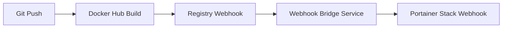

# How to Automate Docker Builds and Deployments with Portainer

Author: [nawazdhandala](https://www.github.com/nawazdhandala)

Tags: Portainer, Docker Build, Automation, CI/CD, Stack Webhooks, Docker Hub

Description: Learn how to automate Docker image builds and trigger automatic deployments to Portainer using registry webhooks and the Portainer API.

---

Fully automated Docker deployments involve three components: an automated image build trigger, a registry push, and a Portainer stack redeploy. This guide covers several approaches to connect these pieces.

## Approach 1: Portainer Git-Backed Auto Update

Portainer can poll a Git repository for stack changes and redeploy automatically. This is the simplest zero-CI approach:

1. In Portainer, create a stack from a **Git repository**.
2. Enable **Auto update** and set a polling interval (e.g., every 5 minutes).
3. Commit compose file changes to the repository - Portainer detects and applies them automatically.

For image updates, combine this with a CI step that updates the image tag in the compose file on commit.

## Approach 2: Registry Webhook → Portainer Webhook

Link a Docker Hub automated build to a Portainer stack webhook:



Docker Hub webhooks send a POST to a URL when a new image is pushed. Since Docker Hub sends a specific payload format, use a small bridge service to forward it to Portainer:

```bash
# Simple bridge using a serverless function or tiny Node.js app

# Docker Hub sends POST to your-bridge.example.com/hook
# Bridge forwards to Portainer webhook URL
curl -X POST "$PORTAINER_WEBHOOK_URL"
```

## Approach 3: Full Automation Script

A self-contained build-and-deploy script for use in any CI system or as a cron job:

```bash
#!/bin/bash
set -euo pipefail

REPO_DIR="/opt/my-app"
IMAGE_NAME="myregistry.example.com/my-app"
PORTAINER_URL="https://portainer.example.com"
STACK_NAME="my-app"
PORTAINER_USER="${PORTAINER_USER:-admin}"
PORTAINER_PASSWORD="${PORTAINER_PASSWORD:?PORTAINER_PASSWORD required}"

log() { echo "[$(date '+%Y-%m-%d %H:%M:%S')] $*"; }

# Pull latest code
cd "$REPO_DIR"
git pull origin main

# Build image with build number
BUILD_TAG="$(git rev-parse --short HEAD)"
log "Building $IMAGE_NAME:$BUILD_TAG"
docker build -t "$IMAGE_NAME:$BUILD_TAG" -t "$IMAGE_NAME:latest" .

# Push to registry
docker push "$IMAGE_NAME:$BUILD_TAG"
docker push "$IMAGE_NAME:latest"
log "Pushed $IMAGE_NAME:$BUILD_TAG"

# Authenticate with Portainer
TOKEN=$(curl -s -X POST "$PORTAINER_URL/api/auth" \
  -H "Content-Type: application/json" \
  -d "{\"Username\":\"$PORTAINER_USER\",\"Password\":\"$PORTAINER_PASSWORD\"}" \
  | jq -r .jwt)

# Get stack ID
STACK_ID=$(curl -s -H "Authorization: Bearer $TOKEN" \
  "$PORTAINER_URL/api/stacks" | \
  jq -r --arg name "$STACK_NAME" '.[] | select(.Name==$name) | .Id')

if [ -z "$STACK_ID" ]; then
  log "ERROR: Stack '$STACK_NAME' not found"
  exit 1
fi

# Trigger redeploy with latest images
curl -fsS -X POST \
  -H "Authorization: Bearer $TOKEN" \
  "$PORTAINER_URL/api/stacks/$STACK_ID/images/update?pullImage=true"

log "Deployment triggered for stack $STACK_NAME (ID: $STACK_ID)"
```

## Approach 4: Portainer API Token for Automation

Use a long-lived API token instead of username/password for automation:

```bash
# Create an API token in Portainer:
# My Account > Access Tokens > Add access token

# Use the token directly - no auth step needed
curl -s -X POST \
  -H "x-api-key: YOUR_API_TOKEN" \
  "$PORTAINER_URL/api/stacks/$STACK_ID/images/update?pullImage=true"
```

API tokens are more secure than passwords in CI because they can be scoped and revoked independently.

## Watching Deployment Logs

After triggering a redeploy, watch container logs to verify the new version started:

```bash
# Wait for the new container to start
sleep 5

# Stream logs from the newly deployed service
docker service logs --follow my-app_api 2>&1 | head -50
```

## Scheduling Nightly Rebuilds

Use cron to rebuild and redeploy nightly for base image security updates:

```bash
# /etc/cron.d/nightly-rebuild
0 2 * * * root /opt/scripts/build-and-deploy.sh >> /var/log/deploys.log 2>&1
```

This ensures base image patches (OS updates, library CVEs) are applied regularly even without code changes.
