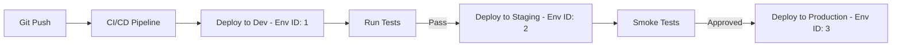

# How to Automate Multi-Environment Deployments with Portainer

Author: [nawazdhandala](https://www.github.com/nawazdhandala)

Tags: Portainer, CI/CD, Multi-Environment, DevOps, Deployment Automation, Docker

Description: Learn how to automate deployments across development, staging, and production Portainer environments using environment-specific configurations and CI/CD pipelines.

---

Multi-environment deployment automation ensures your application moves through development, staging, and production in a consistent, repeatable way. Portainer's environment model maps directly to this pattern: each environment (dev/staging/prod) has its own configuration, access controls, and stack variables. This guide shows how to automate across all three using the Portainer API.

---

## Environment Architecture



---

## Step 1: Set Up Environment-Specific Stack Variables

In Portainer, each environment has separate stack instances with different variables.

```yaml
# docker-compose.yml — single file, environment-specific vars injected by Portainer
version: "3.8"

services:
  webapp:
    image: myrepo/myapp:${IMAGE_TAG}
    restart: unless-stopped
    environment:
      APP_ENV: ${APP_ENV}
      DB_HOST: ${DB_HOST}
      LOG_LEVEL: ${LOG_LEVEL}
      REPLICAS: ${REPLICAS}
    deploy:
      replicas: ${REPLICAS:-1}
```

In each Portainer environment, configure these stack variables:

| Variable | Dev | Staging | Production |
|---|---|---|---|
| `APP_ENV` | `development` | `staging` | `production` |
| `DB_HOST` | `db-dev.internal` | `db-stage.internal` | `db-prod.internal` |
| `LOG_LEVEL` | `debug` | `info` | `warn` |
| `REPLICAS` | `1` | `2` | `5` |

---

## Step 2: Multi-Environment Deployment Script

```bash
#!/bin/bash
# deploy-all-envs.sh — promote a build through environments

PORTAINER_URL="https://portainer.example.com"
API_KEY="${PORTAINER_API_KEY}"
IMAGE_TAG="${1:-latest}"  # pass image tag as argument

# Environment configuration
declare -A ENV_STACKS=(
  ["dev"]="3"       # Portainer endpoint ID for dev
  ["staging"]="5"   # Portainer endpoint ID for staging
  ["prod"]="8"      # Portainer endpoint ID for production
)

deploy_to_environment() {
  local env_name="$1"
  local env_id="$2"
  local stack_id

  echo "=== Deploying to $env_name (endpoint $env_id) ==="

  # Find the stack ID for this environment
  stack_id=$(curl -s -H "X-API-Key: $API_KEY" \
    "$PORTAINER_URL/api/stacks?filters={\"EndpointID\":$env_id}" | \
    python3 -c "
import sys, json
stacks = json.load(sys.stdin)
for s in stacks:
    if s['Name'] == 'webapp':
        print(s['Id'])
        break
")

  if [ -z "$stack_id" ]; then
    echo "Stack not found for $env_name — deploying new stack"
    # Create stack if it doesn't exist
    curl -s -X POST \
      -H "X-API-Key: $API_KEY" \
      -H "Content-Type: application/json" \
      -d "{
        \"Name\": \"webapp\",
        \"StackFileContent\": $(cat docker-compose.yml | python3 -c "import sys,json; print(json.dumps(sys.stdin.read()))"),
        \"Env\": [
          {\"name\": \"IMAGE_TAG\", \"value\": \"$IMAGE_TAG\"},
          {\"name\": \"APP_ENV\", \"value\": \"$env_name\"}
        ]
      }" \
      "$PORTAINER_URL/api/stacks?type=1&method=string&endpointId=$env_id"
  else
    echo "Updating existing stack $stack_id"
    curl -s -X PUT \
      -H "X-API-Key: $API_KEY" \
      -H "Content-Type: application/json" \
      -d "{
        \"StackFileContent\": $(cat docker-compose.yml | python3 -c "import sys,json; print(json.dumps(sys.stdin.read()))"),
        \"Env\": [{\"name\": \"IMAGE_TAG\", \"value\": \"$IMAGE_TAG\"}],
        \"Prune\": true,
        \"PullImage\": true
      }" \
      "$PORTAINER_URL/api/stacks/$stack_id?endpointId=$env_id"
  fi
  echo "$env_name deployment triggered."
}

# Deploy to dev first
deploy_to_environment "dev" "${ENV_STACKS[dev]}"

echo ""
echo "Dev deployment complete. Run your integration tests, then:"
echo "  $0 $IMAGE_TAG staging     # to promote to staging"
echo "  $0 $IMAGE_TAG prod        # to promote to production"
```

---

## Step 3: GitHub Actions Multi-Environment Pipeline

```yaml
# .github/workflows/multi-env-deploy.yml
name: Multi-Environment Deploy

on:
  push:
    branches: [main]

jobs:
  build:
    runs-on: ubuntu-latest
    outputs:
      image_tag: ${{ steps.meta.outputs.version }}
    steps:
      - uses: actions/checkout@v4
      - id: meta
        run: echo "version=$(git rev-parse --short HEAD)" >> $GITHUB_OUTPUT
      - name: Build and push
        run: |
          docker build -t myrepo/myapp:${{ steps.meta.outputs.version }} .
          docker push myrepo/myapp:${{ steps.meta.outputs.version }}

  deploy-dev:
    needs: build
    runs-on: ubuntu-latest
    steps:
      - name: Deploy to Dev
        run: |
          curl -X PUT -H "X-API-Key: ${{ secrets.PORTAINER_TOKEN }}" \
            -H "Content-Type: application/json" \
            -d '{"Env": [{"name": "IMAGE_TAG", "value": "${{ needs.build.outputs.image_tag }}"}], "PullImage": true, "Prune": false}' \
            "${{ secrets.PORTAINER_URL }}/api/stacks/${{ vars.DEV_STACK_ID }}?endpointId=${{ vars.DEV_ENV_ID }}"

  deploy-staging:
    needs: [build, deploy-dev]
    runs-on: ubuntu-latest
    environment: staging   # requires manual approval in GitHub
    steps:
      - name: Deploy to Staging
        run: |
          curl -X PUT -H "X-API-Key: ${{ secrets.PORTAINER_TOKEN }}" \
            "${{ secrets.PORTAINER_URL }}/api/stacks/${{ vars.STAGING_STACK_ID }}?endpointId=${{ vars.STAGING_ENV_ID }}"

  deploy-prod:
    needs: [build, deploy-staging]
    runs-on: ubuntu-latest
    environment: production  # requires manual approval in GitHub
    steps:
      - name: Deploy to Production
        run: echo "Deploying to production..."
```

---

## Summary

Multi-environment deployments with Portainer use the same Docker Compose files with environment-specific variables injected per environment. The Portainer API allows CI/CD pipelines to deploy and update stacks programmatically across dev, staging, and production environments. GitHub Actions `environment:` blocks provide the human approval gates between environments.
