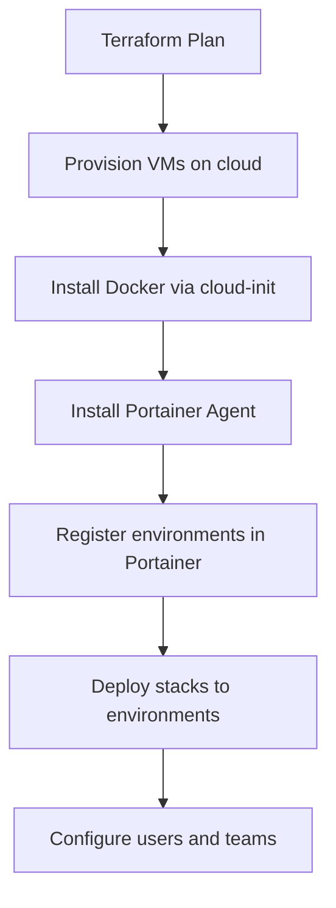

# How to Automate Portainer Infrastructure with Terraform

Author: [nawazdhandala](https://www.github.com/nawazdhandala)

Tags: Portainer, Terraform, Automation, Infrastructure as Code, DevOps

Description: Learn how to build a complete automated Portainer infrastructure setup using Terraform, from VM provisioning to stack deployment.

## End-to-End Automation Architecture



## Complete Multi-File Terraform Setup

### Provider Configuration

```hcl
# versions.tf

terraform {
  required_providers {
    portainer = {
      source  = "portainer/portainer"
      version = "~> 1.0"
    }
    hcloud = {
      source  = "hetznercloud/hcloud"
      version = "~> 1.44"
    }
  }

  backend "s3" {
    bucket = "mycompany-terraform-state"
    key    = "portainer-infra/terraform.tfstate"
    region = "us-east-1"
  }
}

provider "portainer" {
  endpoint     = var.portainer_url
  access_token = var.portainer_api_token
}

provider "hcloud" {
  token = var.hcloud_token
}
```

### VM Provisioning with Docker

```hcl
# compute.tf

# Cloud-init script to install Docker and Portainer Agent
locals {
  docker_init_script = <<-EOF
    #!/bin/bash
    apt-get update
    apt-get install -y docker.io docker-compose
    systemctl enable docker
    systemctl start docker

    # Install Portainer Agent
    docker run -d \
      -p 9001:9001 \
      --name portainer-agent \
      --restart always \
      -v /var/run/docker.sock:/var/run/docker.sock \
      -v /var/lib/docker/volumes:/var/lib/docker/volumes \
      portainer/agent:latest
  EOF
}

# Create Docker host VMs
resource "hcloud_server" "docker_hosts" {
  count       = var.docker_host_count
  name        = "docker-host-${count.index + 1}"
  server_type = "cx31"
  image       = "ubuntu-22.04"
  location    = "nbg1"
  user_data   = local.docker_init_script

  firewall_ids = [hcloud_firewall.docker.id]
}

# Firewall for Docker hosts
resource "hcloud_firewall" "docker" {
  name = "docker-firewall"

  rule {
    direction = "in"
    port      = "9001"
    protocol  = "tcp"
    source_ips = [var.portainer_server_ip]
  }
}
```

### Auto-Register Environments

```hcl
# environments.tf

# Wait for agent to start, then register each VM
resource "portainer_environment" "docker_hosts" {
  count = var.docker_host_count

  name = hcloud_server.docker_hosts[count.index].name
  type = 2  # Docker standalone via agent
  url  = "tcp://${hcloud_server.docker_hosts[count.index].ipv4_address}:9001"

  group_id = portainer_environment_group.production.id
  tag_ids  = [portainer_tag.production.id]

  depends_on = [hcloud_server.docker_hosts]
}
```

### Deploy Stacks to All Environments

```hcl
# stacks.tf

# Deploy monitoring stack to every environment
resource "portainer_stack" "monitoring" {
  count = var.docker_host_count

  name        = "monitoring"
  endpoint_id = portainer_environment.docker_hosts[count.index].id

  stack_file_content = file("stacks/monitoring/docker-compose.yml")

  env = [
    { name = "GRAFANA_PASSWORD", value = var.grafana_password }
  ]
}

# Deploy application stack to production hosts
resource "portainer_stack" "app" {
  count = var.docker_host_count

  name        = "my-application"
  endpoint_id = portainer_environment.docker_hosts[count.index].id

  stack_file_content = templatefile("stacks/app/docker-compose.yml", {
    image_tag = var.app_image_tag
  })

  depends_on = [portainer_stack.monitoring]
}
```

### Outputs

```hcl
# outputs.tf
output "infrastructure_summary" {
  value = {
    host_count  = var.docker_host_count
    host_ips    = hcloud_server.docker_hosts[*].ipv4_address
    env_ids     = portainer_environment.docker_hosts[*].id
    stack_names = portainer_stack.app[*].name
  }
}
```

## Scaling the Infrastructure

```bash
# Scale from 2 to 5 hosts in one command
terraform apply -var="docker_host_count=5"

# Terraform automatically:
# 1. Creates 3 new VMs
# 2. Registers 3 new Portainer environments
# 3. Deploys monitoring and app stacks to the new hosts
```

## Conclusion

Full Portainer infrastructure automation with Terraform enables on-demand, repeatable cluster provisioning. A single `terraform apply` can provision VMs, configure Docker, register environments in Portainer, and deploy all application stacks - turning hours of manual work into minutes.
