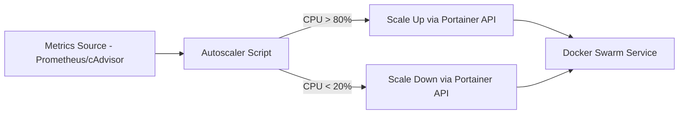

# How to Build an Automated Container Scaling System with Portainer

Author: [nawazdhandala](https://www.github.com/nawazdhandala)

Tags: Portainer, Scaling, Docker Swarm, Automation, DevOps, API

Description: Learn how to build an automated container scaling system that adjusts service replica counts based on metrics using the Portainer API.

---

Docker Swarm supports scaling services up and down via the API. Combined with metrics from cAdvisor, Prometheus, or custom health endpoints, you can build an autoscaler that monitors load and adjusts replica counts automatically through Portainer. This guide walks through a complete scaling system.

---

## How the Scaling System Works



---

## Step 1: Deploy a Metrics Stack via Portainer

Deploy cAdvisor and Prometheus to collect container CPU/memory metrics.

```yaml
# metrics-stack.yml

version: "3.8"

services:
  cadvisor:
    image: gcr.io/cadvisor/cadvisor:latest
    restart: unless-stopped
    ports:
      - "8080:8080"
    volumes:
      - /:/rootfs:ro
      - /var/run:/var/run:ro
      - /sys:/sys:ro
      - /var/lib/docker/:/var/lib/docker:ro

  prometheus:
    image: prom/prometheus:latest
    restart: unless-stopped
    ports:
      - "9090:9090"
    volumes:
      - prometheus_config:/etc/prometheus
      - prometheus_data:/prometheus
    command:
      - "--config.file=/etc/prometheus/prometheus.yml"

volumes:
  prometheus_config:
  prometheus_data:
```

---

## Step 2: Get Current Service Scale via Portainer API

```python
import requests

PORTAINER_URL = "https://portainer.example.com"
API_KEY = "ptr_your_api_key_here"
HEADERS = {"X-API-Key": API_KEY}
ENV_ID = 1  # Swarm environment ID

def get_service_replicas(service_name: str) -> int:
    """Get current replica count for a Swarm service."""
    r = requests.get(
        f"{PORTAINER_URL}/api/endpoints/{ENV_ID}/docker/services",
        headers=HEADERS
    )
    for service in r.json():
        if service["Spec"]["Name"] == service_name:
            return service["Spec"]["Mode"]["Replicated"]["Replicas"]
    return 0
```

---

## Step 3: Scale a Service via Portainer API

```python
def scale_service(service_name: str, replicas: int):
    """Scale a Swarm service to the specified replica count."""
    # First get the current service spec (required for update)
    r = requests.get(
        f"{PORTAINER_URL}/api/endpoints/{ENV_ID}/docker/services",
        headers=HEADERS
    )
    service = next((s for s in r.json() if s["Spec"]["Name"] == service_name), None)
    if not service:
        print(f"Service '{service_name}' not found")
        return

    service_id = service["ID"]
    current_version = service["Version"]["Index"]
    spec = service["Spec"]

    # Update the replica count in the spec
    spec["Mode"]["Replicated"]["Replicas"] = replicas

    print(f"Scaling '{service_name}' to {replicas} replicas...")
    update_r = requests.post(
        f"{PORTAINER_URL}/api/endpoints/{ENV_ID}/docker/services/{service_id}/update",
        headers=HEADERS,
        params={"version": current_version},
        json=spec
    )
    if update_r.ok:
        print(f"Scaled '{service_name}' to {replicas} replicas successfully.")
    else:
        print(f"Scale failed: {update_r.text}")
```

---

## Step 4: Query Metrics and Make Scaling Decisions

```python
def get_cpu_usage(service_name: str) -> float:
    """Get average CPU usage % for a service from Prometheus."""
    query = f'avg(rate(container_cpu_usage_seconds_total{{name=~".*{service_name}.*"}}[2m])) * 100'
    r = requests.get(
        "http://prometheus:9090/api/v1/query",
        params={"query": query}
    )
    result = r.json()["data"]["result"]
    if result:
        return float(result[0]["value"][1])
    return 0.0

def autoscale(service_name: str, min_replicas: int = 1, max_replicas: int = 10):
    """Autoscale a service based on CPU usage."""
    cpu = get_cpu_usage(service_name)
    current = get_service_replicas(service_name)

    print(f"Service: {service_name} | CPU: {cpu:.1f}% | Replicas: {current}")

    if cpu > 80.0 and current < max_replicas:
        # Scale up: add 2 replicas
        new_count = min(current + 2, max_replicas)
        print(f"CPU high ({cpu:.1f}%) - scaling UP from {current} to {new_count}")
        scale_service(service_name, new_count)

    elif cpu < 20.0 and current > min_replicas:
        # Scale down: remove 1 replica
        new_count = max(current - 1, min_replicas)
        print(f"CPU low ({cpu:.1f}%) - scaling DOWN from {current} to {new_count}")
        scale_service(service_name, new_count)
    else:
        print("No scaling action needed.")
```

---

## Step 5: Run the Autoscaler Continuously

```python
import time

if __name__ == "__main__":
    services_to_scale = ["webapp", "worker", "api"]
    while True:
        for service in services_to_scale:
            autoscale(service, min_replicas=1, max_replicas=10)
        print("---")
        time.sleep(60)  # check every minute
```

---

## Summary

Automated container scaling with Portainer combines cAdvisor/Prometheus for metrics collection with the Portainer API for Swarm service updates. The autoscaler reads CPU usage, compares it against thresholds, and calls the Portainer API to adjust replica counts. Running the autoscaler itself as a Portainer stack ensures it's managed with the same tools as everything else in your infrastructure.
