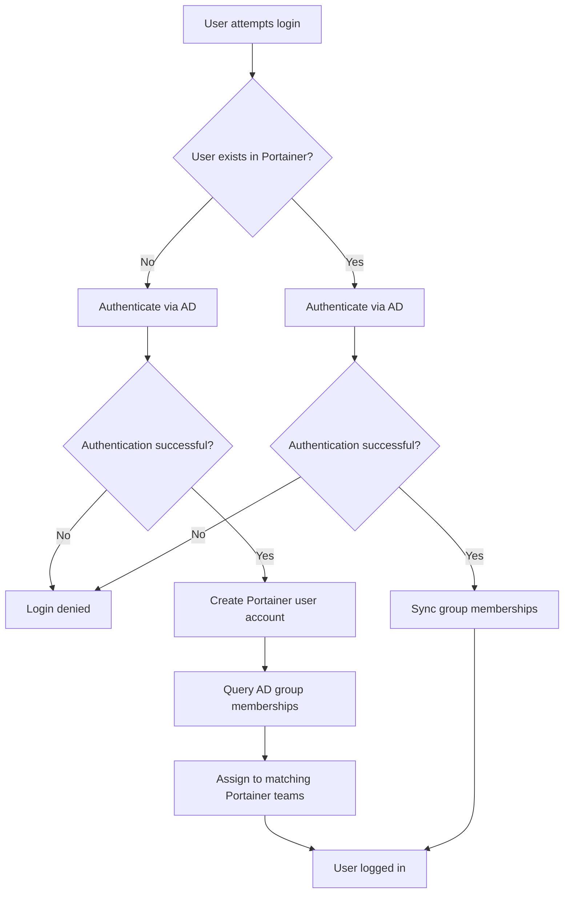

# How to Set Up Automatic User Provisioning with Active Directory in Portainer

Author: [nawazdhandala](https://www.github.com/nawazdhandala)

Tags: Portainer, Active Directory, User Provisioning, LDAP, Automation

Description: Configure Portainer to automatically create user accounts on first login when authenticating via Active Directory, eliminating manual user management.

---

With auto-provisioning enabled, Portainer creates a user account the first time someone logs in via Active Directory — no pre-registration required. Users inherit team memberships from their AD group assignments.

## Enable Auto-Create Users

The `AutoCreateUsers` setting controls whether Portainer creates accounts on first LDAP/AD login:

```bash
TOKEN=$(curl -s -X POST \
  https://localhost:9443/api/auth \
  -H "Content-Type: application/json" \
  -d '{"username":"admin","password":"yourpassword"}' \
  --insecure | python3 -c "import sys,json; print(json.load(sys.stdin)['jwt'])")

# Enable automatic user provisioning
curl -X PUT \
  https://localhost:9443/api/settings \
  -H "Authorization: Bearer $TOKEN" \
  -H "Content-Type: application/json" \
  -d '{
    "AuthenticationMethod": 2,
    "LDAPSettings": {
      "ReaderDN": "CN=portainer-svc,OU=Service Accounts,DC=corp,DC=example,DC=com",
      "Password": "ServicePassword!",
      "URLs": ["ldaps://dc01.corp.example.com:636"],
      "TLSConfig": {"TLS": true, "TLSSkipVerify": false},
      "SearchSettings": [{
        "BaseDN": "DC=corp,DC=example,DC=com",
        "Filter": "(&(objectClass=user)(objectCategory=person))",
        "UserNameAttribute": "sAMAccountName"
      }],
      "GroupSearchSettings": [{
        "GroupBaseDN": "OU=Portainer Groups,DC=corp,DC=example,DC=com",
        "GroupFilter": "(objectClass=group)",
        "UserAttribute": "member",
        "GroupAttribute": "cn"
      }],
      "AutoCreateUsers": true
    }
  }' \
  --insecure
```

## How Auto-Provisioning Works



## Control Which AD Users Can Auto-Provision

Restrict auto-provisioning to specific AD groups using the search filter:

```bash
# Only auto-provision users who are members of the Portainer users OU
# or who have a specific AD attribute set
curl -X PUT \
  https://localhost:9443/api/settings \
  -H "Authorization: Bearer $TOKEN" \
  -H "Content-Type: application/json" \
  -d '{
    "LDAPSettings": {
      "SearchSettings": [{
        "BaseDN": "OU=Portainer Users,DC=corp,DC=example,DC=com",
        "Filter": "(&(objectClass=user)(objectCategory=person)(!(userAccountControl:1.2.840.113556.1.4.803:=2)))",
        "UserNameAttribute": "sAMAccountName"
      }],
      "AutoCreateUsers": true
    }
  }' \
  --insecure
# Only users in the "Portainer Users" OU can log in and be auto-provisioned
```

## View Auto-Provisioned Users

```bash
# List all users in Portainer to see auto-provisioned accounts
curl -s https://localhost:9443/api/users \
  -H "Authorization: Bearer $TOKEN" \
  --insecure | python3 -c "
import sys, json
users = json.load(sys.stdin)
for u in users:
    role = 'Admin' if u.get('Role') == 1 else 'User'
    print(f\"{u['Username']:<30} {role:<10} Teams: {u.get('TeamIDs', [])}\")
"
```

## Deprovisioning Users

When someone leaves the organization, disable their AD account. The next time Portainer checks (on login), the authentication will fail. For immediate revocation:

```bash
# Delete a specific user from Portainer
USER_ID=5  # Get from users list
curl -X DELETE \
  https://localhost:9443/api/users/$USER_ID \
  -H "Authorization: Bearer $TOKEN" \
  --insecure
```

---

*Maintain visibility over your provisioned users' container activities with [OneUptime](https://oneuptime.com).*
