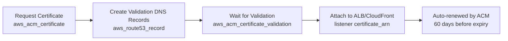

# How to Manage AWS ACM Certificates with OpenTofu

Author: [nawazdhandala](https://www.github.com/nawazdhandala)

Tags: OpenTofu, AWS, ACM, TLS, SSL, Certificates, Route53, Infrastructure as Code

Description: Learn how to request, validate, and attach AWS Certificate Manager (ACM) certificates using OpenTofu with automatic DNS validation via Route 53 and multi-region certificate replication for CloudFront.

---

AWS Certificate Manager (ACM) provisions and renews TLS certificates automatically. OpenTofu handles the full lifecycle: requesting the certificate, creating DNS validation records in Route 53, waiting for validation, and attaching the certificate to load balancers or CloudFront distributions.

## ACM Certificate Lifecycle



## DNS-Validated Certificate

```hcl
# acm.tf

resource "aws_acm_certificate" "main" {
  domain_name               = var.domain_name
  subject_alternative_names = [
    "*.${var.domain_name}",
    "www.${var.domain_name}",
  ]
  validation_method = "DNS"

  lifecycle {
    create_before_destroy = true
  }

  tags = {
    Environment = var.environment
    ManagedBy   = "opentofu"
  }
}

# Create Route 53 validation records
resource "aws_route53_record" "cert_validation" {
  for_each = {
    for dvo in aws_acm_certificate.main.domain_validation_options : dvo.domain_name => {
      name   = dvo.resource_record_name
      record = dvo.resource_record_value
      type   = dvo.resource_record_type
    }
  }

  allow_overwrite = true
  name            = each.value.name
  records         = [each.value.record]
  ttl             = 60
  type            = each.value.type
  zone_id         = aws_route53_zone.main.zone_id
}

# Wait until ACM validates the certificate
resource "aws_acm_certificate_validation" "main" {
  certificate_arn         = aws_acm_certificate.main.arn
  validation_record_fqdns = [for record in aws_route53_record.cert_validation : record.fqdn]

  timeouts {
    create = "10m"
  }
}
```

## Attach Certificate to ALB

```hcl
# alb_https.tf
resource "aws_lb_listener" "https" {
  load_balancer_arn = aws_lb.main.arn
  port              = "443"
  protocol          = "HTTPS"
  ssl_policy        = "ELBSecurityPolicy-TLS13-1-2-2021-06"
  certificate_arn   = aws_acm_certificate_validation.main.certificate_arn

  default_action {
    type             = "forward"
    target_group_arn = aws_lb_target_group.app.arn
  }
}

# Redirect HTTP to HTTPS
resource "aws_lb_listener" "http_redirect" {
  load_balancer_arn = aws_lb.main.arn
  port              = "80"
  protocol          = "HTTP"

  default_action {
    type = "redirect"
    redirect {
      port        = "443"
      protocol    = "HTTPS"
      status_code = "HTTP_301"
    }
  }
}
```

## Multi-Region Certificate for CloudFront

```hcl
# CloudFront requires certificates in us-east-1 regardless of distribution region
resource "aws_acm_certificate" "cloudfront" {
  provider = aws.us_east_1  # Must be us-east-1 for CloudFront

  domain_name               = var.domain_name
  subject_alternative_names = ["*.${var.domain_name}"]
  validation_method         = "DNS"

  lifecycle {
    create_before_destroy = true
  }
}

resource "aws_route53_record" "cloudfront_cert_validation" {
  provider = aws.us_east_1

  for_each = {
    for dvo in aws_acm_certificate.cloudfront.domain_validation_options : dvo.domain_name => {
      name   = dvo.resource_record_name
      record = dvo.resource_record_value
      type   = dvo.resource_record_type
    }
  }

  allow_overwrite = true
  name            = each.value.name
  records         = [each.value.record]
  ttl             = 60
  type            = each.value.type
  zone_id         = aws_route53_zone.main.zone_id
}

resource "aws_acm_certificate_validation" "cloudfront" {
  provider                = aws.us_east_1
  certificate_arn         = aws_acm_certificate.cloudfront.arn
  validation_record_fqdns = [for record in aws_route53_record.cloudfront_cert_validation : record.fqdn]
}
```

## Certificate Expiry Monitoring

```hcl
resource "aws_cloudwatch_metric_alarm" "cert_expiry" {
  alarm_name          = "${var.domain_name}-cert-expiry"
  comparison_operator = "LessThanThreshold"
  evaluation_periods  = 1
  metric_name         = "DaysToExpiry"
  namespace           = "AWS/CertificateManager"
  period              = 86400  # Check daily
  statistic           = "Minimum"
  threshold           = 30     # Alert 30 days before expiry

  dimensions = {
    CertificateArn = aws_acm_certificate.main.arn
  }

  alarm_description = "ACM certificate expires in less than 30 days"
  alarm_actions     = [aws_sns_topic.alerts.arn]
}
```

## Best Practices

- Always use `create_before_destroy = true` on ACM certificates so replacements are provisioned before the old one is removed - this prevents downtime during certificate rotation.
- Use wildcard certificates (`*.example.com`) alongside the apex domain to cover all subdomains with a single certificate and avoid managing multiple certificates.
- Use `allow_overwrite = true` on Route 53 validation records - if the record already exists from a previous deployment, Terraform won't fail.
- CloudFront distributions require the ACM certificate to be in `us-east-1` - always deploy a separate certificate in that region for CloudFront even if your infrastructure is elsewhere.
- Monitor certificate expiry with CloudWatch even though ACM auto-renews - DNS validation can fail if DNS records are misconfigured, preventing renewal.
