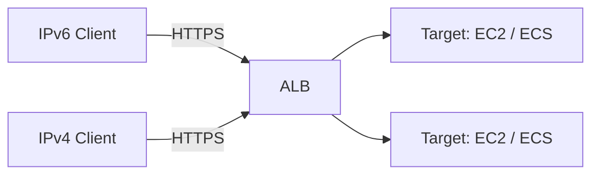

# How to Configure AWS ALB with IPv6 Using Terraform

Author: [nawazdhandala](https://www.github.com/nawazdhandala)

Tags: AWS, Terraform, IPv6, ALB, Load Balancer, Networking

Description: A guide to creating an AWS Application Load Balancer with dual-stack (IPv4 and IPv6) support using Terraform.

The AWS Application Load Balancer (ALB) supports a `dualstack` IP address type, which gives it both an IPv4 and an IPv6 DNS record. This allows clients to connect over either address family while the ALB forwards traffic to backend targets.

## Architecture Overview



## Step 1: Create Security Group for the ALB

```hcl
# sg-alb.tf - Security group for dual-stack ALB

resource "aws_security_group" "alb" {
  name        = "alb-sg"
  description = "Allow inbound HTTP/HTTPS from IPv4 and IPv6"
  vpc_id      = aws_vpc.main.id

  ingress {
    from_port   = 443; to_port = 443; protocol = "tcp"
    cidr_blocks      = ["0.0.0.0/0"]
    ipv6_cidr_blocks = ["::/0"]
    description = "HTTPS dual-stack"
  }

  ingress {
    from_port   = 80; to_port = 80; protocol = "tcp"
    cidr_blocks      = ["0.0.0.0/0"]
    ipv6_cidr_blocks = ["::/0"]
    description = "HTTP dual-stack"
  }

  egress {
    from_port   = 0; to_port = 0; protocol = "-1"
    cidr_blocks      = ["0.0.0.0/0"]
    ipv6_cidr_blocks = ["::/0"]
  }
}
```

## Step 2: Create the Dual-Stack ALB

```hcl
# alb.tf - Application Load Balancer with dualstack IP address type
resource "aws_lb" "main" {
  name               = "main-alb"
  internal           = false
  load_balancer_type = "application"
  security_groups    = [aws_security_group.alb.id]

  # Place the ALB in public subnets across AZs
  subnets = aws_subnet.public[*].id

  # Set to "dualstack" to enable both IPv4 and IPv6
  ip_address_type = "dualstack"

  tags = {
    Name = "main-alb"
  }
}

output "alb_dns_name" {
  value = aws_lb.main.dns_name
  description = "ALB DNS name - resolves to both A and AAAA records"
}
```

## Step 3: Create a Target Group

```hcl
# target-group.tf - HTTP target group for backend instances
resource "aws_lb_target_group" "app" {
  name     = "app-tg"
  port     = 80
  protocol = "HTTP"
  vpc_id   = aws_vpc.main.id

  health_check {
    path                = "/health"
    healthy_threshold   = 2
    unhealthy_threshold = 3
    timeout             = 5
    interval            = 30
  }

  tags = {
    Name = "app-target-group"
  }
}
```

## Step 4: Create an HTTPS Listener

```hcl
# listener.tf - HTTPS listener with TLS termination
resource "aws_lb_listener" "https" {
  load_balancer_arn = aws_lb.main.arn
  port              = 443
  protocol          = "HTTPS"
  ssl_policy        = "ELBSecurityPolicy-TLS13-1-2-2021-06"
  certificate_arn   = var.acm_certificate_arn

  default_action {
    type             = "forward"
    target_group_arn = aws_lb_target_group.app.arn
  }
}

# HTTP -> HTTPS redirect
resource "aws_lb_listener" "http_redirect" {
  load_balancer_arn = aws_lb.main.arn
  port              = 80
  protocol          = "HTTP"

  default_action {
    type = "redirect"
    redirect {
      port        = "443"
      protocol    = "HTTPS"
      status_code = "HTTP_301"
    }
  }
}
```

## Step 5: Apply and Test

```bash
terraform apply

# Get the ALB DNS name
ALB_DNS=$(terraform output -raw alb_dns_name)

# Verify AAAA record exists (IPv6)
dig AAAA "$ALB_DNS"

# Test IPv6 connectivity
curl -6 "https://$ALB_DNS/"

# Test IPv4 connectivity
curl -4 "https://$ALB_DNS/"
```

The `dualstack` IP address type on the ALB is the simplest way to serve both IPv4 and IPv6 clients without running separate load balancers - AWS handles the address family selection automatically based on the client's connection.
