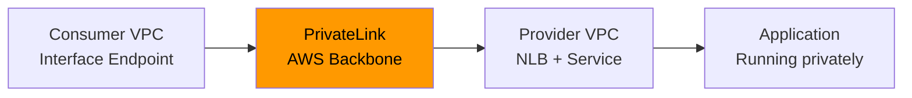

# How to Set Up AWS PrivateLink with OpenTofu

Author: [nawazdhandala](https://www.github.com/nawazdhandala)

Tags: OpenTofu, AWS, PrivateLink, VPC, Private Connectivity, NLB, Infrastructure as Code

Description: Learn how to create AWS PrivateLink endpoint services and VPC interface endpoints using OpenTofu to expose services privately across VPCs and AWS accounts without internet routing.

---

AWS PrivateLink enables private connectivity between VPCs and services without traversing the public internet. OpenTofu manages the VPC endpoint services (provider side) and VPC interface endpoints (consumer side) for cross-account and cross-VPC service connectivity.

## PrivateLink Architecture



## Provider: Endpoint Service

```hcl
# provider_service.tf — the VPC that hosts the service

# NLB is required as the front-end for PrivateLink endpoint services
resource "aws_lb" "privatelink" {
  name               = "${var.service_name}-privatelink-nlb"
  internal           = true
  load_balancer_type = "network"
  subnets            = var.private_subnet_ids

  enable_cross_zone_load_balancing = true

  tags = {
    Service     = var.service_name
    Environment = var.environment
    ManagedBy   = "opentofu"
  }
}

resource "aws_lb_target_group" "service" {
  name        = "${var.service_name}-tg"
  port        = var.service_port
  protocol    = "TCP"
  vpc_id      = var.vpc_id
  target_type = "ip"

  health_check {
    enabled             = true
    protocol            = "TCP"
    port                = var.service_port
    healthy_threshold   = 3
    unhealthy_threshold = 3
    interval            = 10
  }
}

resource "aws_lb_listener" "service" {
  load_balancer_arn = aws_lb.privatelink.arn
  port              = var.service_port
  protocol          = "TCP"

  default_action {
    type             = "forward"
    target_group_arn = aws_lb_target_group.service.arn
  }
}

# Create the VPC endpoint service
resource "aws_vpc_endpoint_service" "main" {
  acceptance_required        = var.require_acceptance  # true = manual approval per consumer
  network_load_balancer_arns = [aws_lb.privatelink.arn]

  # Allowlist specific AWS accounts that can connect
  allowed_principals = [for account_id in var.allowed_consumer_accounts :
    "arn:aws:iam::${account_id}:root"
  ]

  tags = {
    Name        = var.service_name
    Environment = var.environment
    ManagedBy   = "opentofu"
  }
}

output "endpoint_service_name" {
  description = "Share this with consumers to create interface endpoints"
  value       = aws_vpc_endpoint_service.main.service_name
  # e.g., com.amazonaws.vpce.us-east-1.vpce-svc-1234567890abcdef
}
```

## Consumer: Interface Endpoint

```hcl
# consumer_endpoint.tf — the VPC that consumes the service

resource "aws_security_group" "endpoint" {
  name        = "${var.service_name}-endpoint"
  description = "Allow inbound to PrivateLink endpoint"
  vpc_id      = var.consumer_vpc_id

  ingress {
    description = "Service port from VPC"
    from_port   = var.service_port
    to_port     = var.service_port
    protocol    = "tcp"
    cidr_blocks = [var.consumer_vpc_cidr]
  }

  egress {
    from_port   = 0
    to_port     = 0
    protocol    = "-1"
    cidr_blocks = ["0.0.0.0/0"]
  }
}

resource "aws_vpc_endpoint" "service" {
  vpc_id              = var.consumer_vpc_id
  service_name        = var.endpoint_service_name  # From provider output
  vpc_endpoint_type   = "Interface"
  subnet_ids          = var.consumer_private_subnet_ids
  security_group_ids  = [aws_security_group.endpoint.id]
  private_dns_enabled = true  # Creates Route 53 private hosted zone

  tags = {
    Name        = var.service_name
    Environment = var.environment
    ManagedBy   = "opentofu"
  }
}

output "endpoint_dns" {
  description = "DNS name for connecting to the service"
  value       = aws_vpc_endpoint.service.dns_entry[0].dns_name
}
```

## Cross-Account PrivateLink

```hcl
# cross_account.tf — provider accepts consumer from another account

# Provider allows consumer account to create endpoints
resource "aws_vpc_endpoint_service_allowed_principal" "consumer" {
  vpc_endpoint_service_id = aws_vpc_endpoint_service.main.id
  principal_arn           = "arn:aws:iam::${var.consumer_account_id}:root"
}

# If acceptance_required = true, accept pending connections
data "aws_vpc_endpoint_connections" "pending" {
  vpc_endpoint_service_id = aws_vpc_endpoint_service.main.id

  filter {
    name   = "vpc-endpoint-state"
    values = ["pendingAcceptance"]
  }
}

resource "aws_vpc_endpoint_connection_accepter" "consumer" {
  for_each = toset(data.aws_vpc_endpoint_connections.pending.vpc_endpoint_ids)

  vpc_endpoint_service_id = aws_vpc_endpoint_service.main.id
  vpc_endpoint_id         = each.value
}
```

## Best Practices

- Use `acceptance_required = true` for services shared across accounts — this requires manual or automated approval before a consumer can connect, preventing unauthorized access.
- Enable `private_dns_enabled = true` on interface endpoints — this creates a private Route 53 hosted zone so applications can use the service's original DNS name without code changes.
- Use network load balancers with `enable_cross_zone_load_balancing = true` — without cross-zone balancing, consumers in AZs without healthy targets will experience failures.
- Scope `allowed_principals` to specific accounts rather than using `"*"` — PrivateLink visibility and access should be explicitly granted, not open to all accounts.
- Test connectivity from the consumer VPC using `nslookup` to verify private DNS resolution works before your application connects.
