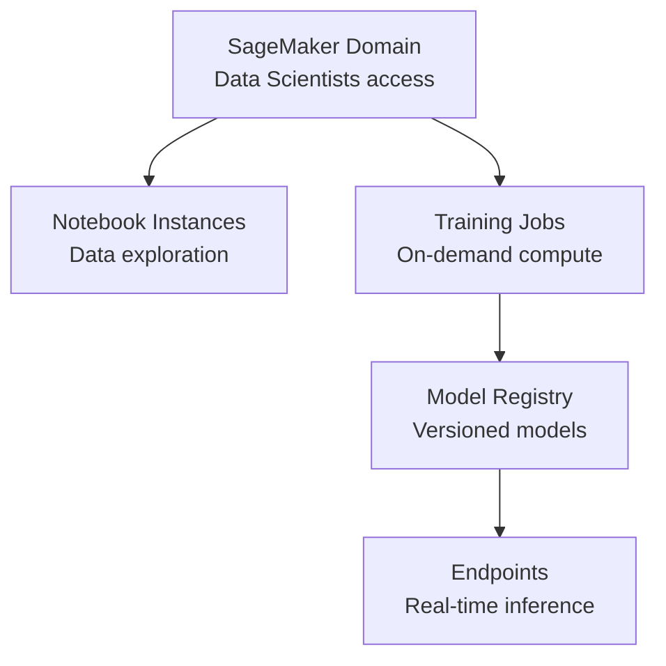

# How to Deploy AWS SageMaker with OpenTofu

Author: [nawazdhandala](https://www.github.com/nawazdhandala)

Tags: OpenTofu, AWS, SageMaker, Machine Learning, MLOps, IAM, Infrastructure as Code

Description: Learn how to provision AWS SageMaker domains, user profiles, notebook instances, and model endpoints using OpenTofu for reproducible machine learning infrastructure.

---

AWS SageMaker provides managed infrastructure for the full ML lifecycle - from data exploration in notebooks to model training and production serving. OpenTofu manages SageMaker domains, execution roles, endpoints, and the surrounding VPC and IAM configuration.

## SageMaker Architecture



## SageMaker Execution Role

```hcl
# iam.tf

resource "aws_iam_role" "sagemaker" {
  name = "${var.prefix}-sagemaker-execution"

  assume_role_policy = jsonencode({
    Version = "2012-10-17"
    Statement = [{
      Effect    = "Allow"
      Principal = { Service = "sagemaker.amazonaws.com" }
      Action    = "sts:AssumeRole"
    }]
  })
}

resource "aws_iam_role_policy_attachment" "sagemaker_full" {
  role       = aws_iam_role.sagemaker.name
  policy_arn = "arn:aws:iam::aws:policy/AmazonSageMakerFullAccess"
}

# S3 access for training data and model artifacts
resource "aws_iam_policy" "sagemaker_s3" {
  name = "${var.prefix}-sagemaker-s3"
  policy = jsonencode({
    Version = "2012-10-17"
    Statement = [
      {
        Effect = "Allow"
        Action = ["s3:GetObject", "s3:PutObject", "s3:ListBucket"]
        Resource = [
          aws_s3_bucket.ml_data.arn,
          "${aws_s3_bucket.ml_data.arn}/*",
          aws_s3_bucket.model_artifacts.arn,
          "${aws_s3_bucket.model_artifacts.arn}/*",
        ]
      }
    ]
  })
}

resource "aws_iam_role_policy_attachment" "sagemaker_s3" {
  role       = aws_iam_role.sagemaker.name
  policy_arn = aws_iam_policy.sagemaker_s3.arn
}
```

## SageMaker Domain (Studio)

```hcl
# domain.tf
resource "aws_sagemaker_domain" "main" {
  domain_name = "${var.prefix}-ml-domain"
  auth_mode   = "IAM"
  vpc_id      = var.vpc_id
  subnet_ids  = var.private_subnet_ids

  default_user_settings {
    execution_role = aws_iam_role.sagemaker.arn

    jupyter_server_app_settings {
      default_resource_spec {
        instance_type = "system"
      }
    }

    kernel_gateway_app_settings {
      default_resource_spec {
        instance_type        = "ml.t3.medium"
        lifecycle_config_arn = aws_sagemaker_studio_lifecycle_config.auto_shutdown.arn
      }
    }
  }

  domain_settings {
    security_group_ids = [aws_security_group.sagemaker.id]
  }

  tags = {
    Environment = var.environment
    ManagedBy   = "opentofu"
  }
}

# Auto-shutdown lifecycle config to save costs
resource "aws_sagemaker_studio_lifecycle_config" "auto_shutdown" {
  studio_lifecycle_config_name     = "${var.prefix}-auto-shutdown"
  studio_lifecycle_config_app_type = "KernelGateway"

  # Base64-encoded script to shut down idle kernels after 1 hour
  studio_lifecycle_config_content = base64encode(<<-EOF
    #!/bin/bash
    pip install jupyter-activity-monitor-extension
    jupyter lab --generate-config
    echo "c.ServerApp.shutdown_no_activity_timeout = 3600" >> ~/.jupyter/jupyter_lab_config.py
  EOF
  )
}

# User profile for each data scientist
resource "aws_sagemaker_user_profile" "data_scientist" {
  for_each = toset(var.data_scientists)

  domain_id         = aws_sagemaker_domain.main.id
  user_profile_name = each.value

  user_settings {
    execution_role = aws_iam_role.sagemaker.arn
  }
}
```

## Model Endpoint

```hcl
# endpoint.tf
resource "aws_sagemaker_model" "main" {
  name               = "${var.model_name}-${var.model_version}"
  execution_role_arn = aws_iam_role.sagemaker.arn

  primary_container {
    image          = var.inference_image_uri
    model_data_url = "s3://${aws_s3_bucket.model_artifacts.id}/${var.model_s3_key}"
    environment = {
      SAGEMAKER_PROGRAM      = "inference.py"
      SAGEMAKER_SUBMIT_DIRECTORY = "s3://${aws_s3_bucket.model_artifacts.id}/code"
    }
  }

  vpc_config {
    subnets            = var.private_subnet_ids
    security_group_ids = [aws_security_group.sagemaker.id]
  }
}

resource "aws_sagemaker_endpoint_configuration" "main" {
  name = "${var.model_name}-config-${var.model_version}"

  production_variants {
    variant_name           = "primary"
    model_name             = aws_sagemaker_model.main.name
    initial_instance_count = var.environment == "production" ? 2 : 1
    instance_type          = var.inference_instance_type  # e.g., "ml.m5.xlarge"
    initial_variant_weight = 1.0
  }
}

resource "aws_sagemaker_endpoint" "main" {
  name                 = "${var.model_name}-endpoint"
  endpoint_config_name = aws_sagemaker_endpoint_configuration.main.name

  lifecycle {
    create_before_destroy = true
  }

  tags = {
    ModelVersion = var.model_version
    Environment  = var.environment
    ManagedBy    = "opentofu"
  }
}
```

## Auto Scaling for Endpoints

```hcl
# auto_scaling.tf
resource "aws_appautoscaling_target" "endpoint" {
  max_capacity       = 10
  min_capacity       = 1
  resource_id        = "endpoint/${aws_sagemaker_endpoint.main.name}/variant/primary"
  scalable_dimension = "sagemaker:variant:DesiredInstanceCount"
  service_namespace  = "sagemaker"
}

resource "aws_appautoscaling_policy" "endpoint" {
  name               = "${var.model_name}-scaling"
  policy_type        = "TargetTrackingScaling"
  resource_id        = aws_appautoscaling_target.endpoint.resource_id
  scalable_dimension = aws_appautoscaling_target.endpoint.scalable_dimension
  service_namespace  = aws_appautoscaling_target.endpoint.service_namespace

  target_tracking_scaling_policy_configuration {
    target_value = 70.0  # Target 70% CPU utilization

    predefined_metric_specification {
      predefined_metric_type = "SageMakerVariantInvocationsPerInstance"
    }

    scale_in_cooldown  = 300
    scale_out_cooldown = 60
  }
}
```

## Best Practices

- Use SageMaker Studio lifecycle configs to auto-shutdown idle notebook kernels - without auto-shutdown, data scientists may leave expensive GPU instances running overnight.
- Deploy endpoints in a VPC with private subnets - SageMaker endpoints don't need public internet access, and keeping them private reduces the attack surface.
- Use endpoint configuration versioning (`create_before_destroy = true`) - updating an endpoint replaces the configuration without downtime.
- Configure Application Auto Scaling for production endpoints - traffic patterns for ML inference are often unpredictable and bursty.
- Use model registry to version models rather than naming endpoints by version - this separates the infrastructure (endpoint) from the artifact (model version) and enables rollbacks.
