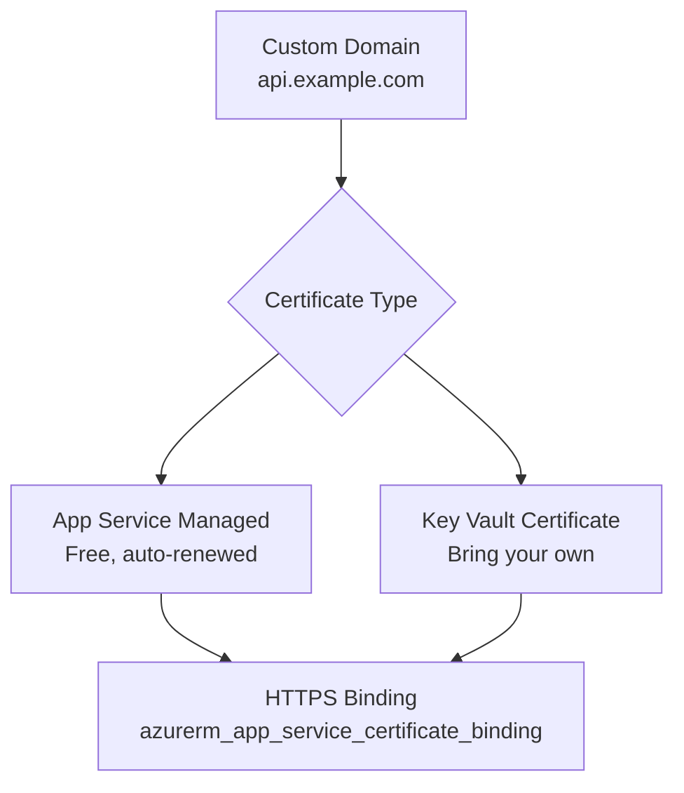

# How to Manage Azure App Service Certificates with OpenTofu

Author: [nawazdhandala](https://www.github.com/nawazdhandala)

Tags: OpenTofu, Azure, App Service, Certificates, TLS, Custom Domain, Infrastructure as Code

Description: Learn how to create and bind TLS certificates to Azure App Service custom domains using OpenTofu, including managed certificates, Key Vault certificates, and custom domain binding configuration.

---

Azure App Service supports custom domains with TLS certificates through managed certificates (free, auto-renewed) or certificates imported from Azure Key Vault. OpenTofu manages custom domain bindings, certificate provisioning, and the association between domains and certificates.

## Certificate Binding Architecture



## App Service with Custom Domain

```hcl
# app_service.tf

resource "azurerm_resource_group" "app" {
  name     = "rg-app-${var.environment}"
  location = var.location
}

resource "azurerm_service_plan" "main" {
  name                = "asp-${var.app_name}-${var.environment}"
  resource_group_name = azurerm_resource_group.app.name
  location            = azurerm_resource_group.app.location
  os_type             = "Linux"
  sku_name            = var.environment == "production" ? "P2v3" : "B1"
}

resource "azurerm_linux_web_app" "main" {
  name                = "${var.app_name}-${var.environment}"
  resource_group_name = azurerm_resource_group.app.name
  location            = azurerm_resource_group.app.location
  service_plan_id     = azurerm_service_plan.main.id

  site_config {
    always_on = var.environment == "production"
  }

  https_only = true
}

# Custom domain binding - must verify domain ownership first
resource "azurerm_app_service_custom_hostname_binding" "main" {
  hostname            = "api.${var.domain_name}"
  app_service_name    = azurerm_linux_web_app.main.name
  resource_group_name = azurerm_resource_group.app.name

  # SSL state is managed separately via certificate binding
  ssl_state   = null
  thumbprint  = null

  depends_on = [azurerm_dns_cname_record.app]
}
```

## Managed Certificate (Free, Auto-Renewed)

```hcl
# Managed certificates are free and auto-renewed by Azure
resource "azurerm_app_service_managed_certificate" "main" {
  custom_hostname_binding_id = azurerm_app_service_custom_hostname_binding.main.id
}

# Bind the managed certificate to the custom domain
resource "azurerm_app_service_certificate_binding" "main" {
  hostname_binding_id = azurerm_app_service_custom_hostname_binding.main.id
  certificate_id      = azurerm_app_service_managed_certificate.main.id
  ssl_state           = "SniEnabled"
}
```

## Key Vault Certificate

```hcl
# key_vault_cert.tf - import your own certificate

resource "azurerm_key_vault" "certs" {
  name                = "kv-certs-${var.environment}"
  resource_group_name = azurerm_resource_group.app.name
  location            = azurerm_resource_group.app.location
  tenant_id           = data.azurerm_client_config.current.tenant_id
  sku_name            = "standard"

  # Allow App Service to access certificates
  access_policy {
    tenant_id = data.azurerm_client_config.current.tenant_id
    object_id = "f8daea97-2d74-4a92-9945-6b4a4c848c86"  # App Service principal

    secret_permissions      = ["Get"]
    certificate_permissions = ["Get"]
  }
}

resource "azurerm_key_vault_certificate" "main" {
  name         = "${var.app_name}-cert"
  key_vault_id = azurerm_key_vault.certs.id

  certificate_policy {
    issuer_parameters {
      name = "Self"  # Or use DigiCert, GlobalSign for prod
    }

    key_properties {
      exportable = true
      key_size   = 2048
      key_type   = "RSA"
      reuse_key  = true
    }

    lifetime_action {
      action {
        action_type = "AutoRenew"
      }
      trigger {
        days_before_expiry = 30
      }
    }

    secret_properties {
      content_type = "application/x-pkcs12"
    }

    x509_certificate_properties {
      subject            = "CN=api.${var.domain_name}"
      validity_in_months = 12

      subject_alternative_names {
        dns_names = ["api.${var.domain_name}", "www.${var.domain_name}"]
      }

      extended_key_usage = ["1.3.6.1.5.5.7.3.1"]  # serverAuth
      key_usage          = ["digitalSignature", "keyEncipherment"]
    }
  }
}

# Import Key Vault certificate into App Service
resource "azurerm_app_service_certificate" "kv" {
  name                = "${var.app_name}-cert"
  resource_group_name = azurerm_resource_group.app.name
  location            = azurerm_resource_group.app.location
  key_vault_secret_id = azurerm_key_vault_certificate.main.secret_id
}

resource "azurerm_app_service_certificate_binding" "kv" {
  hostname_binding_id = azurerm_app_service_custom_hostname_binding.main.id
  certificate_id      = azurerm_app_service_certificate.kv.id
  ssl_state           = "SniEnabled"
}
```

## DNS Records for Domain Verification

```hcl
# CNAME for subdomain
resource "azurerm_dns_cname_record" "app" {
  name                = "api"
  zone_name           = var.domain_name
  resource_group_name = var.dns_resource_group
  ttl                 = 300
  record              = azurerm_linux_web_app.main.default_hostname
}

# TXT record for domain ownership verification
resource "azurerm_dns_txt_record" "app_verify" {
  name                = "asuid.api"
  zone_name           = var.domain_name
  resource_group_name = var.dns_resource_group
  ttl                 = 300

  record {
    value = azurerm_linux_web_app.main.custom_domain_verification_id
  }
}
```

## Best Practices

- Use managed certificates for most App Service deployments - they're free, auto-renewed, and require no management overhead. Use Key Vault certificates only when you need wildcard or multi-SAN certs.
- Always create the DNS records before binding custom domains - Azure validates domain ownership during binding and will fail if the DNS records don't exist.
- Create the TXT verification record (`asuid.<subdomain>`) in addition to the CNAME - Azure requires this to prove domain ownership.
- Set `https_only = true` on all App Service resources to enforce HTTPS and prevent accidental HTTP access.
- For production, use `SniEnabled` SSL state rather than `IpBasedEnabled` - SNI-based TLS is more cost-effective and supports multiple certificates per IP.
