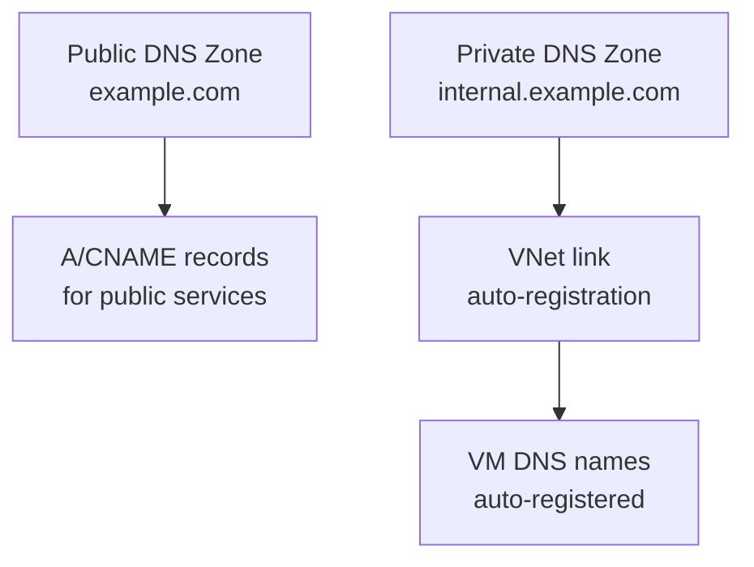

# How to Manage Azure DNS with OpenTofu

Author: [nawazdhandala](https://www.github.com/nawazdhandala)

Tags: OpenTofu, Azure, DNS, Azure DNS, Private DNS, Infrastructure as Code

Description: Learn how to create and manage Azure DNS zones and records using OpenTofu, including public DNS zones, private DNS zones linked to VNets, and automated record management.

---

Azure DNS hosts DNS zones and provides name resolution integrated with Azure services. OpenTofu manages public DNS zones for external-facing domains and private DNS zones for internal service discovery within virtual networks.

## Azure DNS Architecture



## Public DNS Zone

```hcl
# dns.tf

resource "azurerm_resource_group" "dns" {
  name     = "rg-dns-${var.environment}"
  location = var.location
}

resource "azurerm_dns_zone" "main" {
  name                = var.domain_name
  resource_group_name = azurerm_resource_group.dns.name

  tags = {
    Environment = var.environment
    ManagedBy   = "opentofu"
  }
}

# A record
resource "azurerm_dns_a_record" "app" {
  name                = "app"
  zone_name           = azurerm_dns_zone.main.name
  resource_group_name = azurerm_resource_group.dns.name
  ttl                 = 300
  records             = [azurerm_public_ip.app.ip_address]
}

# CNAME record
resource "azurerm_dns_cname_record" "www" {
  name                = "www"
  zone_name           = azurerm_dns_zone.main.name
  resource_group_name = azurerm_resource_group.dns.name
  ttl                 = 300
  record              = var.domain_name
}

# MX records for email
resource "azurerm_dns_mx_record" "mail" {
  name                = "@"
  zone_name           = azurerm_dns_zone.main.name
  resource_group_name = azurerm_resource_group.dns.name
  ttl                 = 300

  record {
    preference = 10
    exchange   = "mail.${var.domain_name}"
  }
}

# TXT record for domain verification
resource "azurerm_dns_txt_record" "verification" {
  name                = "_dmarc"
  zone_name           = azurerm_dns_zone.main.name
  resource_group_name = azurerm_resource_group.dns.name
  ttl                 = 300

  record {
    value = "v=DMARC1; p=quarantine; rua=mailto:dmarc@${var.domain_name}"
  }
}
```

## Private DNS Zone

```hcl
# Private zone for internal service discovery
resource "azurerm_private_dns_zone" "internal" {
  name                = "internal.${var.domain_name}"
  resource_group_name = azurerm_resource_group.dns.name

  tags = {
    Environment = var.environment
    Type        = "private"
  }
}

# Link private zone to VNet
resource "azurerm_private_dns_zone_virtual_network_link" "vnet" {
  name                  = "vnet-link-${var.environment}"
  resource_group_name   = azurerm_resource_group.dns.name
  private_dns_zone_name = azurerm_private_dns_zone.internal.name
  virtual_network_id    = azurerm_virtual_network.main.id
  registration_enabled  = true  # Auto-register VMs in this zone
}

# Private A record for internal database
resource "azurerm_private_dns_a_record" "database" {
  name                = "db"
  zone_name           = azurerm_private_dns_zone.internal.name
  resource_group_name = azurerm_resource_group.dns.name
  ttl                 = 60
  records             = [azurerm_private_endpoint.database.private_service_connection[0].private_ip_address]
}
```

## Azure Private Endpoint DNS Integration

```hcl
# Private DNS zones for Azure PaaS services
resource "azurerm_private_dns_zone" "storage_blob" {
  name                = "privatelink.blob.core.windows.net"
  resource_group_name = azurerm_resource_group.dns.name
}

resource "azurerm_private_dns_zone_virtual_network_link" "storage_blob" {
  name                  = "storage-blob-vnet-link"
  resource_group_name   = azurerm_resource_group.dns.name
  private_dns_zone_name = azurerm_private_dns_zone.storage_blob.name
  virtual_network_id    = azurerm_virtual_network.main.id
}

# DNS A record created automatically by private endpoint
resource "azurerm_private_endpoint" "storage" {
  name                = "pe-storage-${var.environment}"
  location            = var.location
  resource_group_name = azurerm_resource_group.main.name
  subnet_id           = azurerm_subnet.private.id

  private_service_connection {
    name                           = "storage-connection"
    private_connection_resource_id = azurerm_storage_account.main.id
    is_manual_connection           = false
    subresource_names              = ["blob"]
  }

  private_dns_zone_group {
    name                 = "storage-dns"
    private_dns_zone_ids = [azurerm_private_dns_zone.storage_blob.id]
  }
}
```

## Outputs

```hcl
output "dns_name_servers" {
  description = "Azure DNS name servers - configure these at your registrar"
  value       = azurerm_dns_zone.main.name_servers
}
```

## Best Practices

- After creating an Azure DNS zone, update your domain registrar's NS records with the Azure name servers shown in `name_servers` output.
- Create Private DNS zones for all Azure PaaS services accessed via Private Endpoints - without them, DNS resolution bypasses Private Endpoints and routes through the public internet.
- Enable `registration_enabled = true` on private zone VNet links to auto-register VMs with their hostnames.
- Use TTL of 60s for records that may change (ALB endpoints, database failovers) and 300-3600s for stable records.
- Manage DNS records for all environments from the same zone via naming conventions (`app-dev`, `app-staging`, `app`) rather than separate zones per environment.
