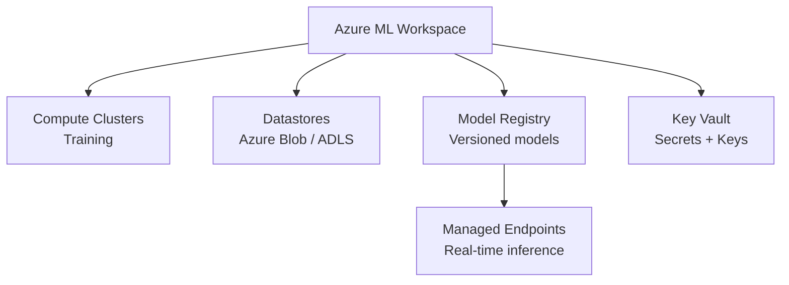

# How to Deploy Azure Machine Learning Workspaces with OpenTofu

Author: [nawazdhandala](https://www.github.com/nawazdhandala)

Tags: OpenTofu, Azure, Machine Learning, Azure ML, MLOps, Compute Clusters, Infrastructure as Code

Description: Learn how to provision Azure Machine Learning workspaces, compute clusters, datastores, and managed endpoints using OpenTofu for reproducible ML infrastructure on Azure.

---

Azure Machine Learning provides managed infrastructure for model training, experiment tracking, and deployment. OpenTofu provisions the workspace and all associated resources - compute clusters, storage, container registries, and online endpoints - as code.

## Azure ML Architecture



## Workspace Dependencies

```hcl
# dependencies.tf

resource "azurerm_resource_group" "ml" {
  name     = "rg-ml-${var.environment}"
  location = var.location
}

# Storage for datasets and artifacts
resource "azurerm_storage_account" "ml" {
  name                     = "sttml${var.environment}${random_id.suffix.hex}"
  resource_group_name      = azurerm_resource_group.ml.name
  location                 = azurerm_resource_group.ml.location
  account_tier             = "Standard"
  account_replication_type = "LRS"
}

# Container registry for training images
resource "azurerm_container_registry" "ml" {
  name                = "acr${var.prefix}${var.environment}"
  resource_group_name = azurerm_resource_group.ml.name
  location            = azurerm_resource_group.ml.location
  sku                 = "Premium"  # Required for workspace integration
  admin_enabled       = false
}

# Key Vault for secrets
resource "azurerm_key_vault" "ml" {
  name                = "kv-ml-${var.environment}-${random_id.suffix.hex}"
  resource_group_name = azurerm_resource_group.ml.name
  location            = azurerm_resource_group.ml.location
  tenant_id           = data.azurerm_client_config.current.tenant_id
  sku_name            = "standard"
  purge_protection_enabled = var.environment == "production"
}

# Application Insights for experiment tracking
resource "azurerm_application_insights" "ml" {
  name                = "ai-ml-${var.environment}"
  resource_group_name = azurerm_resource_group.ml.name
  location            = azurerm_resource_group.ml.location
  application_type    = "web"
}
```

## Azure ML Workspace

```hcl
# workspace.tf
resource "azurerm_machine_learning_workspace" "main" {
  name                    = "mlw-${var.prefix}-${var.environment}"
  resource_group_name     = azurerm_resource_group.ml.name
  location                = azurerm_resource_group.ml.location
  application_insights_id = azurerm_application_insights.ml.id
  key_vault_id            = azurerm_key_vault.ml.id
  storage_account_id      = azurerm_storage_account.ml.id
  container_registry_id   = azurerm_container_registry.ml.id

  # System-assigned identity for accessing dependencies
  identity {
    type = "SystemAssigned"
  }

  # Public network access - disable for private workspaces
  public_network_access_enabled = var.environment != "production"

  tags = {
    Environment = var.environment
    ManagedBy   = "opentofu"
  }
}

# Grant workspace identity access to its storage
resource "azurerm_role_assignment" "workspace_storage" {
  scope                = azurerm_storage_account.ml.id
  role_definition_name = "Storage Blob Data Contributor"
  principal_id         = azurerm_machine_learning_workspace.main.identity[0].principal_id
}

resource "azurerm_role_assignment" "workspace_acr" {
  scope                = azurerm_container_registry.ml.id
  role_definition_name = "AcrPull"
  principal_id         = azurerm_machine_learning_workspace.main.identity[0].principal_id
}
```

## Compute Cluster for Training

```hcl
# compute.tf
resource "azurerm_machine_learning_compute_cluster" "training" {
  name                          = "compute-train-${var.environment}"
  machine_learning_workspace_id = azurerm_machine_learning_workspace.main.id
  location                      = azurerm_resource_group.ml.location
  vm_priority                   = "Dedicated"  # or "LowPriority" for spot
  vm_size                       = var.training_vm_size  # e.g., "Standard_NC6s_v3" for GPU

  scale_settings {
    min_node_count                       = 0  # Scale to zero when idle
    max_node_count                       = var.max_training_nodes
    scale_down_nodes_after_idle_duration = "PT2M"  # 2 minutes
  }

  identity {
    type = "SystemAssigned"
  }

  ssh {
    admin_username = "azureuser"
    # Use SSH key from Key Vault in production
  }

  subnet_resource_id = var.training_subnet_id
}

# CPU cluster for lightweight experiments
resource "azurerm_machine_learning_compute_cluster" "cpu" {
  name                          = "compute-cpu-${var.environment}"
  machine_learning_workspace_id = azurerm_machine_learning_workspace.main.id
  location                      = azurerm_resource_group.ml.location
  vm_priority                   = "LowPriority"  # Use spot for cost savings
  vm_size                       = "Standard_D4s_v3"

  scale_settings {
    min_node_count                       = 0
    max_node_count                       = 10
    scale_down_nodes_after_idle_duration = "PT2M"
  }

  identity {
    type = "SystemAssigned"
  }
}
```

## Managed Online Endpoint

```hcl
# endpoint.tf
resource "azurerm_machine_learning_online_endpoint" "main" {
  name                          = "${var.model_name}-endpoint"
  machine_learning_workspace_id = azurerm_machine_learning_workspace.main.id
  location                      = azurerm_resource_group.ml.location

  identity {
    type = "SystemAssigned"
  }

  auth_mode = "Key"

  tags = {
    Model       = var.model_name
    Environment = var.environment
  }
}
```

## Data Scientists RBAC

```hcl
# rbac.tf
resource "azurerm_role_assignment" "data_scientist" {
  for_each = toset(var.data_scientist_principal_ids)

  scope                = azurerm_machine_learning_workspace.main.id
  role_definition_name = "AzureML Data Scientist"
  principal_id         = each.value
}

resource "azurerm_role_assignment" "ml_operator" {
  for_each = toset(var.ml_operator_principal_ids)

  scope                = azurerm_machine_learning_workspace.main.id
  role_definition_name = "AzureML Compute Operator"
  principal_id         = each.value
}
```

## Best Practices

- Set `min_node_count = 0` on compute clusters - clusters scale to zero when idle, eliminating compute costs between training runs.
- Set `scale_down_nodes_after_idle_duration = "PT2M"` - a 2-minute cooldown quickly releases expensive GPU instances after training completes.
- Use `vm_priority = "LowPriority"` (spot) for experimentation clusters and `Dedicated` only for production training pipelines - spot VMs reduce costs by 60-80%.
- Disable public network access (`public_network_access_enabled = false`) for production workspaces and use private endpoints for all workspace components.
- Use role-based access control with Azure built-in ML roles (`AzureML Data Scientist`, `AzureML Compute Operator`) rather than granting broad Contributor access to the workspace.
