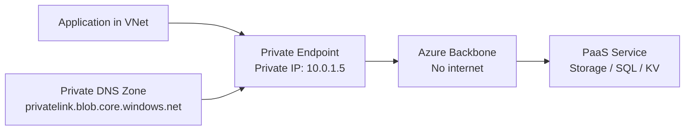

# How to Configure Azure Private Endpoints with OpenTofu

Author: [nawazdhandala](https://www.github.com/nawazdhandala)

Tags: OpenTofu, Azure, Private Endpoints, Private Link, VNet, DNS, Infrastructure as Code

Description: Learn how to create Azure Private Endpoints for PaaS services like Storage, SQL Database, Key Vault, and Service Bus using OpenTofu, with private DNS zone integration for seamless name resolution.

---

Azure Private Endpoints give PaaS services a private IP address in your VNet, routing traffic through the Azure backbone without internet exposure. OpenTofu manages private endpoints, DNS zone groups, and VNet links to provide consistent private connectivity across services.

## Private Endpoint Architecture



## Storage Account Private Endpoint

```hcl
# private_endpoint_storage.tf
resource "azurerm_resource_group" "network" {
  name     = "rg-network-${var.environment}"
  location = var.location
}

# Private DNS zone for blob storage
resource "azurerm_private_dns_zone" "storage_blob" {
  name                = "privatelink.blob.core.windows.net"
  resource_group_name = azurerm_resource_group.network.name
}

# Link DNS zone to VNet
resource "azurerm_private_dns_zone_virtual_network_link" "storage_blob" {
  name                  = "storage-blob-vnet-link"
  resource_group_name   = azurerm_resource_group.network.name
  private_dns_zone_name = azurerm_private_dns_zone.storage_blob.name
  virtual_network_id    = azurerm_virtual_network.main.id
  registration_enabled  = false
}

# Private endpoint for storage account
resource "azurerm_private_endpoint" "storage_blob" {
  name                = "pe-storage-blob-${var.environment}"
  resource_group_name = azurerm_resource_group.network.name
  location            = var.location
  subnet_id           = azurerm_subnet.private_endpoints.id

  private_service_connection {
    name                           = "storage-blob-connection"
    private_connection_resource_id = azurerm_storage_account.main.id
    is_manual_connection           = false
    subresource_names              = ["blob"]
  }

  private_dns_zone_group {
    name                 = "storage-blob-dns"
    private_dns_zone_ids = [azurerm_private_dns_zone.storage_blob.id]
  }

  tags = {
    Environment = var.environment
    ManagedBy   = "opentofu"
  }
}
```

## SQL Database Private Endpoint

```hcl
# private_endpoint_sql.tf
resource "azurerm_private_dns_zone" "sql" {
  name                = "privatelink.database.windows.net"
  resource_group_name = azurerm_resource_group.network.name
}

resource "azurerm_private_dns_zone_virtual_network_link" "sql" {
  name                  = "sql-vnet-link"
  resource_group_name   = azurerm_resource_group.network.name
  private_dns_zone_name = azurerm_private_dns_zone.sql.name
  virtual_network_id    = azurerm_virtual_network.main.id
}

resource "azurerm_private_endpoint" "sql" {
  name                = "pe-sql-${var.environment}"
  resource_group_name = azurerm_resource_group.network.name
  location            = var.location
  subnet_id           = azurerm_subnet.private_endpoints.id

  private_service_connection {
    name                           = "sql-connection"
    private_connection_resource_id = azurerm_mssql_server.main.id
    is_manual_connection           = false
    subresource_names              = ["sqlServer"]
  }

  private_dns_zone_group {
    name                 = "sql-dns"
    private_dns_zone_ids = [azurerm_private_dns_zone.sql.id]
  }
}
```

## Key Vault Private Endpoint

```hcl
# private_endpoint_keyvault.tf
resource "azurerm_private_dns_zone" "keyvault" {
  name                = "privatelink.vaultcore.azure.net"
  resource_group_name = azurerm_resource_group.network.name
}

resource "azurerm_private_dns_zone_virtual_network_link" "keyvault" {
  name                  = "keyvault-vnet-link"
  resource_group_name   = azurerm_resource_group.network.name
  private_dns_zone_name = azurerm_private_dns_zone.keyvault.name
  virtual_network_id    = azurerm_virtual_network.main.id
}

resource "azurerm_private_endpoint" "keyvault" {
  name                = "pe-keyvault-${var.environment}"
  resource_group_name = azurerm_resource_group.network.name
  location            = var.location
  subnet_id           = azurerm_subnet.private_endpoints.id

  private_service_connection {
    name                           = "keyvault-connection"
    private_connection_resource_id = azurerm_key_vault.main.id
    is_manual_connection           = false
    subresource_names              = ["vault"]
  }

  private_dns_zone_group {
    name                 = "keyvault-dns"
    private_dns_zone_ids = [azurerm_private_dns_zone.keyvault.id]
  }
}
```

## Dedicated Subnet for Private Endpoints

```hcl
# subnet.tf
resource "azurerm_subnet" "private_endpoints" {
  name                 = "snet-private-endpoints"
  resource_group_name  = azurerm_resource_group.network.name
  virtual_network_name = azurerm_virtual_network.main.name
  address_prefixes     = [var.pe_subnet_cidr]

  private_endpoint_network_policies_enabled = true
}
```

## Common Private DNS Zones

```hcl
# dns_zones.tf — manage all private DNS zones as a set
locals {
  private_dns_zones = {
    blob       = "privatelink.blob.core.windows.net"
    file       = "privatelink.file.core.windows.net"
    sql        = "privatelink.database.windows.net"
    keyvault   = "privatelink.vaultcore.azure.net"
    servicebus = "privatelink.servicebus.windows.net"
    cosmosdb   = "privatelink.documents.azure.com"
    acr        = "privatelink.azurecr.io"
  }
}

resource "azurerm_private_dns_zone" "all" {
  for_each = var.enabled_private_dns_zones

  name                = local.private_dns_zones[each.key]
  resource_group_name = azurerm_resource_group.network.name
}

resource "azurerm_private_dns_zone_virtual_network_link" "all" {
  for_each = azurerm_private_dns_zone.all

  name                  = "${each.key}-vnet-link"
  resource_group_name   = azurerm_resource_group.network.name
  private_dns_zone_name = each.value.name
  virtual_network_id    = azurerm_virtual_network.main.id
}
```

## Best Practices

- Create Private DNS zones for every PaaS service accessed via Private Endpoints — without the DNS zone, name resolution returns the public IP even though traffic flows privately.
- Use a dedicated subnet for private endpoints — they have special network policy requirements and isolating them simplifies security zone management.
- Link private DNS zones to all VNets that need to resolve the private service — applications in VNets without the link will resolve the public IP of the service.
- Use the `private_dns_zone_group` block inside the `azurerm_private_endpoint` resource — this automatically creates the DNS A record for the private IP, removing a manual step.
- Disable public access on PaaS services after creating private endpoints: set `public_network_access_enabled = false` on storage accounts, SQL servers, and Key Vaults.
