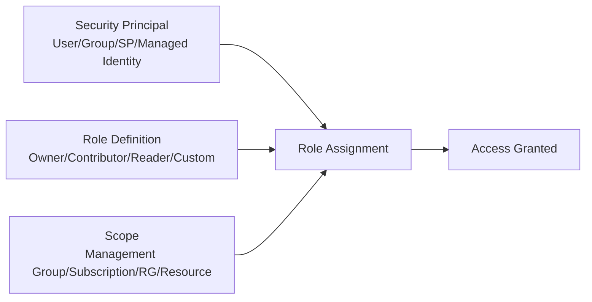

# How to Assign Azure RBAC Roles with OpenTofu

Author: [nawazdhandala](https://www.github.com/nawazdhandala)

Tags: OpenTofu, Azure, RBAC, IAM, Role Assignments, Infrastructure as Code, Security

Description: Learn how to assign Azure Role-Based Access Control (RBAC) roles to users, groups, and service principals using OpenTofu for consistent and auditable permission management.

---

Azure RBAC is the authorization system that controls who can do what with Azure resources. Managing role assignments manually through the portal is error-prone and hard to audit. With OpenTofu, every role assignment is defined as code, reviewed in pull requests, and tracked in version control.

## RBAC Concepts Refresher

Azure RBAC works on three components: security principal (who), role definition (what permissions), and scope (where). The combination is called a role assignment.



## Assigning Built-in Roles

Built-in roles like Reader, Contributor, and Owner cover most common scenarios.

```hcl
# main.tf

terraform {
  required_providers {
    azurerm = {
      source  = "hashicorp/azurerm"
      version = "~> 3.85"
    }
  }
}

provider "azurerm" {
  features {}
}

data "azurerm_subscription" "current" {}

# Assign Reader role to a user at subscription scope
resource "azurerm_role_assignment" "reader_user" {
  scope                = data.azurerm_subscription.current.id
  role_definition_name = "Reader"
  # Use the user's object ID from Azure AD
  principal_id         = var.user_object_id
}

# Assign Contributor to a group at resource group scope
resource "azurerm_resource_group" "app_rg" {
  name     = "app-production-rg"
  location = "eastus"
}

resource "azurerm_role_assignment" "contributor_group" {
  scope                = azurerm_resource_group.app_rg.id
  role_definition_name = "Contributor"
  principal_id         = var.dev_group_object_id
}
```

## Assigning Roles to Managed Identities

Managed identities are the preferred way to grant Azure services access to other Azure resources.

```hcl
# managed_identity.tf
# Create a user-assigned managed identity for the application
resource "azurerm_user_assigned_identity" "app_identity" {
  name                = "app-managed-identity"
  resource_group_name = azurerm_resource_group.app_rg.name
  location            = azurerm_resource_group.app_rg.location
}

# Grant the managed identity access to a storage account
resource "azurerm_role_assignment" "storage_blob_access" {
  scope                = azurerm_storage_account.app_storage.id
  role_definition_name = "Storage Blob Data Reader"
  principal_id         = azurerm_user_assigned_identity.app_identity.principal_id
}

# Grant Key Vault secrets access
resource "azurerm_role_assignment" "keyvault_access" {
  scope                = azurerm_key_vault.app_kv.id
  role_definition_name = "Key Vault Secrets User"
  principal_id         = azurerm_user_assigned_identity.app_identity.principal_id
}
```

## Assigning Roles Using Role Definition IDs

For consistency and to avoid issues with display name changes, use role definition IDs.

```hcl
# roles_by_id.tf
# Look up a built-in role by name to get its ID
data "azurerm_role_definition" "storage_contributor" {
  name = "Storage Account Contributor"
}

resource "azurerm_role_assignment" "storage_contrib_assignment" {
  scope              = azurerm_storage_account.app_storage.id
  role_definition_id = data.azurerm_role_definition.storage_contributor.role_definition_resource_id
  principal_id       = var.service_principal_object_id
}
```

## Variables and Locals

```hcl
# variables.tf
variable "user_object_id" {
  description = "Azure AD Object ID of the user to grant Reader access"
  type        = string
}

variable "dev_group_object_id" {
  description = "Azure AD Object ID of the developer group"
  type        = string
}

variable "service_principal_object_id" {
  description = "Object ID of the service principal"
  type        = string
}

# locals.tf
locals {
  # Map of role assignments to create - useful for multiple similar assignments
  app_role_assignments = {
    storage_reader = {
      scope  = azurerm_storage_account.app_storage.id
      role   = "Storage Blob Data Reader"
      principal = var.service_principal_object_id
    }
    kv_user = {
      scope  = azurerm_key_vault.app_kv.id
      role   = "Key Vault Secrets User"
      principal = var.service_principal_object_id
    }
  }
}

# Use for_each to create multiple assignments from the map
resource "azurerm_role_assignment" "app_assignments" {
  for_each = local.app_role_assignments

  scope                = each.value.scope
  role_definition_name = each.value.role
  principal_id         = each.value.principal
}
```

## Best Practices

- Always assign roles at the narrowest scope possible - prefer resource group or resource scope over subscription scope.
- Avoid assigning `Owner` - prefer `Contributor` plus specific data-plane roles.
- Use Azure AD groups for user role assignments rather than assigning roles directly to individuals.
- Regularly audit assignments using `tofu plan` to catch drift from manually added roles.
