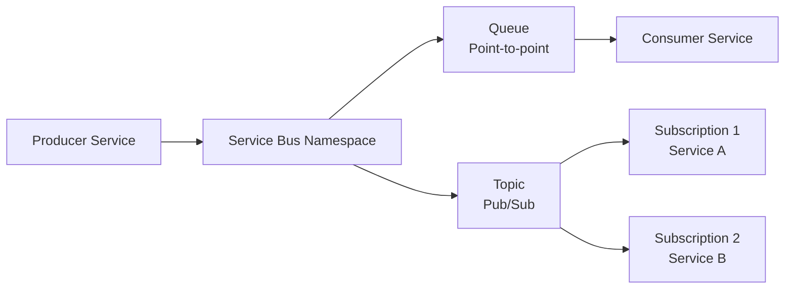

# How to Set Up Azure Service Bus with OpenTofu

Author: [nawazdhandala](https://www.github.com/nawazdhandala)

Tags: OpenTofu, Azure, Service Bus, Messaging, Queues, Topics, Infrastructure as Code

Description: Learn how to provision Azure Service Bus namespaces, queues, topics, subscriptions, and authorization rules using OpenTofu for reliable asynchronous messaging between services.

---

Azure Service Bus provides enterprise messaging with queues for point-to-point and topics for publish-subscribe patterns. OpenTofu manages the namespace, queues, topics, subscriptions, and RBAC assignments for a fully configured messaging infrastructure.

## Service Bus Architecture



## Service Bus Namespace

```hcl
# service_bus.tf
resource "azurerm_resource_group" "messaging" {
  name     = "rg-messaging-${var.environment}"
  location = var.location
}

resource "azurerm_servicebus_namespace" "main" {
  name                = "sb-${var.prefix}-${var.environment}"
  resource_group_name = azurerm_resource_group.messaging.name
  location            = azurerm_resource_group.messaging.location
  sku                 = var.environment == "production" ? "Premium" : "Standard"

  # Premium SKU features: private endpoints, dedicated capacity
  capacity = var.environment == "production" ? 1 : 0

  # Disable local authentication — use Azure AD only
  local_auth_enabled = false

  minimum_tls_version = "1.2"

  tags = {
    Environment = var.environment
    ManagedBy   = "opentofu"
  }
}
```

## Queues

```hcl
# queues.tf
resource "azurerm_servicebus_queue" "orders" {
  name         = "orders"
  namespace_id = azurerm_servicebus_namespace.main.id

  max_size_in_megabytes        = 5120
  max_delivery_count           = 10  # Move to DLQ after 10 failures
  default_message_ttl          = "P14D"  # 14 days
  lock_duration                = "PT30S"  # 30 second lock for processing

  dead_lettering_on_message_expiration = true
  requires_duplicate_detection         = true
  duplicate_detection_history_time_window = "PT10M"

  enable_partitioning = var.environment == "production"
}

resource "azurerm_servicebus_queue" "orders_dlq_processor" {
  name         = "orders-dlq-processor"
  namespace_id = azurerm_servicebus_namespace.main.id

  max_size_in_megabytes = 1024
  default_message_ttl   = "P7D"
}
```

## Topics and Subscriptions

```hcl
# topics.tf
resource "azurerm_servicebus_topic" "events" {
  name         = "domain-events"
  namespace_id = azurerm_servicebus_namespace.main.id

  max_size_in_megabytes   = 5120
  default_message_ttl     = "P7D"
  enable_partitioning     = var.environment == "production"
  support_ordering        = false
}

# Each consuming service gets its own subscription
resource "azurerm_servicebus_subscription" "inventory" {
  name               = "inventory-service"
  topic_id           = azurerm_servicebus_topic.events.id
  max_delivery_count = 10

  dead_lettering_on_filter_evaluation_error = true
  dead_lettering_on_message_expiration      = true

  # SQL filter — only receive order-related events
  rule {
    name        = "order-events-only"
    filter_type = "SqlFilter"
    sql_filter  = "EventType LIKE 'Order%'"
  }
}

resource "azurerm_servicebus_subscription" "notifications" {
  name               = "notification-service"
  topic_id           = azurerm_servicebus_topic.events.id
  max_delivery_count = 5
}
```

## RBAC Assignments

```hcl
# rbac.tf — use managed identity instead of connection strings

# Grant sender role to producer app
resource "azurerm_role_assignment" "producer" {
  scope                = azurerm_servicebus_namespace.main.id
  role_definition_name = "Azure Service Bus Data Sender"
  principal_id         = var.producer_identity_id
}

# Grant receiver role to consumer app
resource "azurerm_role_assignment" "consumer" {
  scope                = azurerm_servicebus_queue.orders.id
  role_definition_name = "Azure Service Bus Data Receiver"
  principal_id         = var.consumer_identity_id
}
```

## Best Practices

- Use `local_auth_enabled = false` to require Azure AD authentication — this prevents the use of SAS keys, which are harder to rotate and audit than managed identity assignments.
- Set `max_delivery_count` and enable dead-letter queues — without a DLQ, poison messages can block queue processing indefinitely. Dead-lettering after N failures gives visibility into problematic messages.
- Use `enable_partitioning = true` for high-throughput production queues — partitioned queues distribute load across multiple message brokers, dramatically increasing throughput.
- Set appropriate `lock_duration` (30-300 seconds) based on your processing time — if processing takes longer than the lock duration, the message is redelivered to another consumer.
- Grant RBAC roles at the queue or topic level rather than the namespace level — this limits each service to only the queues it needs, following the principle of least privilege.
