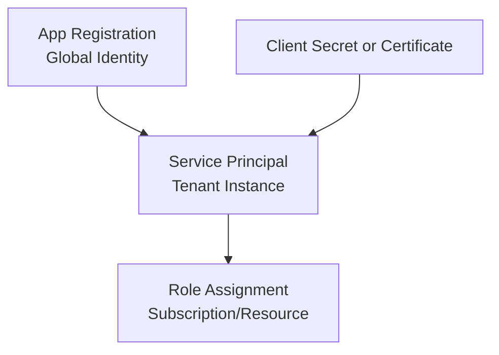

# How to Create Service Principals with OpenTofu on Azure

Author: [nawazdhandala](https://www.github.com/nawazdhandala)

Tags: OpenTofu, Azure, Service Principal, IAM, Infrastructure as Code, AzureAD, Security

Description: Learn how to create and manage Azure Service Principals using OpenTofu to enable secure, automated access to Azure resources for applications and CI/CD pipelines.

---

Azure Service Principals are identities created for use with automated tools, CI/CD pipelines, and applications. They provide a way to authenticate to Azure without using a human user account. OpenTofu's AzureAD provider makes creating and managing service principals straightforward and reproducible.

## Understanding Service Principals

A Service Principal is the local representation of an Azure AD Application within a specific tenant or directory. Think of the App Registration as the global identity definition and the Service Principal as its instantiation in your subscription.



## Creating an App Registration and Service Principal

```hcl
# main.tf
terraform {
  required_providers {
    azuread = {
      source  = "hashicorp/azuread"
      version = "~> 2.47"
    }
    azurerm = {
      source  = "hashicorp/azurerm"
      version = "~> 3.85"
    }
  }
}

provider "azuread" {}
provider "azurerm" {
  features {}
}

# Retrieve current Azure subscription info
data "azurerm_subscription" "current" {}

# Create the App Registration
resource "azuread_application" "cicd_app" {
  display_name = "my-cicd-pipeline-app"

  # Optional: set owners so the app isn't orphaned
  owners = [data.azuread_client_config.current.object_id]
}

data "azuread_client_config" "current" {}

# Create the Service Principal from the App Registration
resource "azuread_service_principal" "cicd_sp" {
  client_id = azuread_application.cicd_app.client_id
  owners    = [data.azuread_client_config.current.object_id]
}

# Generate a client secret for authentication
resource "azuread_application_password" "cicd_secret" {
  application_id = azuread_application.cicd_app.id
  display_name   = "cicd-secret"

  # Secret expires after 1 year — plan for rotation
  end_date = timeadd(timestamp(), "8760h")

  lifecycle {
    # Prevent accidental deletion of the secret
    ignore_changes = [end_date]
  }
}
```

## Assigning a Role to the Service Principal

Once created, assign an RBAC role to grant the service principal access to Azure resources.

```hcl
# role_assignment.tf
# Assign the Contributor role at the subscription level
resource "azurerm_role_assignment" "cicd_contributor" {
  scope                = data.azurerm_subscription.current.id
  role_definition_name = "Contributor"
  principal_id         = azuread_service_principal.cicd_sp.object_id
}
```

## Storing Credentials Securely

Never hard-code the client secret. Store it in Azure Key Vault immediately after creation.

```hcl
# keyvault.tf
data "azurerm_key_vault" "secrets_vault" {
  name                = var.key_vault_name
  resource_group_name = var.resource_group_name
}

# Store the client secret in Key Vault
resource "azurerm_key_vault_secret" "cicd_client_secret" {
  name         = "cicd-client-secret"
  value        = azuread_application_password.cicd_secret.value
  key_vault_id = data.azurerm_key_vault.secrets_vault.id
}

# Store the client ID for reference
resource "azurerm_key_vault_secret" "cicd_client_id" {
  name         = "cicd-client-id"
  value        = azuread_application.cicd_app.client_id
  key_vault_id = data.azurerm_key_vault.secrets_vault.id
}
```

## Outputs

```hcl
# outputs.tf
output "service_principal_object_id" {
  description = "Object ID of the service principal"
  value       = azuread_service_principal.cicd_sp.object_id
}

output "application_client_id" {
  description = "Client ID (Application ID) of the app registration"
  value       = azuread_application.cicd_app.client_id
}

# Mark secret as sensitive so it doesn't appear in logs
output "client_secret" {
  description = "Client secret — store this securely"
  value       = azuread_application_password.cicd_secret.value
  sensitive   = true
}
```

## Best Practices

- Prefer certificate-based authentication over client secrets for production workloads.
- Set explicit expiry dates on secrets and automate rotation using Key Vault rotation policies.
- Assign the minimum required role — avoid `Owner` or `Contributor` at subscription scope unless absolutely necessary.
- Use federated credentials for GitHub Actions and Azure Pipelines to eliminate secrets entirely via OIDC.

With OpenTofu managing your service principals, every change is tracked in version control and reproducible across environments.
