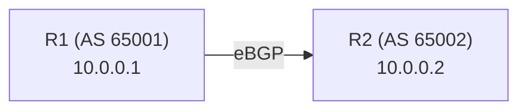

# How to Configure a Basic BGP Network on Cisco IOS

Author: [nawazdhandala](https://www.github.com/nawazdhandala)

Tags: BGP, Cisco IOS, Routing, Networking, Autonomous Systems

Description: A step-by-step guide to configuring a basic BGP network on Cisco IOS, including enabling the BGP process, defining neighbors, and advertising networks.

## What Is BGP?

Border Gateway Protocol (BGP) is the routing protocol that drives the global Internet. Unlike interior routing protocols such as OSPF or EIGRP, BGP is a path-vector protocol designed to exchange routing information between autonomous systems (AS). Even in enterprise environments, BGP is commonly used for ISP connectivity and data center peering.

## Topology Overview



- R1: AS 65001, interface 10.0.0.1/30
- R2: AS 65002, interface 10.0.0.2/30

## Step 1: Enable BGP on R1

Enter global configuration mode and start the BGP process with your AS number:

```
R1# configure terminal

! Start BGP process for AS 65001
R1(config)# router bgp 65001

! Set the BGP Router ID explicitly (recommended)
R1(config-router)# bgp router-id 1.1.1.1

! Define the eBGP neighbor (R2) with its AS number
R1(config-router)# neighbor 10.0.0.2 remote-as 65002

! Advertise the network you want to announce to neighbors
R1(config-router)# network 192.168.1.0 mask 255.255.255.0

R1(config-router)# end
```

The `network` command requires the exact prefix and mask to exist in the routing table before BGP will advertise it.

## Step 2: Enable BGP on R2

Mirror the configuration on R2, pointing back to R1:

```
R2# configure terminal

! Start BGP process for AS 65002
R2(config)# router bgp 65002

! Set Router ID
R2(config-router)# bgp router-id 2.2.2.2

! Define eBGP neighbor (R1)
R2(config-router)# neighbor 10.0.0.1 remote-as 65001

! Advertise R2's network
R2(config-router)# network 172.16.0.0 mask 255.255.0.0

R2(config-router)# end
```

## Step 3: Verify BGP Neighbor State

After a few seconds, check whether the BGP session has reached the Established state:

```
R1# show ip bgp summary

! Expected output excerpt:
! Neighbor        V     AS   MsgRcvd MsgSent   TblVer  InQ OutQ Up/Down  State/PfxRcd
! 10.0.0.2        4  65002        12      12        3    0    0 00:05:23        1
```

A `State/PfxRcd` value showing a number (rather than a state name like `Active`) means the session is established and prefixes are being received.

## Step 4: Check Received BGP Routes

Verify that the prefix from R2 appears in R1's BGP table:

```
R1# show ip bgp

! Look for routes with > (best) and * (valid) flags
! Network          Next Hop         Metric LocPrf Weight Path
! *> 172.16.0.0/16  10.0.0.2              0              0 65002 i
```

The `i` at the end indicates the prefix was learned via an IGP network statement (internal origin).

## Step 5: Verify the Route Is in the Routing Table

A BGP route only matters if it makes it into the global routing table:

```
R1# show ip route bgp

! B        172.16.0.0/16 [20/0] via 10.0.0.2, 00:05:23
```

The `[20/0]` shows an administrative distance of 20 (eBGP) and a metric of 0.

## Common Issues

- **Neighbor stuck in Active state:** Check IP reachability between peers with `ping`. Verify AS numbers match what each side expects.
- **Network not advertised:** The prefix must exist in the routing table. Add a static route or ensure the connected interface is up.
- **Routes not installed:** Check for route policy or filter mismatches with `show ip bgp neighbors X.X.X.X received-routes`.

## Conclusion

Configuring basic BGP on Cisco IOS involves enabling the BGP process with your AS number, defining neighbors with their AS numbers, and advertising networks. Once the session reaches Established, verify routes with `show ip bgp summary` and `show ip route bgp`.
