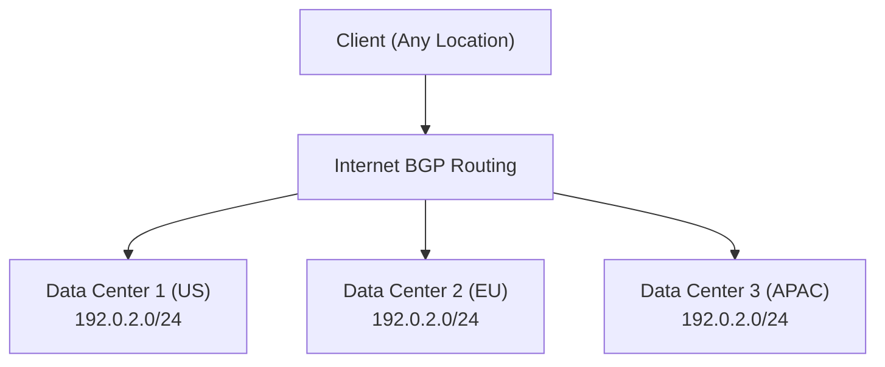

# How to Implement BGP Anycast for DNS or CDN Load Distribution

Author: [nawazdhandala](https://www.github.com/nawazdhandala)

Tags: BGP, Anycast, DNS, CDN, Load Distribution, Networking

Description: Learn how to implement BGP anycast to route clients to the nearest server automatically, enabling geographic load distribution for DNS resolvers and CDN edge nodes.

## What Is BGP Anycast?

In anycast routing, multiple servers in different locations share the same IP address or prefix. BGP advertises this prefix from each location, and clients are automatically routed to the topologically nearest instance based on BGP path selection. This is how large DNS providers (1.1.1.1, 8.8.8.8) and CDNs achieve global reach from a single IP.

## Architecture



Each data center advertises the same `192.0.2.0/24` prefix. A client in Europe reaches DC2; a client in Asia reaches DC3.

## Step 1: Configure the Anycast IP on Each Server

On each server that will participate in anycast, assign the anycast IP to the loopback interface:

```bash
# On each server (Linux)
# Add the anycast IP to the loopback - use /32 to avoid ARP issues
sudo ip addr add 192.0.2.1/32 dev lo label lo:anycast

# Make it persistent (Debian/Ubuntu - /etc/network/interfaces)
# auto lo:anycast
# iface lo:anycast inet static
#   address 192.0.2.1
#   netmask 255.255.255.255

# The service (DNS, HTTP) binds to this IP
# For DNS: add listen-on { 192.0.2.1; }; in named.conf
```

## Step 2: Configure BGP to Advertise the Anycast Prefix

On each site's border router, advertise the anycast prefix to upstream ISPs:

```
! On the US site border router
router bgp 65001
 bgp router-id 1.1.1.1

 neighbor 203.0.113.1 remote-as 65100   ! US ISP
 neighbor 203.0.113.1 description US-ISP-Upstream

 address-family ipv4 unicast
  neighbor 203.0.113.1 activate
  ! Advertise the anycast prefix
  network 192.0.2.0 mask 255.255.255.0
 exit-address-family
```

Create a static null route to ensure the prefix stays in the routing table:

```
! Keep the prefix in the routing table even if no servers are active
ip route 192.0.2.0 255.255.255.0 Null0
```

## Step 3: Use Health Checks to Withdraw the Prefix

The key to safe anycast is withdrawing the prefix when local servers are unhealthy. Use a script with ExaBGP or a routing daemon:

```bash
#!/bin/bash
# anycast_healthcheck.sh - Withdraw BGP prefix if service is unhealthy

ANYCAST_PREFIX="192.0.2.0/24"
DNS_IP="192.0.2.1"

# Check if DNS service is responding
if dig +time=2 +tries=1 @${DNS_IP} health.example.com A > /dev/null 2>&1; then
    # Service is healthy - ensure prefix is advertised
    # (add static route to ensure network statement works)
    ip route add ${ANYCAST_PREFIX} via 127.0.0.1 dev lo 2>/dev/null || true
    logger "Anycast: Service healthy, prefix ${ANYCAST_PREFIX} advertised"
else
    # Service is unhealthy - remove static route to withdraw prefix
    ip route del ${ANYCAST_PREFIX} via 127.0.0.1 dev lo 2>/dev/null || true
    logger "Anycast: Service UNHEALTHY, prefix ${ANYCAST_PREFIX} WITHDRAWN"
fi
```

Run this check every 30 seconds with a cron job or systemd timer.

## Step 4: Use ExaBGP for Dynamic Prefix Injection

ExaBGP allows programmatic BGP prefix injection from a Python/shell script:

```python
# exabgp_announce.py - ExaBGP process script
import sys
import time
import subprocess

def is_healthy():
    """Check if the local service is healthy."""
    result = subprocess.run(
        ["dig", "+time=2", "+tries=1", "@192.0.2.1", "health.example.com"],
        capture_output=True, timeout=5
    )
    return result.returncode == 0

PREFIX = "192.0.2.0/24"
announced = False

while True:
    healthy = is_healthy()

    if healthy and not announced:
        # Announce the prefix to neighbors
        print(f"announce route {PREFIX} next-hop self")
        sys.stdout.flush()
        announced = True

    elif not healthy and announced:
        # Withdraw the prefix
        print(f"withdraw route {PREFIX}")
        sys.stdout.flush()
        announced = False

    time.sleep(30)
```

## Step 5: Test Anycast Routing

From clients in different locations, trace the route to the anycast IP:

```bash
# From a US client
traceroute 192.0.2.1
# Should reach the US data center

# From a European client
traceroute 192.0.2.1
# Should reach the EU data center
```

## Conclusion

BGP anycast is a powerful mechanism for geographic load distribution and automatic failover. Assign the anycast IP to server loopbacks, advertise the prefix via BGP from each location, and implement health checks that withdraw the prefix when services are degraded. Used correctly, anycast provides sub-second failover and optimal routing for global services.
