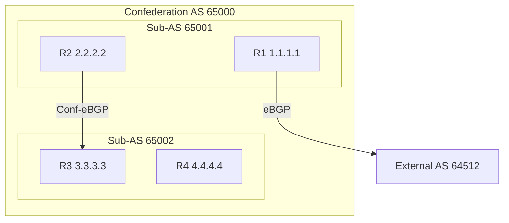

# How to Configure BGP Confederations for Large Networks

Author: [nawazdhandala](https://www.github.com/nawazdhandala)

Tags: BGP, Confederations, IBGP, Cisco IOS, Routing, Scalability

Description: Learn how to configure BGP confederations to partition a large AS into sub-ASes, reducing iBGP full-mesh complexity while maintaining consistent routing policy.

## What Are BGP Confederations?

BGP Confederations (RFC 5065) divide a large autonomous system into smaller sub-autonomous systems (sub-ASes). Routers within a sub-AS use iBGP among themselves, and routers in different sub-ASes use a special form of eBGP called confederation eBGP. From outside the confederation, all sub-ASes appear as a single AS.

This is an alternative to Route Reflectors for scaling iBGP.

## Topology



## Step 1: Configure Sub-AS 65001 (R1 and R2)

Each router in sub-AS 65001 specifies the confederation identifier (the public AS) and the list of peer sub-ASes:

```text
! R1 configuration - sub-AS 65001, public AS 65000
R1(config)# router bgp 65001

! Declare the public-facing AS number (what external peers see)
R1(config-router)# bgp confederation identifier 65000

! List all other sub-ASes in the confederation
R1(config-router)# bgp confederation peers 65002

! iBGP peer within same sub-AS 65001
R1(config-router)# neighbor 2.2.2.2 remote-as 65001
R1(config-router)# neighbor 2.2.2.2 update-source Loopback0
```

```text
! R2 configuration - sub-AS 65001
R2(config)# router bgp 65001
R2(config-router)# bgp confederation identifier 65000
R2(config-router)# bgp confederation peers 65002

! iBGP peer within sub-AS 65001
R2(config-router)# neighbor 1.1.1.1 remote-as 65001
R2(config-router)# neighbor 1.1.1.1 update-source Loopback0

! Confederation eBGP peer in sub-AS 65002
R2(config-router)# neighbor 3.3.3.3 remote-as 65002
R2(config-router)# neighbor 3.3.3.3 update-source Loopback0
R2(config-router)# neighbor 3.3.3.3 ebgp-multihop 2
```

## Step 2: Configure Sub-AS 65002 (R3 and R4)

```text
! R3 configuration - sub-AS 65002
R3(config)# router bgp 65002
R3(config-router)# bgp confederation identifier 65000
R3(config-router)# bgp confederation peers 65001

! iBGP within sub-AS 65002
R3(config-router)# neighbor 4.4.4.4 remote-as 65002
R3(config-router)# neighbor 4.4.4.4 update-source Loopback0

! Confederation eBGP to sub-AS 65001
R3(config-router)# neighbor 2.2.2.2 remote-as 65001
R3(config-router)# neighbor 2.2.2.2 update-source Loopback0
R3(config-router)# neighbor 2.2.2.2 ebgp-multihop 2
```

## Step 3: Verify Confederation Sessions

```text
R2# show ip bgp summary

Neighbor        V     AS   MsgRcvd MsgSent   TblVer  InQ OutQ Up/Down  State/PfxRcd
1.1.1.1         4  65001        20      20        4    0    0 00:09:00        2
3.3.3.3         4  65002        15      15        4    0    0 00:07:30        3
```

Notice that R3 shows as AS 65002-this is the sub-AS, not the confederation ID.

## Step 4: Verify External AS View

From an external router peering with R1, the confederation looks like a single AS:

```text
! On external router
External# show ip bgp 172.16.0.0/24

! AS path will show only 65000, not 65001 or 65002
! (confederation sub-AS numbers are stripped at the border)
BGP routing table entry for 172.16.0.0/24
  Paths: (1 available)
    65000
      203.0.113.1 from 203.0.113.1
```

## Key Differences: Confederations vs Route Reflectors

| Feature | Route Reflectors | Confederations |
|---|---|---|
| Complexity | Lower | Higher |
| Sub-AS path visibility | N/A | Internal only |
| Next-hop behavior | Unchanged by default | Same as eBGP between sub-ASes |
| Preferred for | Most networks | Very large ISP cores |

## Conclusion

BGP Confederations partition a large AS into sub-ASes using `bgp confederation identifier` and `bgp confederation peers`. Routers within a sub-AS use iBGP; routers between sub-ASes use confederation eBGP. External peers see only the public confederation AS number, keeping inter-AS routing clean.
