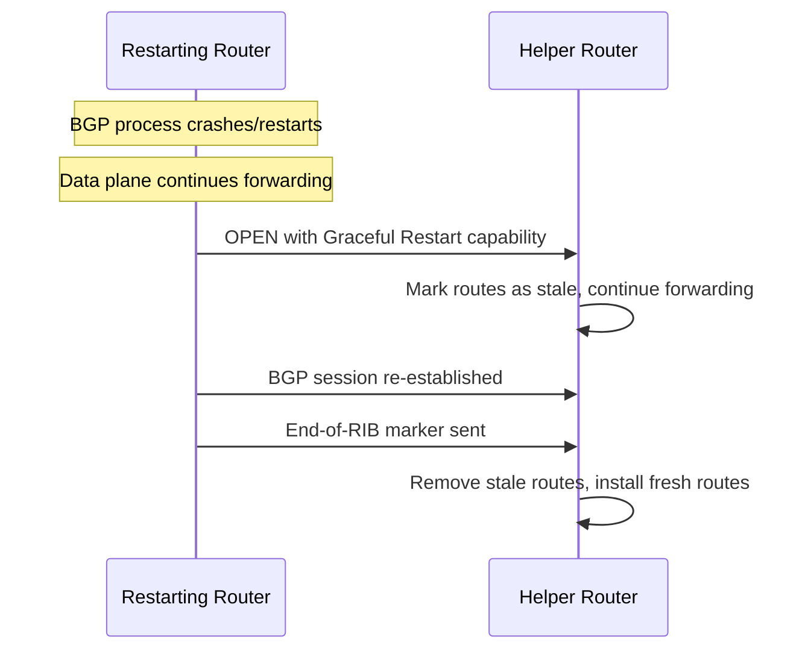

# How to Implement BGP Graceful Restart for Non-Stop Forwarding

Author: [nawazdhandala](https://www.github.com/nawazdhandala)

Tags: BGP, Graceful Restart, Non-Stop Forwarding, Cisco IOS, High Availability

Description: Learn how to configure BGP Graceful Restart to maintain packet forwarding during BGP session restarts, reducing traffic disruption during router software upgrades.

## What Is BGP Graceful Restart?

BGP Graceful Restart (GR), defined in RFC 4724, allows a router that is restarting its BGP process to signal its neighbors to continue forwarding packets using stale routes while the session is re-established. Without GR, a BGP restart causes neighbors to immediately withdraw all routes, creating a traffic blackhole until the session comes back up.

Non-Stop Forwarding (NSF) is the Cisco implementation that works with GR on hardware platforms that support separate control and data planes.

## How Graceful Restart Works



## Step 1: Enable BGP Graceful Restart

On Cisco IOS, graceful restart is enabled per address family:

```
router bgp 65001
 ! Enable graceful restart globally
 bgp graceful-restart

 ! Optionally set the restart time (seconds router takes to restart)
 bgp graceful-restart restart-time 120

 ! Optionally set the stalepath time (how long helper keeps stale routes)
 bgp graceful-restart stalepath-time 360
```

The `restart-time` is advertised to helpers so they know how long to retain stale routes. The `stalepath-time` is the local maximum for keeping stale routes before purging them.

## Step 2: Verify Graceful Restart Capability Is Negotiated

```
Router# show ip bgp neighbors 203.0.113.1

! Look for:
! Graceful Restart Capability: advertised and received
! Graceful-restart restart time is 120 seconds
! Address families preserved: IPv4 Unicast
```

Both the restarting router and the helper must support and advertise the GR capability.

## Step 3: Enable NSF on Cisco Platforms with Dual Processors

On platforms that support NSF (like Cisco 7600, ASR series), enable NSF awareness:

```
! Enable NSF awareness (helps BGP peers using NSF)
router bgp 65001
 bgp graceful-restart
 ! NSF is automatically enabled on supported platforms
```

On IOS XE/XR platforms, NSF may be enabled by default—verify with:

```
Router# show ip bgp neighbors | include NSF
! Output should show: NSF aware route processor
```

## Step 4: Configure Graceful Restart on FRRouting

For Linux routers running FRR:

```bash
# In /etc/frr/bgpd.conf or via vtysh

router bgp 65001
 bgp graceful-restart
 bgp graceful-restart preserve-fw-state
 bgp graceful-restart restart-time 120
 bgp graceful-restart stalepath-time 360
```

## Step 5: Test Graceful Restart

Test GR behavior in a lab by clearing the BGP process and observing stale route handling:

```
! Clear BGP process (simulates restart)
Router# clear ip bgp * soft

! On the helper router, observe stale routes
Helper# show ip bgp neighbors 1.1.1.1

! During the restart window, routes are marked stale
! but the helper continues to forward traffic
```

## Caveats and Limitations

- GR only helps if the **data plane** remains operational during the control plane restart
- If the router completely reboots (power cycle), forwarding also stops
- Not all neighbor implementations support the GR helper role
- Stale routes may cause suboptimal forwarding if the network changed during the restart
- Default timers may need tuning for your maintenance window duration

## Conclusion

BGP Graceful Restart significantly reduces traffic disruption during planned BGP process restarts and software upgrades. Enable it with `bgp graceful-restart`, set appropriate `restart-time` and `stalepath-time` values, and verify both sides have negotiated the capability before relying on it for production maintenance windows.
