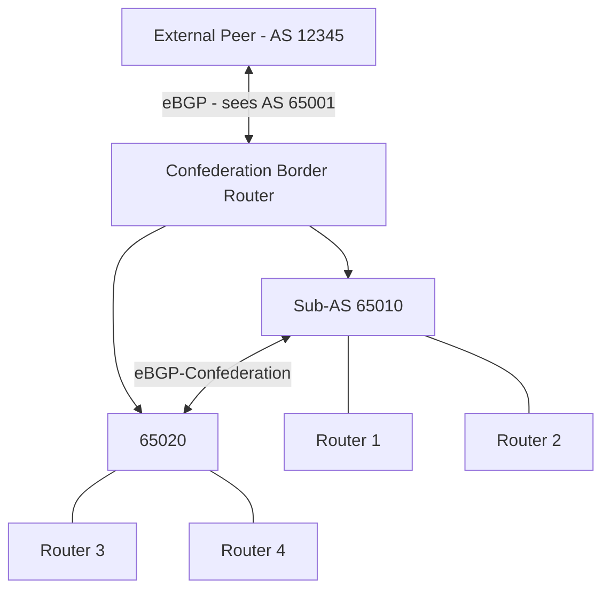

# How to Configure BGP IPv6 with Confederations

Author: [nawazdhandala](https://www.github.com/nawazdhandala)

Tags: BGP, IPv6, Confederations, IBGP, Routing

Description: Learn how to configure BGP IPv6 confederations as an alternative to route reflectors for scaling iBGP within large autonomous systems.

## Overview

BGP confederations divide a large AS into multiple sub-ASes. Within each sub-AS, a full iBGP mesh (or route reflectors) is used. Between sub-ASes, a special form of eBGP called eBGP-confederation is used. Externally, the confederation appears as a single AS.

## Confederation Architecture



External peers see confederation AS 65001. Internal sub-ASes are 65010 and 65020.

## Configuring Confederations on FRRouting

```bash
vtysh
configure terminal

! Sub-AS 65010 configuration
router bgp 65010

 ! Declare the confederation identifier (visible to external peers)
 bgp confederation identifier 65001

 ! Declare the other sub-ASes in the confederation
 bgp confederation peers 65020 65030

 bgp router-id 1.1.1.1

 ! iBGP within Sub-AS 65010 (full mesh or RR)
 neighbor 2001:db8::r2 remote-as 65010
 neighbor 2001:db8::r2 update-source lo

 ! eBGP-confederation to Sub-AS 65020
 neighbor 2001:db8::r3 remote-as 65020

 ! External eBGP to AS 12345
 neighbor 2001:db8::external remote-as 12345

 address-family ipv6 unicast
  neighbor 2001:db8::r2 activate
  neighbor 2001:db8::r3 activate
  neighbor 2001:db8::external activate
  network 2001:db8:myorg::/48
 exit-address-family

end
write memory
```

## Configuring the Second Sub-AS

```bash
vtysh
configure terminal

! Sub-AS 65020 configuration
router bgp 65020

 bgp confederation identifier 65001
 bgp confederation peers 65010 65030

 bgp router-id 2.2.2.2

 ! iBGP within Sub-AS 65020
 neighbor 2001:db8::r4 remote-as 65020
 neighbor 2001:db8::r4 update-source lo

 ! eBGP-confederation to Sub-AS 65010
 neighbor 2001:db8::r1 remote-as 65010

 address-family ipv6 unicast
  neighbor 2001:db8::r4 activate
  neighbor 2001:db8::r1 activate
 exit-address-family

end
write memory
```

## Cisco Confederation Configuration

```text
Router(config)# router bgp 65010
Router(config-router)# bgp confederation identifier 65001
Router(config-router)# bgp confederation peers 65020
Router(config-router)# bgp router-id 1.1.1.1

Router(config-router)# neighbor 2001:db8::r3 remote-as 65020    ! Confederation peer

Router(config-router)# address-family ipv6 unicast
Router(config-router-af)# neighbor 2001:db8::r3 activate
```

## AS_CONFED_SEQUENCE and AS_CONFED_SET

Confederation routers use two special AS-path segment types:
- **AS_CONFED_SEQUENCE** - internal confederation hops (shown in parentheses)
- **AS_CONFED_SET** - like AS_SET but for confederation

External peers see the confederation identifier without the internal sub-AS details.

## Verifying Confederation Configuration

```bash
# Show BGP confederation configuration

vtysh -c "show bgp ipv6 unicast"
# Routes from confederation peers have AS path with (65020) notation

# Verify the confederation identifier
vtysh -c "show bgp ipv6 unicast summary"
# Should show: Local AS is 65010, Confederation ID is 65001

# Check that external routes don't show sub-AS numbers
vtysh -c "show bgp ipv6 unicast neighbors 2001:db8::external advertised-routes"
# AS path should show only 65001, not 65010 or 65020
```

## Confederations vs Route Reflectors

| Feature | Confederations | Route Reflectors |
|---------|---------------|-----------------|
| Complexity | Higher | Lower |
| Loop prevention | AS_CONFED attributes | ORIGINATOR_ID, CLUSTER_LIST |
| Next-hop behavior | Preserved naturally | May need next-hop-self |
| Deployment | Large enterprise/ISP | Most environments |

## Summary

BGP IPv6 confederations divide a large AS into sub-ASes for iBGP scaling. Each router's local AS is a sub-AS; `bgp confederation identifier` sets the visible AS. `bgp confederation peers` lists other sub-ASes. Confederation sessions behave like eBGP internally but like iBGP externally. Verify that external advertisements show only the confederation identifier, not sub-AS numbers.
