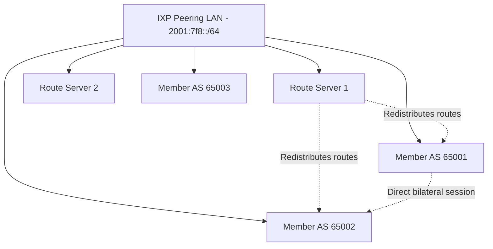

# How to Configure BGP IPv6 for Internet Exchange Points (IXPs)

Author: [nawazdhandala](https://www.github.com/nawazdhandala)

Tags: BGP, IPv6, IXP, Internet Exchange, Peering

Description: Learn how to configure BGP IPv6 for peering at Internet Exchange Points, including BIRD route server configuration and multi-lateral peering policies.

## Overview

Internet Exchange Points (IXPs) are physical locations where networks exchange traffic. At an IXP, participants peer via BGP over a shared switching fabric, often using route servers to simplify multi-lateral peering. IPv6 peering at IXPs uses the same address fabric as IPv4 but in the IXP's IPv6 peering LAN.

## IXP BGP Architecture



## Participant Configuration (FRRouting)

```bash
vtysh
configure terminal

router bgp 65001
 bgp router-id 1.1.1.1

 ! Peer with IXP Route Server 1
 neighbor 2001:7f8::rs1 remote-as 65500
 neighbor 2001:7f8::rs1 description "IXP Route Server 1"

 ! Peer with IXP Route Server 2
 neighbor 2001:7f8::rs2 remote-as 65500
 neighbor 2001:7f8::rs2 description "IXP Route Server 2"

 ! Direct bilateral peer (no route server)
 neighbor 2001:7f8::65002 remote-as 65002
 neighbor 2001:7f8::65002 description "Direct Peer AS65002"

 address-family ipv6 unicast

  ! Activate neighbors
  neighbor 2001:7f8::rs1 activate
  neighbor 2001:7f8::rs2 activate
  neighbor 2001:7f8::65002 activate

  ! Only advertise our own prefix to the route server
  neighbor 2001:7f8::rs1 prefix-list MY_PREFIXES out
  neighbor 2001:7f8::rs2 prefix-list MY_PREFIXES out

  ! Our network to advertise
  network 2001:db8:myorg::/48

 exit-address-family

end
write memory
```

## Route Server Configuration (BIRD)

```python
# /etc/bird/bird.conf - IXP Route Server configuration

router id 10.0.0.1;
log syslog all;

protocol device { scan time 10; }

# Define import filter - validate prefixes from members

filter IMPORT_FROM_MEMBER {
    # Reject default route
    if net = ::/0 then reject;
    # Reject bogons
    if net ~ [ fc00::/7+, fe80::/10+, ff00::/8+ ] then reject;
    # Accept valid prefixes
    accept;
}

# Template for route server clients
template bgp RS_CLIENT {
    local 2001:7f8::1 as 65500;
    rs client;         # This is a route server client session
    ipv6 {
        import filter IMPORT_FROM_MEMBER;
        export all;    # Send all valid routes to this member
    };
}

# Member AS 65001
protocol bgp AS65001 from RS_CLIENT {
    neighbor 2001:7f8::65001 as 65001;
    description "Member AS65001";
}

# Member AS 65002
protocol bgp AS65002 from RS_CLIENT {
    neighbor 2001:7f8::65002 as 65002;
}
```

## IXP Best Practices for IPv6

1. **Accept only announced prefixes** - Use IRR-based filtering to accept only prefixes the AS is authorized to announce
2. **Enforce RPKI ROV** - Reject routes with invalid RPKI Route Origin Validation status
3. **Use maximum-prefix limits** - Prevent members from accidentally advertising too many routes
4. **Advertise only your own space** - Never advertise learned routes back to the IXP fabric

## RPKI Validation in FRRouting

```bash
vtysh
configure terminal

! Configure RPKI cache validator
rpki
 cache 192.0.2.10 3323 preference 1
 exit

router bgp 65001
 bgp bestpath prefix-validate allow-invalid    ! Or 'disable' to hard-reject

 address-family ipv6 unicast
  neighbor 2001:7f8::rs1 activate
 exit-address-family

end

! Check RPKI validation state of routes
vtysh -c "show bgp ipv6 unicast rpki valid"
```

## Summary

IXP IPv6 BGP peering uses the IXP's shared peering LAN IPv6 addresses. Participants peer with route servers using standard BGP IPv6 configuration. Route servers redistribute prefixes between members. Always apply IRR-based prefix filtering and RPKI validation, advertise only your own prefixes, and use maximum-prefix limits as a safety measure.
