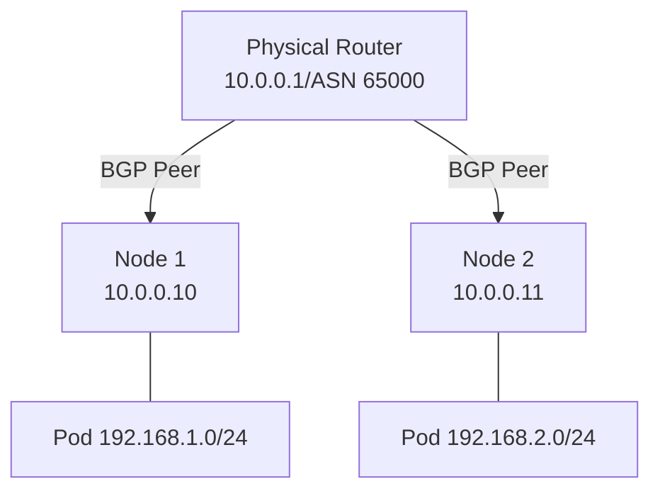

# How to Configure BGP on Kubernetes with Calico

Author: [nawazdhandala](https://www.github.com/nawazdhandala)

Tags: BGP, Kubernetes, Calico, CNI, IPv4, Networking, Cloud Native

Description: Learn how to configure Calico's BGP capabilities in Kubernetes to advertise pod and service IPv4 CIDR ranges to upstream routers without encapsulation.

---

Calico uses BGP to distribute routing information across Kubernetes nodes and optionally peers with external routers. This eliminates the need for overlay networks (VXLAN/IPIP), giving pods routable IPv4 addresses on your physical network.

## Calico BGP Architecture



## Installing Calico

```bash
# Install Calico with the operator
kubectl create -f https://raw.githubusercontent.com/projectcalico/calico/v3.27.0/manifests/tigera-operator.yaml

# Install with BGP enabled (no overlay)
cat << 'EOF' | kubectl apply -f -
apiVersion: operator.tigera.io/v1
kind: Installation
metadata:
  name: default
spec:
  calicoNetwork:
    bgp: Enabled
    ipPools:
    - blockSize: 26
      cidr: 192.168.0.0/16    # Pod IPv4 CIDR
      encapsulation: None     # No VXLAN/IPIP; use native BGP routing
      natOutgoing: Enabled
EOF
```

## Configure a BGP Peer (Global)

Peer all Kubernetes nodes with an upstream router.

```yaml
# bgp-global-peer.yaml
apiVersion: projectcalico.org/v3
kind: BGPPeer
metadata:
  name: global-router-peer
spec:
  # The upstream router's IPv4 address and ASN
  peerIP: 10.0.0.1
  asNumber: 65000
```

```bash
kubectl apply -f bgp-global-peer.yaml
```

## Configure Node-Specific BGP Peers

```yaml
# bgp-node-peer.yaml
apiVersion: projectcalico.org/v3
kind: BGPPeer
metadata:
  name: node1-router-peer
spec:
  # Apply only to the specific node
  nodeSelector: kubernetes.io/hostname == 'node1'
  peerIP: 10.0.0.1
  asNumber: 65000
```

## Configure the Calico ASN

```yaml
# bgp-config.yaml
apiVersion: projectcalico.org/v3
kind: BGPConfiguration
metadata:
  name: default
spec:
  # The ASN used by all Kubernetes nodes
  asNumber: 65001

  # Advertise service ClusterIPs to the upstream router
  serviceClusterIPs:
    - cidr: 10.96.0.0/12    # Kubernetes service CIDR

  # Advertise external IPs
  serviceExternalIPs:
    - cidr: 203.0.113.0/24
```

```bash
kubectl apply -f bgp-config.yaml
```

## Checking BGP Session Status

```bash
# Check BGP peer status (run on a node or via calicoctl)
calicoctl node status

# Expected output:
# IPv4 BGP status
# +--------------+-------------------+-------+----------+-------------+
# | PEER ADDRESS |     PEER TYPE     | STATE |  SINCE   |    INFO     |
# +--------------+-------------------+-------+----------+-------------+
# | 10.0.0.1     | global            | up    | 12:00:00 | Established |
# | 10.0.0.11    | node-to-node mesh | up    | 11:50:00 | Established |
# +--------------+-------------------+-------+----------+-------------+
```

## Key Takeaways

- `encapsulation: None` in the IP pool disables overlay networking, requiring BGP routes on the physical fabric.
- A `BGPPeer` resource defines the upstream router to peer with; use `nodeSelector` for per-node peering.
- `serviceClusterIPs` in `BGPConfiguration` advertises Kubernetes service IPs externally via BGP.
- Use `calicoctl node status` to verify BGP sessions are `Established`.
