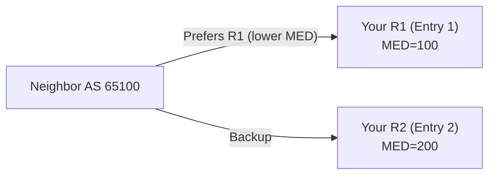

# How to Use BGP MED to Influence Outbound Traffic from Neighbors

Author: [nawazdhandala](https://www.github.com/nawazdhandala)

Tags: BGP, MED, Traffic Engineering, Cisco IOS, Routing Policy

Description: Learn how to configure BGP Multi-Exit Discriminator (MED) to suggest preferred entry points to neighboring autonomous systems for inbound traffic control.

## What Is BGP MED?

The Multi-Exit Discriminator (MED) is a BGP attribute that suggests to a neighboring AS which of your multiple entry points it should use when sending traffic to your network. Unlike Local Preference (which affects outbound traffic within your AS), MED is sent to external BGP neighbors and influences their **inbound** routing decisions toward you.

Key facts:
- Lower MED value is preferred
- Non-transitive: not forwarded beyond the directly connected AS
- Compared only between routes from the same neighboring AS (by default)
- Default MED is 0 (absent MED is treated as 0 or infinity, depending on config)

## Topology



## Step 1: Set MED on Outbound Advertisements

Set a lower MED on your primary entry point and a higher MED on the backup:

```
! On R1 (primary entry) - set low MED to attract traffic
route-map SET_MED_PRIMARY permit 10
 set metric 100

router bgp 65001
 neighbor 203.0.113.1 remote-as 65100
 neighbor 203.0.113.1 route-map SET_MED_PRIMARY out

! On R2 (backup entry) - set high MED to discourage traffic
route-map SET_MED_BACKUP permit 10
 set metric 200

router bgp 65001
 neighbor 198.51.100.1 remote-as 65100
 neighbor 198.51.100.1 route-map SET_MED_BACKUP out
```

## Step 2: Apply MED Selectively by Prefix

You can set different MED values for different prefixes to split inbound load:

```
ip prefix-list SITE_A_PREFIX seq 10 permit 192.168.10.0/24
ip prefix-list SITE_B_PREFIX seq 10 permit 192.168.20.0/24

! R1 preferred for Site A (low MED for Site A prefix)
route-map R1_OUT permit 10
 match ip address prefix-list SITE_A_PREFIX
 set metric 50

route-map R1_OUT permit 20
 match ip address prefix-list SITE_B_PREFIX
 set metric 200

route-map R1_OUT permit 30
```

## Step 3: Allow MED Comparison Across Different Peers

By default, Cisco IOS only compares MED between routes from the same neighboring AS. Enable `always-compare-med` to compare MED regardless of origin:

```
router bgp 65001
 ! Compare MED from ALL neighbors, not just same-AS peers
 bgp always-compare-med

 ! Optionally, treat missing MED as the worst value (avoid this if unclear)
 bgp bestpath med missing-as-worst
```

Use `always-compare-med` carefully—it changes path selection behavior globally.

## Step 4: Verify MED Values in BGP Table

```
! View routes sent to a neighbor
Router# show ip bgp neighbors 203.0.113.1 advertised-routes

   Network          Next Hop            Metric LocPrf Weight Path
*> 192.168.0.0/24   0.0.0.0              100         32768 i
                    ^^^ Metric column = MED value

! Check MED in detail for a specific prefix
Router# show ip bgp 192.168.0.0/24

  Path: Local
    metric 100, localpref 100, weight 32768
```

## Step 5: Limitations of MED

MED is only a **suggestion**—the neighboring AS can choose to ignore it. Many ISPs do ignore customer MED values. For reliable inbound traffic control, consider:

- **AS-path prepending:** More universally respected
- **Prefix deaggregation:** Advertise more-specifics via one ISP (use carefully)
- **Direct peering agreements:** Negotiate traffic engineering with your upstream

## Conclusion

BGP MED lets you hint to neighboring ASes which of your routers they should use as the entry point. Set lower MED values on primary entry routers and higher values on backups using outbound route maps. Always verify with `show ip bgp neighbors X advertised-routes` that MED values are being sent correctly, and understand that neighbors may not honor your MED.
