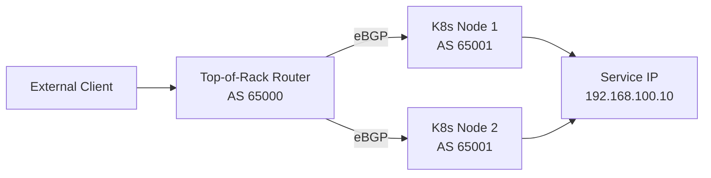

# How to Set Up BGP with MetalLB in Kubernetes

Author: [nawazdhandala](https://www.github.com/nawazdhandala)

Tags: Kubernetes, MetalLB, BGP, Load Balancer, Networking, Cloud Native

Description: Learn how to configure MetalLB in BGP mode to integrate Kubernetes LoadBalancer services with your network infrastructure for bare-metal or on-premise clusters.

## What Is MetalLB?

MetalLB is a load balancer implementation for bare-metal Kubernetes clusters. In cloud environments, LoadBalancer services get IPs from the cloud provider automatically. On bare metal, MetalLB fills this role. In BGP mode, MetalLB peers with your network's BGP routers and advertises the service IPs via BGP—enabling proper routing to your Kubernetes services.

## Architecture



## Step 1: Install MetalLB

```bash
# Install MetalLB using the official manifest
kubectl apply -f https://raw.githubusercontent.com/metallb/metallb/v0.14.5/config/manifests/metallb-native.yaml

# Wait for MetalLB pods to be ready
kubectl wait --namespace metallb-system \
  --for=condition=ready pod \
  --selector=app=metallb \
  --timeout=90s

# Verify pods are running
kubectl get pods -n metallb-system
```

## Step 2: Define an IP Address Pool

Create an `IPAddressPool` with the IPs MetalLB will assign to LoadBalancer services:

```yaml
# address-pool.yaml
apiVersion: metallb.io/v1beta1
kind: IPAddressPool
metadata:
  name: production-pool
  namespace: metallb-system
spec:
  addresses:
    # IP range MetalLB will assign to LoadBalancer services
    - 192.168.100.0/24
```

```bash
kubectl apply -f address-pool.yaml
```

## Step 3: Configure BGP Peers

Create `BGPPeer` resources to define your upstream routers:

```yaml
# bgp-peer.yaml
apiVersion: metallb.io/v1beta2
kind: BGPPeer
metadata:
  name: tor-switch
  namespace: metallb-system
spec:
  # Your top-of-rack switch AS number
  myASN: 65001
  # Remote router AS number
  peerASN: 65000
  # Router IP to peer with
  peerAddress: 192.168.1.1
  # Optional: limit which nodes peer with this router
  # nodeSelectors:
  #   - matchLabels:
  #       kubernetes.io/role: worker
```

```bash
kubectl apply -f bgp-peer.yaml
```

## Step 4: Create a BGPAdvertisement

Link the IP address pool to BGP advertisement:

```yaml
# bgp-advertisement.yaml
apiVersion: metallb.io/v1beta1
kind: BGPAdvertisement
metadata:
  name: production-bgp-advert
  namespace: metallb-system
spec:
  # Reference the pool to advertise via BGP
  ipAddressPools:
    - production-pool
  # Optional: peer only with specific BGP peers
  peers:
    - tor-switch
  # Optional: add BGP communities
  communities:
    - 65000:100
  # Optional: control AS path prepending
  aggregationLength: 32
```

```bash
kubectl apply -f bgp-advertisement.yaml
```

## Step 5: Configure the Router Side (Cisco IOS)

On your top-of-rack switch or router, configure BGP peering with each Kubernetes node:

```
router bgp 65000
 ! Peer with each Kubernetes node
 neighbor 192.168.1.10 remote-as 65001
 neighbor 192.168.1.10 description k8s-node-1
 neighbor 192.168.1.11 remote-as 65001
 neighbor 192.168.1.11 description k8s-node-2

 address-family ipv4 unicast
  neighbor 192.168.1.10 activate
  neighbor 192.168.1.10 maximum-prefix 1000
  neighbor 192.168.1.11 activate
  neighbor 192.168.1.11 maximum-prefix 1000
 exit-address-family
```

## Step 6: Test with a LoadBalancer Service

Deploy a test service and verify it gets an IP:

```yaml
# test-service.yaml
apiVersion: v1
kind: Service
metadata:
  name: test-nginx
spec:
  type: LoadBalancer
  selector:
    app: nginx
  ports:
    - port: 80
      targetPort: 80
```

```bash
kubectl apply -f test-service.yaml

# Check that an external IP was assigned
kubectl get service test-nginx

# NAME         TYPE           CLUSTER-IP    EXTERNAL-IP       PORT(S)
# test-nginx   LoadBalancer   10.96.1.100   192.168.100.10    80:30001/TCP

# Verify the route is visible on the router
# Router# show ip route 192.168.100.10
```

## Step 7: Verify BGP Sessions

```bash
# Check MetalLB speaker logs
kubectl logs -n metallb-system -l component=speaker

# Look for successful peer connections:
# "BGP session established" peer=192.168.1.1
```

## Conclusion

MetalLB in BGP mode transforms bare-metal Kubernetes clusters into first-class network citizens by advertising service IPs via BGP. Configure IPAddressPool for your service IP range, BGPPeer for router connectivity, and BGPAdvertisement to link them. The router receives /32 routes for each service IP, enabling ECMP load balancing across all nodes hosting the service.
