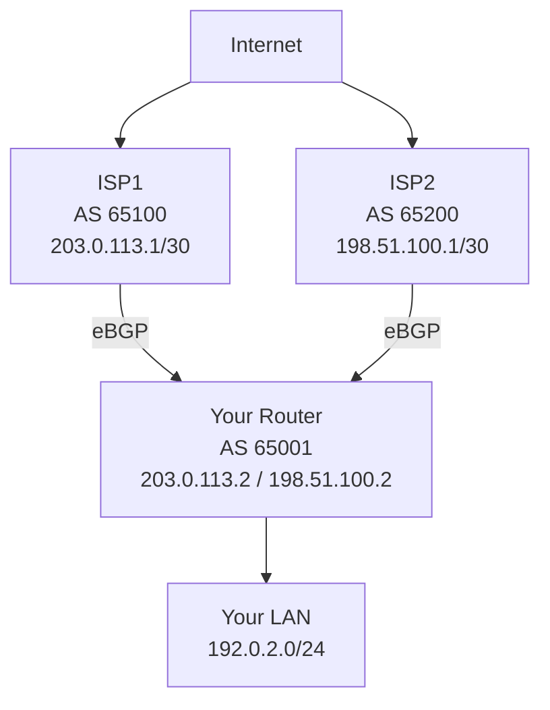

# How to Set Up BGP Multihoming with Two ISPs

Author: [nawazdhandala](https://www.github.com/nawazdhandala)

Tags: BGP, Multihoming, ISP, Cisco IOS, High Availability, Routing

Description: Learn how to configure BGP multihoming with two ISPs to achieve redundant Internet connectivity, including inbound and outbound traffic policy.

## What Is BGP Multihoming?

BGP multihoming connects your network to two or more ISPs simultaneously. This provides redundancy (if one ISP fails, traffic flows through the other) and optionally load balancing. You need your own public AS number and at least a /24 prefix allocation from a Regional Internet Registry (RIR).

## Topology



## Step 1: Configure eBGP Sessions to Both ISPs

```text
router bgp 65001
 bgp router-id 1.1.1.1

 ! ISP1 peering
 neighbor 203.0.113.1 remote-as 65100
 neighbor 203.0.113.1 description ISP1-Primary
 neighbor 203.0.113.1 password ISP1Secret

 ! ISP2 peering
 neighbor 198.51.100.1 remote-as 65200
 neighbor 198.51.100.1 description ISP2-Secondary
 neighbor 198.51.100.1 password ISP2Secret

 ! Advertise your public prefix to both ISPs
 network 192.0.2.0 mask 255.255.255.0
```

## Step 2: Control Outbound Traffic (Primary/Backup)

Use Local Preference to prefer ISP1 for all outbound traffic. Higher local-preference wins:

```text
! Set high local-pref for routes received from ISP1 (preferred)
route-map ISP1_IN permit 10
 set local-preference 200

! Set lower local-pref for routes from ISP2 (backup)
route-map ISP2_IN permit 10
 set local-preference 100

router bgp 65001
 neighbor 203.0.113.1 route-map ISP1_IN in
 neighbor 198.51.100.1 route-map ISP2_IN in
```

With local-preference 200 from ISP1, all outbound traffic uses ISP1. If ISP1 fails and those routes are withdrawn, local-preference 100 routes from ISP2 take over automatically.

## Step 3: Control Inbound Traffic (AS-Path Prepending)

To influence which ISP external traffic prefers to enter your network, use AS-path prepending. Prepending your AS number multiple times on ISP2 makes that path appear longer and less preferred:

```text
! Prepend AS on advertisements to ISP2 to make it less preferred
route-map TO_ISP2_OUT permit 10
 match ip address prefix-list OUR_PREFIX
 ! Prepend AS 65001 twice to make this path less attractive
 set as-path prepend 65001 65001

route-map TO_ISP1_OUT permit 10
 match ip address prefix-list OUR_PREFIX
 ! No prepending - ISP1 is the preferred inbound path

router bgp 65001
 neighbor 203.0.113.1 route-map TO_ISP1_OUT out
 neighbor 198.51.100.1 route-map TO_ISP2_OUT out
```

## Step 4: Verify Both Sessions Are Up

```text
Router# show ip bgp summary

Neighbor        V     AS   MsgRcvd MsgSent   TblVer  InQ OutQ Up/Down  State/PfxRcd
203.0.113.1     4  65100      1200     1200     1500    0    0 1d02h     120000
198.51.100.1    4  65200       800      800     1500    0    0 1d02h      80000
```

## Step 5: Test Failover

Simulate ISP1 failure by shutting down the interface or clearing the BGP session:

```text
! Simulate failure (test only)
Router# clear ip bgp 203.0.113.1

! Verify ISP2 routes are now active
Router# show ip route bgp | head -20
```

## Step 6: Advertise a Default Route Internally

Redistribute a default route from BGP into your IGP so internal routers know to exit via the CE router:

```text
router bgp 65001
 ! Generate a default route into BGP (requires a default in the RIB)
 default-information originate

router ospf 1
 ! Redistribute BGP into OSPF with a high metric for the backup
 redistribute bgp 65001 metric 100 metric-type 2 subnets
```

## Conclusion

BGP multihoming with two ISPs requires eBGP sessions to both providers, local-preference manipulation for outbound path selection, and AS-path prepending for inbound traffic engineering. Always test failover in a maintenance window to confirm traffic shifts correctly when an ISP link fails.
