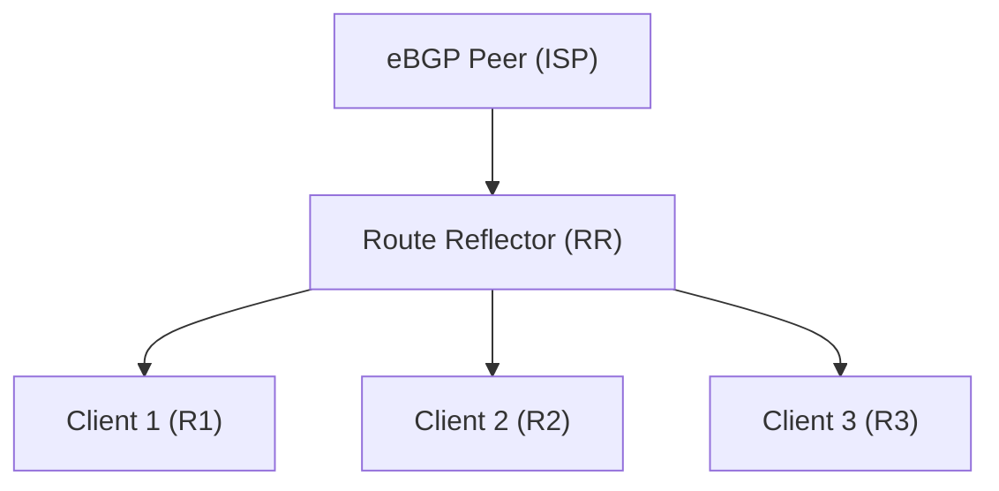

# How to Use BGP Route Reflectors to Scale iBGP

Author: [nawazdhandala](https://www.github.com/nawazdhandala)

Tags: BGP, IBGP, Route Reflector, Cisco IOS, Routing, Scalability

Description: Learn how to configure BGP Route Reflectors to eliminate the iBGP full-mesh requirement and scale internal BGP in large networks.

## The iBGP Full-Mesh Problem

iBGP requires that all routers within an AS form a full mesh of sessions-every router must peer with every other router. With N routers this means N*(N-1)/2 sessions. At 10 routers that's 45 sessions; at 50 routers it's 1,225. This doesn't scale.

BGP Route Reflectors (RRs) solve this by allowing a central router to reflect iBGP routes to clients, breaking the full-mesh requirement.

## Route Reflector Concepts



- **Route Reflector (RR):** Reflects routes learned from one client to all other clients and non-client iBGP peers.
- **Client:** A router that only needs to peer with the RR, not with every other router.
- **Cluster:** The RR and its clients form a cluster, identified by a Cluster-ID.

## Step 1: Configure the Route Reflector

On the designated RR, add all client routers as iBGP neighbors and mark each as a route-reflector client:

```text
! Route Reflector configuration (R_RR, loopback 10.255.0.1)
R_RR(config)# router bgp 65001
R_RR(config-router)# bgp router-id 10.255.0.1

! Client 1 - mark as route-reflector client
R_RR(config-router)# neighbor 10.0.0.1 remote-as 65001
R_RR(config-router)# neighbor 10.0.0.1 update-source Loopback0
R_RR(config-router)# neighbor 10.0.0.1 route-reflector-client

! Client 2
R_RR(config-router)# neighbor 10.0.0.2 remote-as 65001
R_RR(config-router)# neighbor 10.0.0.2 update-source Loopback0
R_RR(config-router)# neighbor 10.0.0.2 route-reflector-client

! Client 3
R_RR(config-router)# neighbor 10.0.0.3 remote-as 65001
R_RR(config-router)# neighbor 10.0.0.3 update-source Loopback0
R_RR(config-router)# neighbor 10.0.0.3 route-reflector-client
```

## Step 2: Configure Client Routers

Client routers only need to peer with the RR-no peering between clients is required:

```text
! R1 (client) - only peers with the RR
R1(config)# router bgp 65001
R1(config-router)# bgp router-id 10.0.0.1
R1(config-router)# neighbor 10.255.0.1 remote-as 65001
R1(config-router)# neighbor 10.255.0.1 update-source Loopback0
R1(config-router)# neighbor 10.255.0.1 next-hop-self
```

Clients do not need any special configuration to indicate they are clients-the RR handles this unilaterally.

## Step 3: Verify Route Reflection

On R1, check that routes originated by R2 (a peer it doesn't directly connect to) appear in the BGP table:

```text
R1# show ip bgp

! Routes learned via RR will show the RR's address as next-hop
! (unless next-hop-self is configured on the RR)

! The ORIGINATOR_ID attribute shows who originated the route
! The CLUSTER_LIST attribute shows which RRs reflected it
R1# show ip bgp 172.16.0.0/24
```

Look for the `Originator:` and `Cluster list:` fields in the detailed BGP output.

## Step 4: Prevent Routing Loops with Cluster-ID

By default, each RR uses its Router-ID as the Cluster-ID. In redundant RR designs with two RRs in the same cluster, assign the same Cluster-ID to both:

```text
! On both RRs in the same cluster
RR1(config-router)# bgp cluster-id 1
RR2(config-router)# bgp cluster-id 1
```

If an RR receives a route with its own Cluster-ID in the CLUSTER_LIST, it discards the route, preventing loops.

## Step 5: Redundant Route Reflectors

For high availability, deploy two RRs per cluster. Clients peer with both:

```text
! R1 client peering with both RRs
R1(config-router)# neighbor 10.255.0.1 remote-as 65001    ! RR1
R1(config-router)# neighbor 10.255.0.1 update-source Loopback0
R1(config-router)# neighbor 10.255.0.2 remote-as 65001    ! RR2
R1(config-router)# neighbor 10.255.0.2 update-source Loopback0
```

## Conclusion

Route Reflectors dramatically reduce iBGP session count by centralizing route distribution. Configure the RR with `route-reflector-client` on each neighbor, set a consistent `bgp cluster-id` for redundant RR pairs, and deploy two RRs per cluster for resilience. Clients only need sessions to the RR(s), not to each other.
