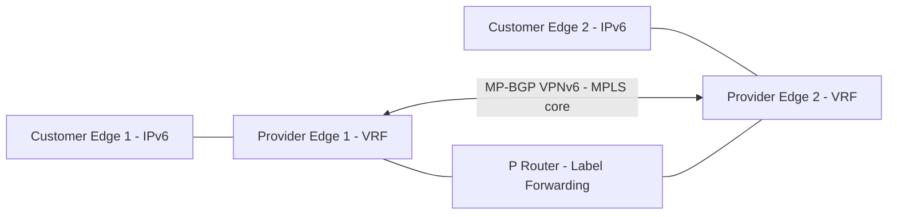

# How to Understand BGP VPNv6 Address Family

Author: [nawazdhandala](https://www.github.com/nawazdhandala)

Tags: BGP, VPNv6, MPLS, IPv6, VPN

Description: Understand the BGP VPNv6 address family used in MPLS L3VPN deployments for IPv6, including the role of Route Distinguishers, Route Targets, and VRFs.

## Overview

BGP VPNv6 (AFI=2, SAFI=128) extends the MPLS Layer 3 VPN framework to support IPv6 customer routes. It is the IPv6 equivalent of VPNv4 (AFI=1, SAFI=128) and enables service providers to offer IPv6 VPN services to multiple customers over a shared MPLS infrastructure.

## VPNv6 Architecture



## Key VPNv6 Concepts

| Concept | Description |
|---------|-------------|
| **VRF** | Virtual Routing and Forwarding — one per customer on PE |
| **Route Distinguisher (RD)** | 8-byte value prepended to IPv6 prefix to make it globally unique |
| **Route Target (RT)** | BGP community used to control VRF route import/export |
| **VPNv6 Route** | 128-bit IPv6 prefix + 8-byte RD = 136-bit globally unique prefix |

## VRF Configuration on Cisco IOS

```
! Create a VRF for the customer
Router(config)# vrf definition CUSTOMER_A
Router(config-vrf)# rd 65001:100          ! Route Distinguisher
Router(config-vrf)# address-family ipv6
Router(config-vrf-af)#  route-target export 65001:100   ! RT for export
Router(config-vrf-af)#  route-target import 65001:100   ! RT for import
Router(config-vrf-af)#  exit
Router(config-vrf)# exit

! Assign CE-facing interface to the VRF
Router(config)# interface GigabitEthernet0/1
Router(config-if)# vrf forwarding CUSTOMER_A
Router(config-if)# ipv6 address 2001:db8:ce::/64 eui-64

! Configure BGP VPNv6
Router(config)# router bgp 65001
Router(config-router)# neighbor 2001:db8:pe2::1 remote-as 65001     ! iBGP to PE2

Router(config-router)# address-family vpnv6 unicast
Router(config-router-af)# neighbor 2001:db8:pe2::1 activate
Router(config-router-af)# neighbor 2001:db8:pe2::1 send-community extended
Router(config-router-af)# exit-address-family

! Redistribute customer VRF routes into BGP VPNv6
Router(config-router)# address-family ipv6 vrf CUSTOMER_A
Router(config-router-af)# redistribute connected
Router(config-router-af)# redistribute static
Router(config-router-af)# exit-address-family
```

## VRF Configuration on FRRouting

```bash
vtysh
configure terminal

! Create VRF
vrf CUSTOMER_A
 vni 100       ! VXLAN/MPLS VNI
exit-vrf

! Configure BGP with VPNv6
router bgp 65001
 ! iBGP PE-to-PE session
 neighbor 2001:db8:pe2::1 remote-as 65001
 neighbor 2001:db8:pe2::1 update-source lo

 address-family ipv6 vpn
  neighbor 2001:db8:pe2::1 activate
  neighbor 2001:db8:pe2::1 send-community extended
 exit-address-family

! Configure BGP within the VRF
router bgp 65001 vrf CUSTOMER_A
 address-family ipv6 unicast
  rd vpn export 65001:100
  rt vpn import 65001:100
  rt vpn export 65001:100
  export vpn
  import vpn
  redistribute connected
 exit-address-family

end
```

## Verifying VPNv6

```
! Cisco: Show VPNv6 BGP table
Router# show bgp vpnv6 unicast all

! Show VRF-specific routes
Router# show bgp ipv6 unicast vrf CUSTOMER_A

! Verify RD/RT
Router# show bgp vpnv6 unicast all neighbors 2001:db8:pe2::1 routes
```

## Summary

BGP VPNv6 uses AFI=2, SAFI=128 to carry IPv6 customer routes across an MPLS backbone. Each customer has a VRF with a Route Distinguisher to make prefixes globally unique and Route Targets to control which VRFs import/export routes. The PE-to-PE exchange uses iBGP with VPNv6 address family and extended communities carrying the Route Target.
