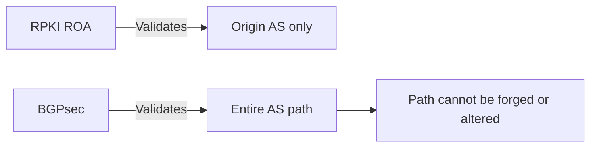
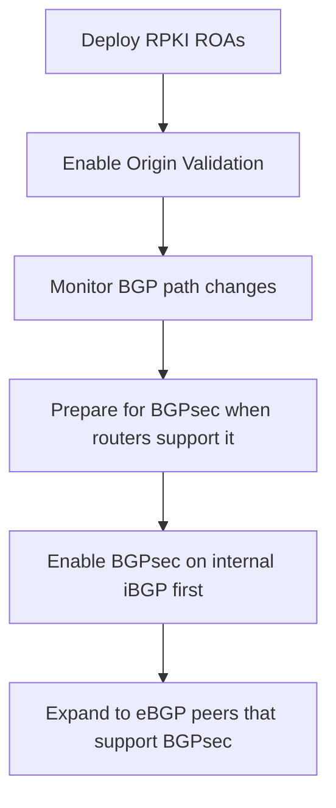

# How to Configure BGPsec for IPv6 Path Security

Author: [nawazdhandala](https://www.github.com/nawazdhandala)

Tags: BGPsec, BGP, IPv6, Routing Security, RPKI

Description: An introduction to BGPsec for IPv6 path security, covering its architecture, configuration concepts, and current deployment considerations.

## What is BGPsec?

BGPsec (RFC 8205) extends BGP to provide cryptographic path validation. While RPKI validates route origin (which AS originated the prefix), BGPsec validates the entire AS path — proving that each AS legitimately received and re-announced the route.

## BGPsec vs RPKI Comparison



## How BGPsec Works

1. Each BGP speaker generates an asymmetric key pair registered with RPKI
2. When advertising a route, the AS signs the BGP UPDATE with its private key
3. The next-hop AS verifies the signature before forwarding
4. A chain of signatures proves the complete AS path is authentic

## BGPsec Router Key Setup

```bash
# BGPsec uses router keys registered in RPKI
# Generate a router key (ECDSA P-256 is standard)
openssl ecparam -name prime256v1 -genkey -noout -out router-key.pem

# Extract the public key
openssl ec -in router-key.pem -pubout -out router-key-pub.pem

# The public key must be registered as a Router Key Object in RPKI
# Contact your RIR to register the router key
```

## FRRouting BGPsec Configuration (Experimental)

FRRouting has experimental BGPsec support:

```
# FRR configuration for BGPsec (experimental as of FRR 8.x)
router bgp 64496
  bgp router-id 192.0.2.1

  # Enable BGPsec capability
  neighbor 2001:db8:peer::1 remote-as 65001

  address-family ipv6 unicast
    neighbor 2001:db8:peer::1 activate
    # BGPsec requires explicit activation (when supported)
    # neighbor 2001:db8:peer::1 capability bgpsec-send
    # neighbor 2001:db8:peer::1 capability bgpsec-receive
  exit-address-family
```

## Current Deployment Reality

BGPsec has significant challenges that limit current deployment:

```
Challenges:
1. CPU overhead: Every BGP UPDATE requires cryptographic verification
2. Path length sensitivity: Longer AS paths require more signatures
3. AS path manipulation: BGPsec breaks when AS path attributes are modified
   (e.g., AS path prepending for traffic engineering)
4. Incremental deployment: Path security only works when ALL ASes in the
   path support BGPsec
5. Performance: Signing/verification adds latency to BGP convergence
```

## Practical Deployment Strategy

Since full BGPsec deployment is years away, a hybrid approach is recommended:



## Monitoring BGP Path Changes as BGPsec Precursor

Until BGPsec is widely deployed, monitor for unexpected AS path changes:

```python
import requests

def check_bgp_path_changes(prefix):
    """Query RIPE RIS for BGP path changes on a prefix."""
    url = f"https://stat.ripe.net/data/bgp-updates/data.json"
    params = {
        "resource": prefix,
        "starttime": "2026-03-19T00:00:00",
        "endtime": "2026-03-20T00:00:00"
    }
    response = requests.get(url, params=params)
    data = response.json()

    updates = data.get("data", {}).get("updates", [])
    for update in updates:
        path = update.get("attrs", {}).get("path", [])
        print(f"Path change: {path}")

check_bgp_path_changes("2001:db8::/32")
```

## Monitoring with OneUptime

Use [OneUptime](https://oneuptime.com) to monitor your BGP infrastructure. While BGPsec deployment is evolving, track BGP session health and combine with external BGP monitoring services to detect unexpected route changes for your IPv6 prefixes.

## Conclusion

BGPsec provides strong path security for IPv6 BGP routes but faces deployment challenges due to CPU overhead and the need for universal adoption. Today, combine RPKI origin validation with BGP path monitoring as a practical substitute, and prepare your infrastructure for BGPsec as router support matures.
