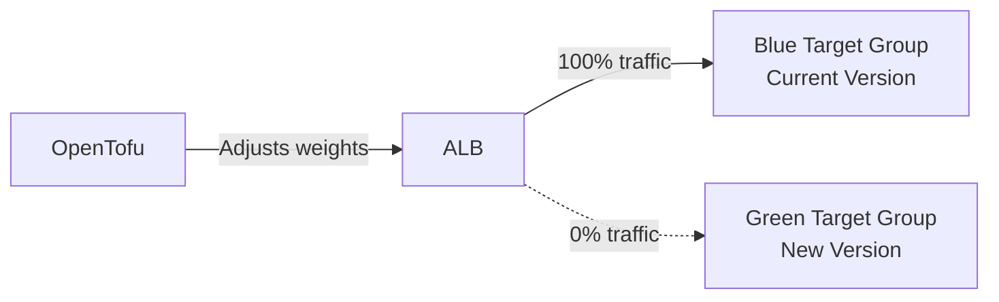

# How to Implement Blue-Green Deployments with OpenTofu

Author: [nawazdhandala](https://www.github.com/nawazdhandala)

Tags: OpenTofu, Blue-Green Deployment, Zero Downtime, AWS, CI/CD, Infrastructure as Code, Reliability

Description: Learn how to implement blue-green deployments using OpenTofu to achieve zero-downtime releases by maintaining two identical environments and switching traffic between them.

---

Blue-green deployments eliminate downtime by running two identical environments (blue and green) and switching traffic atomically. OpenTofu manages both environments and the routing layer, making the cutover a one-command operation that can be instantly rolled back.

## Blue-Green with AWS ALB Target Groups



## Infrastructure Setup

```hcl
# main.tf

terraform {
  required_providers {
    aws = {
      source  = "hashicorp/aws"
      version = "~> 5.30"
    }
  }
}

provider "aws" {
  region = var.aws_region
}

# Variable to control traffic distribution
variable "blue_weight" {
  description = "Traffic weight for the blue environment (0-100)"
  type        = number
  default     = 100  # Blue starts at 100%

  validation {
    condition     = var.blue_weight >= 0 && var.blue_weight <= 100
    error_message = "blue_weight must be between 0 and 100"
  }
}

locals {
  green_weight = 100 - var.blue_weight
}

# ALB
resource "aws_lb" "main" {
  name               = "${var.app_name}-alb"
  internal           = false
  load_balancer_type = "application"
  security_groups    = [aws_security_group.alb.id]
  subnets            = var.public_subnet_ids
}

# Blue target group (current stable version)
resource "aws_lb_target_group" "blue" {
  name     = "${var.app_name}-blue"
  port     = 8080
  protocol = "HTTP"
  vpc_id   = var.vpc_id

  health_check {
    path                = "/health"
    healthy_threshold   = 2
    unhealthy_threshold = 2
    interval            = 10
  }
}

# Green target group (new version being deployed)
resource "aws_lb_target_group" "green" {
  name     = "${var.app_name}-green"
  port     = 8080
  protocol = "HTTP"
  vpc_id   = var.vpc_id

  health_check {
    path                = "/health"
    healthy_threshold   = 2
    unhealthy_threshold = 2
    interval            = 10
  }
}

# Weighted listener that splits traffic between blue and green
resource "aws_lb_listener" "main" {
  load_balancer_arn = aws_lb.main.arn
  port              = 443
  protocol          = "HTTPS"
  ssl_policy        = "ELBSecurityPolicy-TLS13-1-2-2021-06"
  certificate_arn   = var.acm_certificate_arn

  default_action {
    type = "forward"

    forward {
      target_group {
        arn    = aws_lb_target_group.blue.arn
        weight = var.blue_weight
      }

      target_group {
        arn    = aws_lb_target_group.green.arn
        weight = local.green_weight
      }

      # Enable stickiness so users don't bounce between versions
      stickiness {
        enabled  = true
        duration = 600  # 10 minutes
      }
    }
  }
}
```

## ECS Service Configuration

```hcl
# ecs.tf
# Blue ECS service (current version)
resource "aws_ecs_service" "blue" {
  name            = "${var.app_name}-blue"
  cluster         = var.ecs_cluster_arn
  task_definition = aws_ecs_task_definition.blue.arn
  desired_count   = var.blue_weight > 0 ? var.desired_count : 0

  load_balancer {
    target_group_arn = aws_lb_target_group.blue.arn
    container_name   = var.app_name
    container_port   = 8080
  }

  network_configuration {
    subnets         = var.private_subnet_ids
    security_groups = [aws_security_group.app.id]
  }
}

# Green ECS service (new version)
resource "aws_ecs_service" "green" {
  name            = "${var.app_name}-green"
  cluster         = var.ecs_cluster_arn
  task_definition = aws_ecs_task_definition.green.arn
  desired_count   = local.green_weight > 0 ? var.desired_count : 0

  load_balancer {
    target_group_arn = aws_lb_target_group.green.arn
    container_name   = var.app_name
    container_port   = 8080
  }

  network_configuration {
    subnets         = var.private_subnet_ids
    security_groups = [aws_security_group.app.id]
  }
}
```

## Deployment Workflow

```bash
# Step 1: Deploy new version to green (blue still at 100%)
tofu apply -var="blue_weight=100" -var="green_image=v2.0.0"

# Step 2: Gradually shift traffic to green
tofu apply -var="blue_weight=90"  # 10% to green - monitor errors
tofu apply -var="blue_weight=50"  # 50/50 split - canary validation
tofu apply -var="blue_weight=0"   # 100% to green - complete cutover

# Step 3: Rollback in seconds if issues arise
tofu apply -var="blue_weight=100" # Instantly back to blue
```

## Best Practices

- Use session stickiness during the transition to prevent users from switching between versions mid-session.
- Run automated smoke tests on the green environment before shifting any traffic.
- Monitor error rates at each traffic split level - stop and rollback if errors increase.
- Keep the blue environment running for at least 30 minutes after full cutover in case you need to roll back.
- Automate the deployment workflow in your CI/CD pipeline with approval gates at key traffic milestones.
