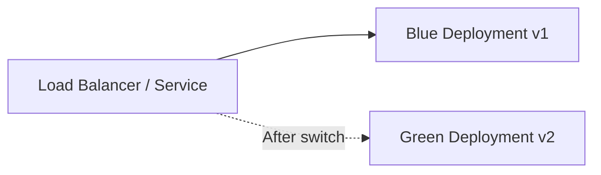

# How to Implement Blue-Green Deployments in Rancher

Author: [nawazdhandala](https://www.github.com/nawazdhandala)

Tags: Blue-Green Deployment, Rancher, Kubernetes, Zero Downtime, DevOps, Deployment Strategy, Service

Description: Learn how to implement blue-green deployments in Rancher-managed Kubernetes clusters to achieve zero-downtime releases by switching traffic between two identical environments.

---

Blue-green deployments eliminate downtime by running two identical environments - blue (current) and green (new). Traffic is switched atomically from blue to green after the new version passes verification, and rollback is instant.

---

## How Blue-Green Works



---

## Step 1: Create the Blue Deployment

Deploy version 1 of your application labeled `slot: blue`:

```yaml
# blue-deployment.yaml

apiVersion: apps/v1
kind: Deployment
metadata:
  name: my-app-blue
  namespace: my-app
spec:
  replicas: 3
  selector:
    matchLabels:
      app: my-app
      slot: blue
  template:
    metadata:
      labels:
        app: my-app
        slot: blue
        version: v1
    spec:
      containers:
        - name: app
          image: my-org/my-app:v1
          ports:
            - containerPort: 8080
          readinessProbe:
            httpGet:
              path: /health
              port: 8080
            initialDelaySeconds: 5
            periodSeconds: 5
```

---

## Step 2: Create the Service Pointing to Blue

The Service uses a `slot` label selector to route traffic. Switching the slot switches traffic:

```yaml
# service.yaml
apiVersion: v1
kind: Service
metadata:
  name: my-app
  namespace: my-app
spec:
  selector:
    app: my-app
    slot: blue   # <-- this is the traffic switch
  ports:
    - port: 80
      targetPort: 8080
```

---

## Step 3: Deploy the Green Version

Create the green deployment running the new version side by side with blue:

```yaml
# green-deployment.yaml
apiVersion: apps/v1
kind: Deployment
metadata:
  name: my-app-green
  namespace: my-app
spec:
  replicas: 3
  selector:
    matchLabels:
      app: my-app
      slot: green
  template:
    metadata:
      labels:
        app: my-app
        slot: green
        version: v2
    spec:
      containers:
        - name: app
          image: my-org/my-app:v2
          ports:
            - containerPort: 8080
          readinessProbe:
            httpGet:
              path: /health
              port: 8080
            initialDelaySeconds: 5
            periodSeconds: 5
```

```bash
kubectl apply -f green-deployment.yaml
# Wait until all green pods are ready before switching
kubectl rollout status deployment/my-app-green -n my-app
```

---

## Step 4: Switch Traffic to Green

Once the green deployment is healthy, patch the Service selector to point to green:

```bash
# This is an atomic operation - traffic switches instantly
kubectl patch service my-app \
  -n my-app \
  --type=json \
  -p='[{"op":"replace","path":"/spec/selector/slot","value":"green"}]'

# Confirm the switch
kubectl get service my-app -n my-app -o jsonpath='{.spec.selector}'
```

---

## Step 5: Verify and Clean Up

Run smoke tests against production, then delete the blue deployment:

```bash
# Quick health check
curl -s https://my-app.example.com/health | jq .

# Remove the old blue deployment once confident
kubectl delete deployment my-app-blue -n my-app
```

---

## Rollback Procedure

If issues appear after the switch, revert the Service selector back to blue in seconds:

```bash
kubectl patch service my-app \
  -n my-app \
  --type=json \
  -p='[{"op":"replace","path":"/spec/selector/slot","value":"blue"}]'
```

---

## Best Practices

- Keep both deployments at the same replica count until after the switch is verified.
- Use **readiness probes** to prevent green from receiving traffic before it is ready.
- Automate the slot switch in your CI/CD pipeline (GitLab, GitHub Actions) and gate it with integration tests.
- For database migrations, use expand-contract patterns to keep both versions compatible.
