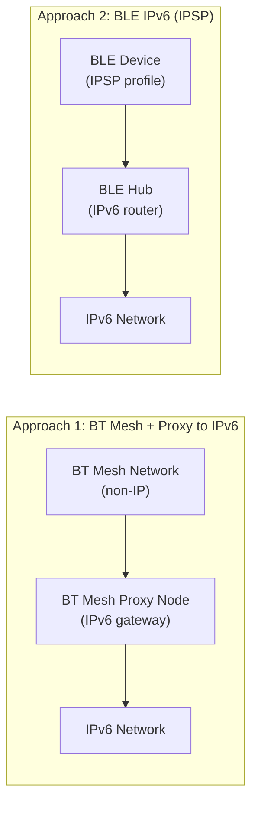

# How to Configure Bluetooth Mesh with IPv6

Author: [nawazdhandala](https://www.github.com/nawazdhandala)

Tags: IPv6, Bluetooth, BLE Mesh, IoT, Networking, Smart Building

Description: Understand the relationship between Bluetooth Mesh and IPv6, including IP Proxy node configuration for connecting Bluetooth Mesh networks to IPv6 infrastructure.

## Introduction

Bluetooth Mesh (BT Mesh) is a networking standard for Bluetooth Low Energy (BLE) devices that enables many-to-many communication. Unlike Thread (which is natively IPv6), Bluetooth Mesh uses its own non-IP network layer. However, IPv6 connectivity can be achieved through Proxy Nodes and the Internet Protocol Support Profile (IPSP).

## Two Approaches to BLE + IPv6



## Approach 1: Bluetooth Mesh with IPv6 Proxy

Bluetooth Mesh Proxy Nodes act as gateways between the BT Mesh network and IPv6:

### Setting Up a Linux BLE Proxy

```bash
# Install BlueZ (Linux Bluetooth stack)
sudo apt-get install bluez-tools bluez

# Check BlueZ version (Mesh support requires 5.50+)
bluetoothctl --version

# Enable BLE mesh daemon
sudo systemctl enable --now bluetooth
sudo bluetoothd --experimental &

# Use mesh-cfgclient to provision and configure a BT Mesh network
mesh-cfgclient
> attach <UUID>
> create <network-key-hex>
> add-node <device-UUID>   # Provision new mesh node
```

### Linux IPv6 Routing via BLE Proxy

```bash
# BlueZ 6LoWPAN support for BLE IPSP devices
# Load the 6LoWPAN module for BLE
sudo modprobe bluetooth_6lowpan

echo 1 > /sys/kernel/debug/bluetooth/6lowpan_enable

# Connect to a BLE device running IPSP (IPv6 over BLE)
# This creates a lowpan interface for each connected BLE device
# Once connected, the device gets a 6LoWPAN IPv6 address

# List 6LoWPAN BLE interfaces
ip link show | grep bt

# Check IPv6 addresses on BLE 6LoWPAN interface
ip -6 addr show bt0
```

## Approach 2: IPv6 Directly on BLE (IPSP)

The Internet Protocol Support Profile (IPSP) enables IPv6 directly over BLE using 6LoWPAN:

### RIOT OS BLE IPSP Device

```makefile
# Makefile - RIOT OS application with BLE IPSP (IPv6 over BLE)
BOARD = nrf52dk
USEMODULE += nimble_netif
USEMODULE += gnrc_ipv6_default
USEMODULE += gnrc_sixlowpan_full
USEMODULE += nimble_ipsp
USEMODULE += auto_init_gnrc_netif
```

```c
// main.c - BLE device with IPv6 connectivity via IPSP
#include "nimble_netif.h"
#include "net/gnrc/ipv6.h"

int main(void) {
    // Initialize NimBLE network interface
    nimble_netif_init();

    // Start advertising as an IPSP node
    // The central device (hub) will connect and assign IPv6 address via RA
    nimble_netif_accept(NULL, NULL, NULL);

    // Once connected, GNRC IPv6 and 6LoWPAN handle the rest
    // The device gets an IPv6 address via SLAAC

    // Simple CoAP server on the device
    // (uses the IPv6 address assigned via BLE connection)
    return 0;
}
```

### Hub Configuration (Raspberry Pi with BLE radio)

```bash
# Configure the Raspberry Pi as a BLE IPv6 hub

# Enable 6LoWPAN over BLE
sudo modprobe bluetooth_6lowpan
echo 1 > /sys/kernel/debug/bluetooth/6lowpan_enable

# Connect to IPSP device
echo "connect <BLE-MAC-ADDRESS> 1" > /sys/kernel/debug/bluetooth/6lowpan_control

# Assign IPv6 prefix to the BLE interface
sudo ip -6 addr add 2001:db8:ble:1::1/64 dev bt0

# Enable forwarding
sudo sysctl -w net.ipv6.conf.all.forwarding=1

# Start radvd for the BLE segment
sudo tee /etc/radvd.conf > /dev/null << 'EOF'
interface bt0 {
    AdvSendAdvert on;
    prefix 2001:db8:ble:1::/64 {
        AdvOnLink on;
        AdvAutonomous on;
        AdvValidLifetime 86400;
        AdvPreferredLifetime 3600;
    };
    RDNSS 2001:db8:ble:1::53 {
        AdvRDNSSLifetime 600;
    };
};
EOF
sudo systemctl start radvd
```

## Verifying BLE IPv6 Connectivity

```bash
# On the hub, check connected BLE devices have IPv6 addresses
ip -6 neigh show dev bt0

# Ping a connected BLE IPSP device
ping6 -c 3 2001:db8:ble:1::sensor1

# Check routing table includes BLE prefix
ip -6 route show dev bt0

# From the BLE device (RIOT OS), test connectivity
# Using the GNRC ping utility:
# > ping 2001:db8:ble:1::1
```

## Conclusion

Bluetooth Mesh and IPv6 can coexist through two approaches: a Proxy Node that bridges the BT Mesh protocol to an IPv6 network, or direct IPv6-over-BLE using the IPSP profile with 6LoWPAN. The IPSP approach is the more direct IPv6 integration, treating the BLE connection as a 6LoWPAN link and assigning genuine IPv6 addresses to BLE devices. For smart building applications where Bluetooth Mesh is already deployed, the Proxy Node approach enables IPv6 management without replacing the existing mesh infrastructure.
